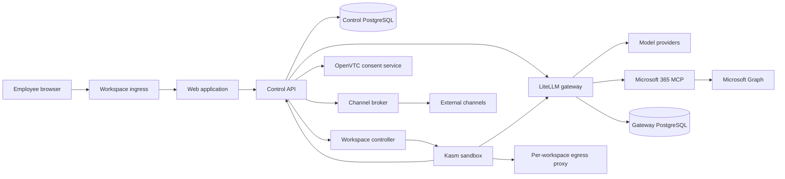

# ONEComputer

ONEComputer is an enterprise control plane for governed AI workspaces. It gives
employees access to frontier AI applications inside persistent sandboxes while
keeping provider credentials, enterprise OAuth tokens, policy decisions, and
high-risk actions outside the user-controlled environment.

The project addresses shadow IT without reducing AI work to a small,
centrally-built chat interface:

- **Flexible sandboxes with external gateways.** Employees use familiar AI
  applications and agents in isolated desktops. Model traffic, MCP tools, and
  approved web destinations are reached through scoped gateways, so provider
  keys and enterprise credentials are never exposed to the sandbox user.
- **Governance through OpenVTC approvals.** Policy can allow, deny, or require a
  signed approval for individual capabilities. Critical Microsoft 365 actions
  are bound to their exact arguments, approved out of band, and executed once
  with a short-lived lease.

## Architecture



The system separates four concerns:

1. **Experience plane:** the Web application, companion approval experience,
   and managed sandbox applications.
2. **Control plane:** identity, policy, workspace lifecycle, scoped grant
   issuance, operation state, audit receipts, and channel routing.
3. **Data plane:** LiteLLM routes model and MCP traffic using revocable
   workspace-and-agent credentials; egress proxies enforce signed domain rules.
4. **Consent plane:** the isolated OpenVTC service signs requests and verifies
   enrollment and decision proofs. Control owns the operation state machine and
   one-time execution lease.

Provider keys exist only in the model gateway. Microsoft OAuth custody stays
outside workspaces. The managed sandbox process receives local broker
credentials rather than provider, gateway-administrator, Microsoft, Control, or
Docker credentials.

See [Architecture](docs/architecture.md) for trust boundaries, runtime flows,
network isolation, policy integrity, and the approval protocol.

## Services

| Service | Responsibility | Exposure |
| --- | --- | --- |
| `workspace-ingress` | Serves the product origin and exchanges short-lived workspace launch links for scoped sessions | `127.0.0.1:4174` |
| `web` | Static React application and authenticated reverse proxy to Control | Private |
| `control-api` | Identity, policy, lifecycle orchestration, grants, governance, audit, and connection APIs | Private |
| `workspace-controller` | Provisions Kasm workspaces through local Docker or the Kasm Developer API | Private |
| `litellm` | Model routing, per-user OAuth custody, scoped virtual keys, and MCP dispatch | `127.0.0.1:4000` |
| `ms365-mcp` | Pinned Microsoft 365 MCP connector for Mail, Calendar, OneDrive, and Teams | OAuth bridge on `127.0.0.1:4311` |
| `openvtc-consent` | OpenVTC executor identity, request signing, and proof verification | Private |
| `channel-broker` | Encrypted external-channel credentials and policy-checked message routing | Private |
| `postgres` | ONEComputer identity, policy, workspace, operation, and audit state | Private |
| `litellm-postgres` | Gateway configuration, virtual keys, and encrypted OAuth state | Private |
| workspace sidecars | Credential brokers, Kasm relay, and default-deny egress enforcement created per workspace | Dynamic/private |

The technical [Service reference](docs/services.md) describes each process,
interface, state owner, health contract, and extension seam.

## Run locally

### Prerequisites

- Linux with Docker Engine and Docker Compose
- Node.js 22 or later
- An `amd64` host for the current managed workspace image
- A Microsoft Entra tenant and application for Web sign-in
- An API key for at least the model route assigned by policy
- At least 4 GiB available to run one workspace, plus capacity for the control
  stack and image build

The reference Compose deployment binds all browser-facing ports to loopback. It
is intended for development and evaluation; see
[Production considerations](docs/operations.md#production-considerations)
before exposing it on a network.

### 1. Install dependencies and initialize configuration

```bash
npm ci
npm run env:init
```

`env:init` creates a mode-`0600` `.env` with fresh service credentials,
encryption keys, an Ed25519 policy-signing key, an OpenVTC executor seed, and
Web Push keys. It refuses to overwrite an existing file.

Edit `.env` and replace:

- `ONECOMPUTER_OPENAI_API_KEY` for the default model route, or the key for the
  route you assign;
- `ONECOMPUTER_ENTRA_TENANT_ID`, `ONECOMPUTER_ENTRA_CLIENT_ID`, and
  `ONECOMPUTER_ENTRA_CLIENT_SECRET`;
- `ONECOMPUTER_ADMINISTRATOR_EMAILS`;
- the Microsoft 365 application values if it uses a separate Entra app;
- the Web Push contact address.

Register these Web redirect URIs in Entra:

```text
http://localhost:4174/api/v1/auth/callback
http://localhost:4000/callback
```

The second URI is needed when using the Microsoft 365 connector.

### 2. Build the managed workspace image

```bash
npm run image:workspace
```

This build downloads checksum-pinned desktop applications and can take several
minutes. It produces the image named by `ONECOMPUTER_WORKSPACE_IMAGE`.

### 3. Validate and start

```bash
npm run compose:config
npm run compose:up
```

The start command builds the control images, waits for health checks, creates
the databases and private networks, and runs database migrations from Control.
Open [http://localhost:4174](http://localhost:4174) and sign in with an address
listed in `ONECOMPUTER_ADMINISTRATOR_EMAILS`.

Inspect the stack with:

```bash
docker compose ps
docker compose logs -f control-api workspace-controller
```

Stop it without deleting state:

```bash
npm run compose:down
```

To remove local database state as well, run `docker compose down --volumes`.
This is destructive and does not remove persistent per-workspace Docker
volumes.

## Development

```bash
npm ci
npm run build
npm test
```

Useful focused processes:

```bash
npm run dev:control
npm run dev:controller
npm run dev:web
```

The monorepo uses npm workspaces. Shared schemas and security invariants live in
`packages/`; runnable processes live in `apps/`; provider and gateway policy
configuration lives in `config/` and `integrations/`.

## Documentation

- [Architecture and trust model](docs/architecture.md)
- [Service reference](docs/services.md)
- [Extending ONEComputer](docs/extending.md)
- [Configuration and operations](docs/operations.md)
- [Contributing](CONTRIBUTING.md)
- [Security policy](SECURITY.md)

ONEComputer is security-sensitive infrastructure. Changes to identity,
credentials, signed policy, approval binding, egress, or execution leases
should include negative tests that demonstrate the relevant boundary fails
closed.
