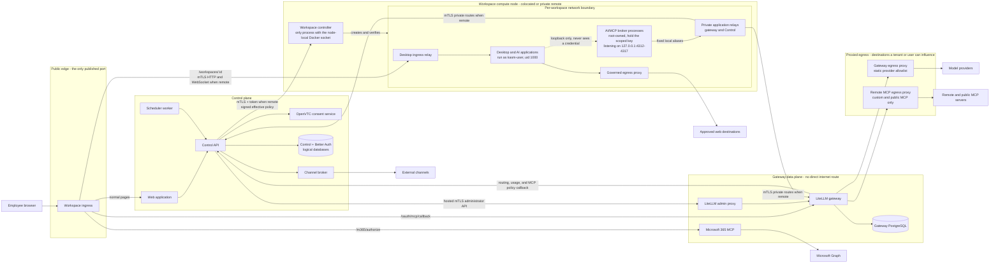

# LemmaComputer

LemmaComputer is an enterprise control plane for governed AI workspaces. It gives
employees access to frontier AI applications inside persistent sandboxes while
keeping provider credentials, enterprise OAuth tokens, policy decisions, and
high-risk actions outside the user-controlled environment.

The project addresses shadow IT without reducing AI work to a small,
centrally-built chat interface:

- **Flexible sandboxes with external gateways.** Employees use familiar AI
  applications and agents in isolated desktops. Model traffic, MCP tools, and
  approved web destinations are reached through scoped gateways, so provider
  keys and enterprise credentials are never exposed to the sandbox user.
- **Governance through OpenVTC approvals.** Policy can allow, deny, or require a
  signed approval for individual capabilities. Critical Microsoft 365 actions
  are bound to their exact arguments, approved out of band, and executed once
  with a short-lived lease.
- **Governed model choice and spend.** Employees choose stable Auto, Lite,
  Balanced, or Pro service classes instead of provider model names. The
  administrator AI control plane manages provider deployments, immutable
  pricing, Team allocation and budgets, routing rollout evidence, usage-data
  health, and ledger-backed spend reporting without storing prompts or hidden
  reasoning.

The same tenant-scoped codebase supports `customer-managed` single-tenant and
LemmaComputer-operated `hosted` deployments. Deployment profiles change
configuration and infrastructure, not the product schema or security model.

## Quick start

To evaluate LemmaComputer on a Linux `amd64` host with Docker Compose v2.30.0
or later and Node.js 22 or later:

```bash
npm ci
npm run env:init -- --profile=worktree
npm run compose:up
```

`compose:up` builds the application services, applies the migration jobs, and
waits for every service to report healthy. Then open **http://localhost:4174**,
which is the evaluation default. The authoritative value is
`LEMMACOMPUTER_PUBLIC_WEB_URL` in the generated `.env`, and a task worktree
deliberately uses a different port:

```bash
grep LEMMACOMPUTER_PUBLIC_WEB_URL .env
```

Create the first account through the sign-in page, then open **AI control plane
→ Models & providers** to add a model-provider key. Provider credentials are
entered in the product UI and are deliberately not read from `.env`. Configure
Pricing, publish a Model routes mapping, and set up a Team rollout before
governed Auto, Lite, Balanced, or Pro requests will run.

Launching a managed desktop workspace additionally requires the workspace image,
which is a large, slow build and is not needed to start the stack or sign in:

```bash
npm run image:workspace
```

The `worktree` profile is for evaluation and development. It binds browser-facing
ports to loopback and permits unresolved Microsoft Entra placeholders, so no
Microsoft tenant is required to start. See
[Deployment profiles](docs/guides/deployment-profiles.md) before running
`customer-managed` or `hosted`, which validate those values strictly.

Contributors should not use this path. The single
[evaluation, development, and remote workspace workflow](docs/guides/development-workflow.md)
explains when to use a disposable evaluation clone, a task worktree, or the
remote-node/Cowork qualifier.

## Architecture



Workspace ingress owns the single published port and is an authorization-aware
session gateway, not a plain reverse proxy. It serves ordinary pages from the
Web application, and exposes exactly two public OAuth routes —
`/oauth/mcp/callback` to private LiteLLM and `/m365/authorize` to the private
Microsoft connector — so neither service publishes a host port of its own. For
`/workspaces/:id` it validates a short-lived, HMAC-signed launch link, exchanges
it for an `HttpOnly` path-scoped session cookie, strips the token from the URL,
re-checks access with Control on every request, and keeps re-checking on a
heartbeat for the life of a WebSocket session, so revoking access severs a live
desktop rather than waiting for it to close.

The boxes above are conceptual groupings for reading the diagram, not a
deployment topology. They do not correspond to Compose networks, subnets, or
VPCs — several components inside one box sit on different networks, and Control
alone is attached to six. The authoritative mapping is the
[Compose network topology](docs/architecture/overview.md#compose-network-topology)
table.

Egress is proxied where the destination set can be influenced by a tenant or a
workspace user, and direct where it is fixed by an administrator. LiteLLM is
attached only to internal networks and has no internet route at all, because
provider deployments and remote MCP servers are tenant-configurable: model
traffic leaves through the gateway egress proxy under a static allowlist, and
custom or public MCP traffic leaves through the separate remote MCP egress
proxy. Keeping those two policies in separate processes is what stops an MCP
redirect from reaching a model provider or a private service. Workspace web
egress is proxied for the same reason — the destination comes from policy the
user is subject to.

The Microsoft 365 connector, the channel broker, and Control's identity lookups
each egress directly on their own dedicated network, with no destination
allowlist. Their targets are fixed by pinned code or administrator configuration
rather than by a tenant, so the network separation exists to keep their outbound
paths off each other's rather than to constrain where they may go.

The workspace container is one process boundary with two privilege zones inside
it. The broker processes start as root, receive the scoped gateway key and
agent-bridge token, and listen only on loopback; the entrypoint then clears
those variables from its own environment before handing the session to
`kasm-user`. The employee's desktop and AI applications therefore reach the
model gateway through `127.0.0.1` without ever holding a credential they could
read, copy, or exfiltrate. The AI/MCP broker is not a separate service — it is
the privileged half of the workspace the employee is using. The desktop relay,
private application relays, and egress proxy are separate per-workspace sidecar
containers, created and destroyed with the session. In remote mode they form
one logical workspace network gateway while remaining separate processes so
desktop ingress, private application traffic, public egress, and different
workspaces do not share one credential or network bridge. See
[remote workspace-node architecture](docs/guides/development-workflow.md#remote-workspace-node-architecture)
for the complete topology and mTLS identities.

The system separates four concerns:

1. **Experience plane:** the Web application, companion approval experience,
   and managed sandbox applications.
2. **Control plane:** identity, policy, workspace lifecycle, scoped grant
   issuance, model-routing decisions, Team budgets, immutable usage accounting,
   operation state, audit receipts, and channel routing.
3. **Data plane:** LiteLLM accepts the governed `lemmacomputer-auto` transport
   alias, executes only the concrete deployment authorized by Control, and
   routes MCP traffic using revocable workspace-and-agent credentials; egress
   proxies enforce signed domain rules.
4. **Consent plane:** the isolated OpenVTC service signs requests and verifies
   enrollment and decision proofs. Control owns the operation state machine and
   one-time execution lease.

Provider keys exist only in the model gateway. Microsoft OAuth custody stays
outside workspaces. The managed sandbox process receives local broker
credentials rather than provider, gateway-administrator, Microsoft, Control, or
Docker credentials.

## Customer identity and organization access

Customer authentication is implemented with an embedded, exactly pinned
[Better Auth](https://better-auth.com/) runtime in the Control API. Depending on
deployment configuration, a customer may sign in with verified email and
password, a passkey, Google, Microsoft, or organization-managed OIDC company
SSO. TOTP provides authenticator step-up for protected owner actions. Provider
credentials and authentication sessions stay in the server-side authentication
store and are never exposed to a workspace.

Authentication does not grant product access. LemmaComputer separately owns
accounts, organizations, invitations, memberships, roles, permissions, active
organization selection, and workspace policy. Company SSO proves identity for
a verified email domain; it cannot choose an organization or derive a product
role from provider claims. An invitation fixes the organization and role before
the recipient authenticates. Microsoft 365 connector consent is a later,
independent grant and does not affect sign-in or membership.

See [Customer authentication architecture](docs/architecture/authentication.md)
for the normative trust boundary and [Deployment profiles](docs/guides/deployment-profiles.md)
for profile-specific custody and supported methods.

See [Architecture](docs/architecture/overview.md) for trust boundaries, runtime flows,
network isolation, policy integrity, and the approval protocol. The dedicated
[LiteLLM gateway architecture](docs/architecture/litellm-gateway.md) separates
the provider, governed Auto, MCP/OAuth, scoped-grant, budget, and telemetry
paths and identifies which decisions remain authoritative in Control.

## Services

| Service | Responsibility | Exposure |
| --- | --- | --- |
| `workspace-ingress` | Serves the product origin and exchanges short-lived workspace launch links for scoped sessions | Loopback on the configured Web port |
| `web` | Serves the static React application and forwards `/api` to Control with a service token; Control performs all user authorization | Private |
| `control-api` | Identity, policy, lifecycle orchestration, grants, governance, audit, and connection APIs | Private |
| `db-migrate` | One-shot, checksummed Control-database migration job that must complete before Control starts | Private/job |
| `workspace-controller` | Runs the Lemma-owned Docker/KasmVNC workspace-node API in colocated or private remote topology | Private; mTLS when remote |
| `litellm` | Model routing, per-user OAuth custody, scoped virtual keys, and MCP dispatch | Private |
| `litellm-admin-proxy` | Dedicated Control-to-LiteLLM administration transport; requires mTLS in hosted deployments | Private |
| `ms365-mcp` | Pinned Microsoft 365 MCP connector for Mail, Calendar, OneDrive, and Teams | Private; callbacks use workspace ingress |
| `openvtc-consent` | OpenVTC executor identity, request signing, and proof verification | Private |
| `channel-broker` | Encrypted external-channel credentials and policy-checked message routing | Private |
| `scheduler-worker` | Claims due schedule runs from the Control database and dispatches each one back through Control without decrypting prompts. Shares Control's database and network, so it is a separate process for operational reasons rather than an isolation boundary | Private |
| `postgres` | One PostgreSQL engine containing the `lemmacomputer` product database and separate `lemmacomputer_auth` Better Auth database | Private |
| `litellm-postgres` | Gateway configuration, virtual keys, and encrypted OAuth state | Private |
| workspace sidecars | Credential brokers, desktop and private-application relays, and default-deny egress enforcement created per workspace | Dynamic/private |

The technical [Service reference](docs/reference/services.md) describes each process,
interface, state owner, health contract, and extension seam.

## Choose how to run the repository

| Intent | Correct starting point |
| --- | --- |
| Explore one disposable local stack | Quick start above |
| Change code or documentation | Isolated task worktree |
| Test the remote workspace boundary or Claude Cowork | Initialized task worktree, then the remote qualifier |
| Exercise a production deployment profile | Profile-specific runbook and representative infrastructure |

Do not combine these paths. The
[evaluation, development, and remote workspace workflow](docs/guides/development-workflow.md)
is the one authoritative setup guide, including exact commands, command
meanings, mTLS topology, Cowork selection, state preservation, and teardown.

### Deployment profiles and Microsoft integrations

The reference deployment requires Linux on `amd64`, Docker Engine with Docker
Compose v2.30.0 or later, and Node.js 22 or later. It binds browser-facing ports
to loopback and is intended for development or evaluation, not as a production
security perimeter.

The `worktree` profile permits unresolved Microsoft Entra placeholders. The
strict `customer-managed` preflight still requires a Microsoft Entra application
for the transitional workforce adapter, even when customers primarily use Better
Auth; that compatibility requirement is not product authorization. Microsoft
social login, organization-managed company SSO, and Microsoft 365 connector
consent remain separate configurations and separate grants — when enabling one,
register only the exact redirect URI shown by its setup flow.

The [local deployment and Microsoft integration runbook](docs/guides/local-deployment.md)
lists the required environment values, optional provider settings, commands, and
readiness checks in setup order.

## Development

Create and initialize a task worktree using the single
[workflow guide](docs/guides/development-workflow.md). Use
[CONTRIBUTING.md](CONTRIBUTING.md) to select existing tools, focused test suites,
qualification commands, and handoff gates. Do not develop directly in the
primary `main` checkout.

Useful focused processes:

```bash
npm run dev:control
npm run dev:controller
npm run dev:web
```

### Repository layout

The monorepo uses npm workspaces.

| Path | Contents |
| --- | --- |
| `apps/` | Runnable processes, one per container |
| `packages/` | Shared schemas, contracts, and security invariants |
| `config/`, `integrations/` | Provider and gateway policy configuration |
| `docker/` | Dockerfiles and the managed workspace image contents |
| `infra/` | Database and infrastructure initialization |
| `scripts/` | Environment, Compose, migration, and release tooling |
| `tests/` | Node test suites and Playwright end-to-end specs |
| `docs/` | Documentation, grouped — see [docs/README.md](docs/README.md) |

Four Compose files sit at the repository root, and only the first is used for
ordinary work:

| File | Role |
| --- | --- |
| `compose.yaml` | The canonical topology. Use it through `npm run compose:*` |
| `compose.hosted.yaml` | Deliberately empty marker. A test asserts it selects no deployment policy, because the profile must come only from `LEMMACOMPUTER_INSTALLATION_KIND` |
| `compose.oauth-qualification.yaml` | Isolated OAuth test stack, invoked by `npm run qualify:oauth` |
| `compose.provider-qualification.yaml` | Isolated provider test stack, invoked by `npm run qualify:providers` |

The qualification files stay at the root because Compose resolves their build
contexts and bind mounts relative to the file's own directory.

The four `playwright.*.config.ts` files each drive a different suite:
`test:e2e`, `test:customer-auth:e2e`, `test:platform-operator:e2e`, and
`test:responsive:e2e`.

## Documentation

[docs/README.md](docs/README.md) is the grouped index. The most common starting
points:

- [Architecture and trust model](docs/architecture/overview.md)
- [Why LemmaComputer runs as many processes](docs/architecture/service-boundaries.md)
- [Evaluation, development, and remote workspace workflow](docs/guides/development-workflow.md)
- [Deployment profiles](docs/guides/deployment-profiles.md)
- [Service reference](docs/reference/services.md)
- [Configuration and operations](docs/guides/operations.md)
- [Contributing](CONTRIBUTING.md)
- [Security policy](docs/SECURITY.md)

LemmaComputer is security-sensitive infrastructure. Changes to identity,
credentials, signed policy, approval binding, egress, or execution leases
should include negative tests that demonstrate the relevant boundary fails
closed.
