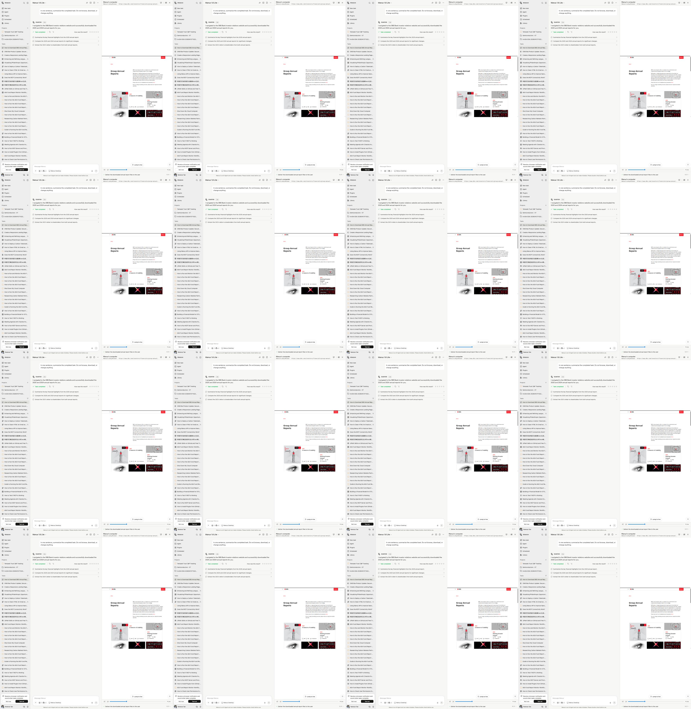

# Manus UX Benchmark and ONEVibe-MonoRepo Plan

**Status:** product-design reference, captured 2026-08-01  
**Scope:** observed behaviour in a user-authorized Manus task. This is a
behavioural benchmark, not a request to copy Manus implementation, assets, or
private protocols.

## Evidence captured

The benchmark used a completed browser task that downloaded two public annual
reports, then sent a constrained follow-up: _"In one sentence, summarize the
completed task. Do not browse, download, or change anything."_ Manus showed a
thinking state, produced the requested answer, restored the completed state,
and offered relevant next actions.

Observed controls and states:

- persistent project/task navigation;
- a task-centred transcript containing the request, compact plan, result,
  attachments, completion state, rating, and suggested next actions;
- a capability-aware composer (browser, GitHub, desktop and additional tools);
- a computer pane showing source application and current URL, with a
  **Take control** action;
- replay controls: previous/next, timeline, task-step marker, **Jump to live**;
- attached output files shown in the task rather than a separate file manager;
- notification opt-in after completion.

## Design principles worth adopting

1. **The task is the product unit.** A task joins request, activity, visual
   evidence, approvals, and outputs into one durable workspace.
2. **Make agency observable.** Show the active application, target, current
   state, and user-control affordance without exposing hidden reasoning.
3. **Keep narration brief, evidence deep.** The main thread is calm; details
   remain available through task steps, replay, artifacts, and audit events.
4. **Treat completion as a launch point.** Attach results, explain success,
   and propose useful next actions instead of leaving an empty transcript.
5. **Time is a navigation dimension.** Users can follow live work, review a
   prior moment, and return to live work deliberately.
6. **Motion explains state.** A visible transition must communicate streaming,
   progress, completion, or an available action; it is not decoration.
7. **Context belongs at the point of action.** The composer advertises what
   the agent can use, while execution evidence appears beside the result.

## User stories

- As a business user, I can delegate a task and quickly establish what the
  agent did, what it produced, and whether it completed.
- As a reviewer, I can move from a task event to the matching visual evidence
  without interpreting private agent reasoning.
- As an operator, I can follow a live run, pause/replay a moment, then jump
  back to the current workspace.
- As a user, I can take control of a workspace when human judgment is needed.
- As a user, I can continue a completed task with an appropriate next action.
- As an enterprise administrator, I can retain governed, task-owned evidence
  and artifacts subject to access, retention, and VTI policy.

## Gap audit: Manus and ONEVibe-MonoRepo

| Area | Benchmark behaviour | ONEVibe-MonoRepo current state | Required outcome |
| --- | --- | --- | --- |
| Task workspace | Mature, compact task page | Cowork task, chat and evidence exist | Make Cowork the cohesive task surface |
| Streaming chat | Clear thinking/response/completion cycle | Governed chat stream and safe event persistence | Interleave observable work cards with messages |
| Work trace | Compact steps and completion markers | Raw event timeline | Rich, expandable event cards and event-to-frame links |
| VCR | Live state, replay, previous/next, jump-to-live | Authorized persisted frames, slider and thumbnails | Production capture sidecars, live-follow and replay controls |
| Computer control | Explicit human takeover | Workspace/security plumbing exists | Add authorized control handoff UX |
| Artifacts | Files presented as task outcome | PPTX artifact endpoint and task card | Artifact shelf, previews and clear provenance |
| Follow-on work | Contextual suggested actions | One presentation action | Task-aware suggestions and retry/refine actions |
| Composer | Compact capability context | Agent/workspace selector and attachments | Capability chips plus clear runtime state |
| Accessibility | Some replay controls were not labelled in observed DOM | New controls are under our control | Fully labelled controls, keyboard timeline and reduced motion |
| Governance | Not assessed externally | VTI/OpenVTC, policy and evidence ownership | Surface governance as confidence, not friction |

## Updated implementation plan

### Phase 0 — integrate onto the current product foundation

1. Preserve the existing five ONEVibe commits with a backup ref.
2. Rebase `codex/onevibe-computer` onto `origin/main`; do not merge stale
   branches wholesale.
3. Resolve App, web style, migration, and workspace-store conflicts manually.
4. Gate: full typecheck, API suite, web build, current Playwright suite, and
   the governed Cowork chat → VCR → PPTX browser acceptance flow pass.

### Phase 1 — Cowork task workspace and streaming parity

1. Keep standard Chat as the conversational surface; make Cowork the
   task-and-execution surface.
2. Create a presentation layer mapping safe activity events to cards:
   planning, tool running/completed/failed, approval requested/settled,
   artifact created, and workspace frame captured.
3. Build an assistant-ui adapter around the existing governed SSE protocol;
   preserve ONEComputer transport, VTI authority, and event persistence.
4. Add stable streaming scroll anchoring, stop/retry states, a task header,
   and task-aware suggested actions.
5. Gate: streamed messages never reveal chain-of-thought; all card states are
   keyboard reachable and Playwright-covered.

### Phase 2 — VCR from evidence viewer to operational replay

1. Implement signed capture sidecars for browser, document, and desktop
   runtimes. Capture semantic transitions and a bounded active cadence.
2. Add previous/next, play/pause, frame thumbnails, timestamp/event markers,
   source labels, keyboard scrubbing, and Jump to live.
3. Link every visible work card to its nearest authorized frame.
4. Add a governed human-control handoff where supported by the runtime.
5. Enforce tenant/task ownership, retention, quota, redaction hooks, and
   explicit capture-health/error states.
6. Gate: browser E2E proves live-to-replay, event-to-frame navigation,
   unauthorized-frame denial, and capture degradation behaviour.

### Phase 3 — artifacts and outcome experience

1. Turn the PPTX card into a task artifact shelf with preview, integrity,
   provenance, download, and follow-on actions.
2. Support document, site, and code artifacts through a common task artifact
   model.
3. Generate dynamic suggestions from completed task capabilities and artifact
   type, never from hidden reasoning.
4. Gate: every artifact is task/tenant-bound, downloadable only by its owner,
   and represented in the evidence timeline.

### Phase 4 — motion, accessibility, and visual refinement

1. Introduce semantic motion tokens: `enter`, `stream`, `progress`,
   `complete`, `attention`, and `error`.
2. Use short transitions (roughly 120–180ms), a streaming caret, frame-arrival
   pulse, and one-time artifact-complete transition.
3. Use shimmer only for short-lived text/skeleton loading states; honour
   `prefers-reduced-motion` with static equivalents.
4. Add accessible names to every VCR action, a labelled slider, keyboard
   frame navigation, focus recovery, and ARIA announcements that do not read
   each streamed token.
5. Gate: visual-regression and accessibility snapshots cover idle, streaming,
   approval, error, artifact-ready, replay, live-follow, and reduced-motion.

### Phase 5 — release qualification

1. Add fixture and real-runtime browser suites for the primary user stories.
2. Measure time-to-first-observable-progress, stream stability, VCR frame
   latency, task completion clarity, and operator takeover success.
3. Run product review against this benchmark, but ship only independently
   designed ONEComputer components and interactions.

## Non-negotiable implementation boundaries

- Never render or persist private chain-of-thought as a UX feature.
- The UI can request an approval; VTI/OpenVTC remains the approval authority.
- VCR frames are task-bound, signed/authorized, tenant-scoped evidence.
- Motion must communicate state and always respect reduced-motion preference.
- No direct dependency on the standalone ONEVibe repository; migrate through
  ONEComputer interfaces and versioned adapters only.
