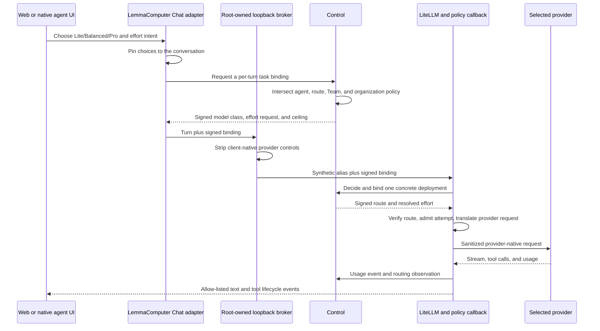

# Agent model and reasoning adapter playbook

This playbook records what was required to make governed model tiers and
thinking effort work through Claude and Hermes, why LiteLLM did not make the
whole integration automatic, and how to qualify the next agent without
repeating the same investigation. The normative promotion rules remain in
[Reasoning adapter qualification](reasoning-adapter-qualification.md).

## The short answer about LiteLLM

LiteLLM removed most provider-wire work. It selects configured deployments,
normalizes common request fields, translates supported provider parameters,
and can bridge OpenAI-compatible Chat Completions requests to the Responses
API. That is valuable, but it begins after an agent has produced a request and
does not own LemmaComputer's product or security contract.

| Concern | Owner | Why LiteLLM cannot decide it |
| --- | --- | --- |
| Show `Lite`, `Balanced`, and `Pro` in a native client | Agent adapter | Each desktop or CLI has a different model-discovery and capability UI |
| Show only qualified thinking levels | Agent adapter plus Control | Similar labels do not prove equivalent client or provider behavior |
| Keep model mode and effort stable for a conversation | LemmaComputer Chat | This is product state, not a provider request parameter |
| Enforce organization and Team ceilings | Control | LiteLLM does not own LemmaComputer tenancy, policy, or authorization |
| Prevent a workspace client from escalating effort | Loopback broker plus signed task binding | A client-controlled `reasoning_effort` field is not trusted policy |
| Translate the resolved effort to a provider API | LiteLLM and its provider adapter | This is the model-agnostic translation LiteLLM is designed to perform |
| Bind execution to one approved deployment | Control plus the LiteLLM callback | Ordinary router selection is not sufficient evidence for governed execution |
| Admit spend and record immutable evidence | Control ledger plus the LiteLLM callback | LiteLLM usage data is an input, not LemmaComputer's accounting authority |
| Suppress hidden reasoning from product surfaces | Agent event adapter | Provider normalization does not define Web Chat or Activity disclosure |

The reusable rule is: **the agent submits product intent, Control authorizes
it, and LiteLLM translates the authorized result**. Do not let an agent's
native setting and the governed task binding become two independent effort
authorities.

## Shared request path

The model name returned by a compatibility endpoint can remain a synthetic
label such as `lemmacomputer-auto`. It is not evidence of the executed model.
The authoritative evidence is the usage admission and routing observation,
which record the selected service class, provider, concrete model, requested
effort, resolved effort, outcome, latency, and cost status.

## Product contract

- Model mode is explicit `Lite`, `Balanced`, or `Pro`. There is no employee
  Auto model mode.
- Thinking effort is the product intent `Auto`, `Low`, `Medium`, or `High` in
  LemmaComputer Chat. A native client may expose the qualified subset only.
- `Auto` thinking is resolved by Control; it is not forwarded as a provider
  value.
- Mode and effort are immutable for the life of a conversation. Changing one
  starts a new conversation.
- The exact agent catalog ID and runtime version must have a qualified adapter.
- The exact provider/model route must independently qualify the resolved
  effort. Agent qualification never implies route qualification.
- Client-supplied `think`, `thinking`, `output_config`, `reasoning`, and enabled
  `reasoning_effort` fields are removed at the workspace trust boundary.
- The narrow Chat Completions value `reasoning_effort: none` may pass only as a
  non-escalating opt-out for a request that does not enable governed reasoning.
- Hidden reasoning content is never exposed or persisted. Only bounded usage
  units and allow-listed activity are retained.

## Claude adapter

Claude required two distinct adaptations.

### Native model presentation

Claude Desktop validates gateway model identifiers against its built-in model
catalog before enabling some native capabilities. The managed configuration in
[`lemmacomputer-claude-config.py`](../../docker/workspace/lemmacomputer-claude-config.py)
therefore projects three exact, Anthropic-shaped client identifiers with the
labels `Lite`, `Balanced`, and `Pro`. Their trailing release dates are adapter
identifiers only. The root-owned loopback broker maps them to provider-neutral
service classes; they do not select or require a direct Anthropic route.

This is intentionally a client compatibility shim. Do not move those synthetic
identifiers into Control routing or infer the provider from them.

### Governed thinking effort

Claude CLI `2.1.215` is registered by exact version. LemmaComputer Chat stores
the conversation effort, Control signs it into every turn, and the broker strips
Claude-native provider controls before LiteLLM sees the request. A qualified
direct-Anthropic route then maps the resolved value to adaptive thinking plus
`output_config.effort`.

The important lesson is that a working Claude effort menu is not the authority.
The signed task binding and route qualification are the authority. This makes
the same Claude client usable with a different organization route when that
route separately qualifies the product level.

See [Governed thinking-effort qualification](claude-reasoning-effort.md) for
the exact Claude pin and route record.

## Hermes adapter

Hermes Agent CLI is pinned to `0.19.0` from upstream tag `v2026.7.20` and Hermes
Desktop is pinned to `0.17.0`. Source inspection showed that Hermes already had
model and reasoning settings, but its upstream choices and request lifecycle did
not directly implement LemmaComputer's governed contract.

### Model and effort presentation

The generated Hermes profile in
[`lemmacomputer-hermes-config.py`](../../docker/workspace/lemmacomputer-hermes-config.py)
points its custom provider at a root-owned loopback broker and chooses one of
`lemmacomputer-lite`, `lemmacomputer-balanced`, or `lemmacomputer-pro`.
The Desktop patch in
[`hermes-desktop-governed-effort.patch`](../../docker/workspace/hermes-desktop-governed-effort.patch)
narrows upstream Minimal, Low, Medium, High, Extra High, Max, and Ultra choices
to the qualified product values Low, Medium, and High on LemmaComputer routes.

The profile deliberately keeps Hermes's global `reasoning_effort` disabled.
That does **not** disable governed provider reasoning. It prevents mutable
process-global Hermes configuration from becoming a second authority. A native
Low, Medium, or High selection is read as intent by the loopback broker, sent to
Control for validation, and returned as a signed per-request binding.

### Request-local identity and binding

The patched Hermes API server carries the signed task binding and the canonical
agent-instance UUID in request-local state into the model request. Do not use a
slash command, prompt injection, global environment mutation, or one shared
in-memory effort value: Hermes Desktop and Web Chat can have concurrent
sessions, and one session must not change another session's route or effort.

### Tools plus OpenAI reasoning

The qualified managed OpenAI route uses `gpt-5.6-luna`, `gpt-5.6-terra`, or
`gpt-5.6-sol` for the three service classes. OpenAI rejects function tools plus
reasoning effort on the legacy Chat Completions wire path. LiteLLM `1.93.0`
already knows how to bridge that combination to the Responses API. No
Hermes-specific OpenAI request translator was added.

The integration still needed one callback fix. During the bridge, LiteLLM
re-enters the deployment hook as `acompletion` while marking the nested request
with `aresponses=true`. The callback originally recognized only a Responses
call-type name and treated the nested provider request as an unbound second
attempt. The final implementation accepts that re-entry only when all of these
remain true:

1. the outer attempt has a callback-signed admission chain;
2. the nested request carries LiteLLM's pinned `aresponses=true` bridge marker;
3. provider and deployment exactly match the already verified decision; and
4. callback-owned metadata is removed again before provider dispatch.

An ordinary changed call, unsigned call, provider mismatch, or deployment
mismatch still fails closed. The implementation is in
[`lemmacomputer_policy_callback.py`](../../integrations/litellm/lemmacomputer_policy_callback.py).

## What failed, and what each failure taught us

| Observed failure | Root cause | Durable fix or lesson |
| --- | --- | --- |
| Native UI showed unsupported effort labels | Hermes upstream labels are broader than the product contract | Filter native choices only for LemmaComputer custom-provider routes |
| Provider rejected an unknown `think` parameter | Native/provider spellings crossed the workspace boundary | Strip every client-native reasoning spelling before governed routing |
| Balanced appeared to execute Luna | Compatibility response labels and stale route evidence were mistaken for execution evidence | Use the admission ledger; match canonical `provider/model` IDs to reviewed route records |
| Control returned 422 for reasoning | Older immutable route records had no reasoning projection and an older MVP policy had no maximum ceiling | Project capabilities only for exact reviewed routes and upgrade only recognized historical policy hashes |
| Function tools plus effort failed on Chat Completions | The selected OpenAI model requires the Responses transport for that combination | Let LiteLLM perform its supported bridge; do not write an agent-specific provider translator |
| The bridged request then returned 503 admission unavailable | LiteLLM's internal nested request used `acompletion` plus `aresponses=true`; our callback recognized the wrong marker | Qualify the exact pinned LiteLLM re-entry contract and reuse only the signed exact-deployment admission |
| A successful response produced a callback warning | Unpriced usage returned a currency without a provider cost | Send `actualCost` and `currency` only as a complete pair; unknown cost is not zero |
| Routing observation insert failed | Workspace authorization policy and model-routing policy are separate version domains | Preserve both independently; never require their IDs to be equal |

The sequence took longer because several fail-closed layers surfaced one at a
time. Fixing the provider transport revealed callback admission behavior;
fixing admission revealed telemetry validation. This is expected for a governed
gateway unless the live test exercises the complete stream, tool, and callback
path at the start.

## Faster workflow for the next agent

### 1. Inspect and pin before implementing

- Pin the exact runtime package, binary, tag, commit, and checksum.
- Locate model discovery, effort settings, first-turn and resume APIs,
  streaming events, tool events, and hidden-reasoning events.
- Record a discovery adapter first. Do not expose product controls yet.
- Inspect the exact pinned LiteLLM version when relying on a protocol bridge;
  do not assume its hook call types or metadata propagation.

### 2. Define the product projection

- Map native model choices to only `Lite`, `Balanced`, and `Pro`.
- Map or narrow native effort choices to the product contract.
- Treat every native selection as untrusted intent until Control signs it.
- Keep the selection request-local and conversation-stable.

### 3. Prove the trust boundary with fixtures

- Valid Low, Medium, and High requests survive as signed intent.
- Unsupported values and over-policy values fail closed.
- Forged provider reasoning fields are removed.
- A signed service class cannot resolve to a different deployment.
- First turn, resumed turn, and concurrent sessions preserve separate bindings.
- Hidden thinking is absent from transcript, Activity, logs, and artifacts.

### 4. Run the hardest live request first

Do not begin with a plain `1+1` request. For every model tier and effort level,
start with the combination most likely to expose integration gaps:

- streaming enabled;
- function tools present with automatic selection;
- a prompt that actually requires one governed tool;
- a resumed turn in the same conversation;
- a concurrent conversation at a different effort;
- inspection of the usage admission and routing observation after completion.

Check the ledger for requested and selected service class, concrete provider
model, requested and resolved effort, outcome, latency, cost status, and tool
terminal state. Do not use the response's compatibility model label as proof.

### 5. Test translation and governance separately

- A direct LiteLLM provider fixture proves provider parameter translation.
- A loopback broker fixture proves stripping and signed task binding.
- A Control fixture proves adapter, route, Team, and organization intersection.
- A callback fixture proves route verification, admission, internal bridge
  re-entry, sanitized provider dispatch, and completion evidence.
- The end-to-end live run proves those layers compose correctly.

### 6. Qualify and promote narrowly

Register only the exact runtime version, LiteLLM version, provider/model route,
and effort levels that passed. A runtime or gateway upgrade creates a new
discovery record and qualification ID. Do not widen an existing registration
because the new version has fields with familiar names.

## Implementation and evidence record

The main implementation trail is intentionally preserved in Git:

| Commit | Purpose |
| --- | --- |
| `42948b5` | Conversation-pinned Claude effort, signed binding, route capability, ledger fields, and Web Chat control |
| `6c6ec1c` | General runtime-adapter and provider-route qualification seams |
| `469aa6f` | Provider-neutral promotion gates and Hermes discovery integration |
| `2a07b47` | Safe reasoning-off behavior for tool-capable Chat Completions requests |
| `9992084` | Hermes native model/effort intent and governed OpenAI Responses transport |
| `125c97d` | Canonical provider-model matching and recognized legacy route/policy compatibility |
| `d05a5a0` | Correct unpriced completion evidence |
| `fd84fcb` | Separation of workspace-policy and routing-policy observation domains |
| `f1a024a` | Signed admission reuse across LiteLLM's internal Responses bridge |

The final live Hermes check used Balanced plus Medium, streaming, and a function
tool with automatic selection. The admission recorded `balanced -> balanced`,
`medium -> medium`, and concrete model `openai/gpt-5.6-terra`; completion and
routing observations were successful. No credential, prompt, response, signed
binding, workspace ID, or provider payload is retained in this document.

This evidence proves the reported desktop transport failure was repaired. A
release qualification should still retain one representative human-verified
governed tool execution and record provider-confirmed cache, reasoning-token,
latency, and cost availability without inventing missing values.
