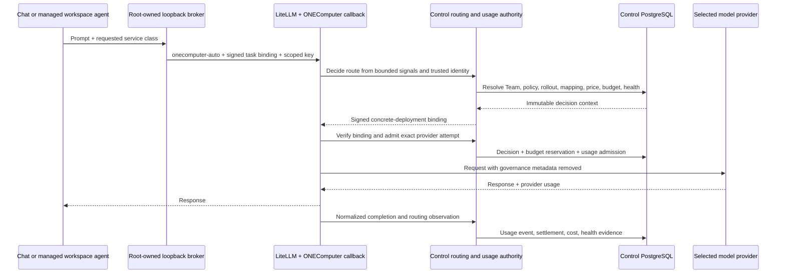

# AI control plane

The administrator-only AI control plane is the product surface for governing
model supply, selection, price, allocation, budgets, usage quality, and spend.
Administrators open it from the account menu. It is separate from personal
Settings and from the employee Activity panel, and it is not general employee
navigation. Every read and write is tenant-scoped in both `customer-managed`
and `hosted` deployment profiles.

## Surface map

| View | Purpose | Authoritative state |
| --- | --- | --- |
| Overview | Current-month provider cost, Team budget coverage, spend trend, top Teams, and the disclosed token-emissions proxy | Usage ledger, Team budgets, and configured provider serving-grid assumptions |
| Models & providers | Write-only provider credentials, approved model inventory, capabilities, route health, and estimated serving grid | LiteLLM credential/model APIs plus tenant-scoped lifecycle metadata in Control |
| Model routes | Immutable Lite/Balanced/Pro deployment mappings, Team eligibility, shadow evidence, reviews, rollout mode, and kill switch | Control PostgreSQL routing records |
| Pricing | Immutable deployment rate-card versions and pricing coverage | Control PostgreSQL rate cards and the pinned local catalogue |
| Teams & budgets | Spend-allocation membership, default spending Team, period budgets, enforcement, overrides, and reconciliation | Control PostgreSQL Team, ledger, reservation, and budget records |
| Data health | Active pricing gaps, admitted attempts awaiting usage, failed attempts without usage, and historical review baselines | Usage admissions/events and append-only cost-coverage acknowledgements |
| Spend Details | Date-filtered spend, exports, Team/user/task drill-down, safe cost drivers, attempts, usage buckets, and price evidence | Frozen tenant-scoped read model over the append-only usage ledger |

Spend Details opens from Overview and returns there. It is not a separate
Settings destination. Provider configuration also lives here, under **Models &
providers**, rather than in personal Settings.

## Governed request and accounting flow

Admission fails closed when routing, ledger, budget, or required pricing state
is unavailable. Completion recording is best effort after a provider response;
an admission without a final usage event remains visible in Data health for
reconciliation. The gateway never falls back outside the concrete deployment
in the signed decision.

## Model selection scopes

Auto, Lite, Balanced, and Pro are service contracts, not provider models.
There are two user selection scopes:

- **Workspace default:** saved in the policy-bounded workspace configuration
  and used when starting a new conversation.
- **Conversation override:** selected in Chat and sent with each turn. The Web
  client remembers it in browser-local storage using the workspace, agent, and
  conversation IDs. It does not become a global preference or change the
  workspace default.

Clearing site data or opening another browser loses the local conversation
override. Unsupported saved values fall back to Auto. Regardless of the UI
choice, governed traffic uses the single synthetic `onecomputer-auto` transport
alias; the requested class is trusted only after Control evaluates the signed
task and workspace context.

An explicit Lite, Balanced, or Pro request bypasses Auto task classification,
but it does not bypass identity or Team policy, capabilities, residency,
deployment health, price integrity, currency, or budget checks. A denied or
ineligible explicit class fails closed.

## Administrator setup order

1. Configure and test at least one provider and its approved models in **Models
   & providers**.
2. Add complete immutable rate cards in **Pricing** for every deployment that
   may carry governed traffic.
3. Publish an immutable Lite/Balanced/Pro mapping in **Model routes** using the
   provider-reported capability inventory.
4. Create Teams, assign each active user a default spending Team, and configure
   budgets where enforcement is required.
5. Set up each Team's routing policy in shadow mode, review a representative
   evidence window, and explicitly enable production routing only after a
   passing immutable review.
6. Monitor Overview, Spend Details, and Data health. Use the kill switch to
   append a disabled rollout when production routing must return to its fixed
   deployment.

Provider setup, pricing, mapping, policy, and rollout are separate authorities.
Saving a provider key does not automatically price it, assign it to a service
class, or enable production Auto routing.

## Evidence and privacy boundaries

The control plane stores identities, Team snapshots, bounded routing signals,
candidate eligibility, price evidence, normalized usage, costs, latency,
outcomes, and safe count-based cost drivers. It does not store prompts,
responses, hidden reasoning, screenshots, retrieved content, raw tool
arguments, OAuth tokens, provider keys, or signed URLs in governance records.

The Overview does not present a general-purpose spend Explainability score.
Spend task drill-down may show only allow-listed cost-driver counts backed by a
recorded usage event. The emissions card is a separately disclosed operational
token proxy and appears as a number only when an administrator has configured a
supported estimated serving grid; it is not a provider-specific footprint or
an assurance-ready inventory.

See [Governed model routing](model-routing.md), [AI usage and cost
ledger](ai-usage-ledger.md), [AI spend observability](ai-spend-observability.md),
[Team budgets](team-budgets.md), and [AI token operational-emissions
estimate](ai-token-emissions.md) for the detailed contracts.
