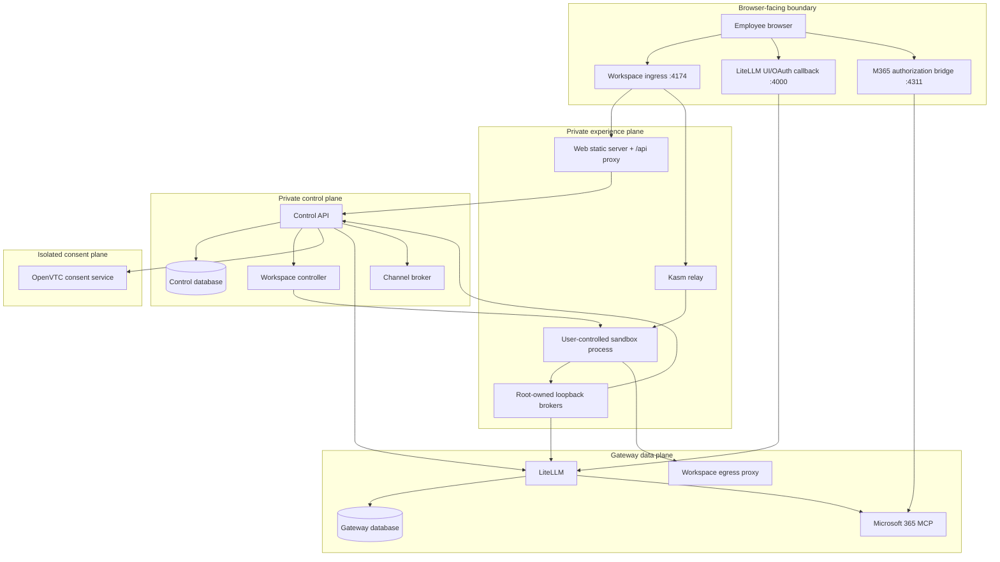
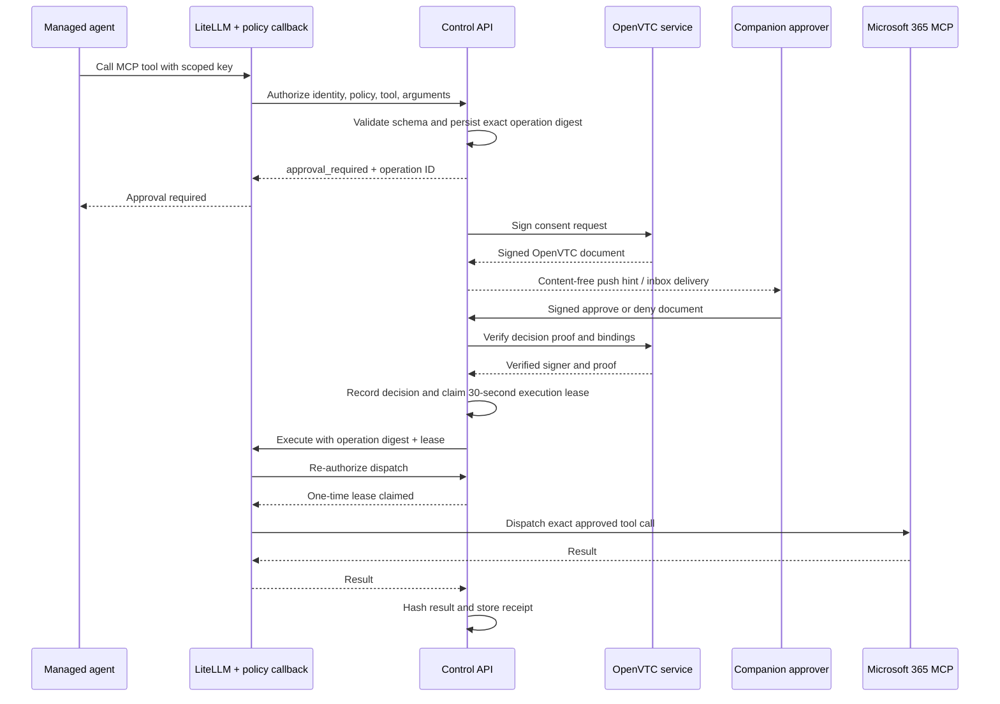

# Architecture and trust model

ONEComputer is a policy and credential boundary around user-facing AI
applications. Its design goal is to preserve the product experience of
frontier AI tools while moving enterprise authority out of the employee's
sandbox.

## Design principles

### Credentials stay outside the workspace

The workspace must not receive provider API keys, the LiteLLM master key,
Microsoft OAuth tokens, Control service credentials, policy-signing keys, the
Docker socket, or external-channel credentials.

Control creates a short-lived LiteLLM virtual key for a specific tenant, user,
workspace, agent, model route, MCP server, tool set, policy version, budget, and
rate limit. A root-owned loopback broker inside the managed image holds that
scoped key. User applications authenticate to the local broker with a
non-authoritative local credential.

OAuth tokens for Microsoft 365 are held in the gateway boundary and persisted
by LiteLLM using its stable salt key. Telegram bot credentials are encrypted by
the out-of-workspace channel broker before storage.

### Policy is projected, signed, and re-verified

Identity policy is persisted by Control. Before provisioning, Control derives
the effective runtime policy and signs a canonical bundle with Ed25519. The
bundle binds:

- tenant, subject, and workspace;
- policy identifier, version, and document hash;
- workspace profile, selected applications, and agents;
- model alias and MCP server;
- tool decisions and egress security-group version;
- gateway and Control endpoints;
- issue and expiry times.

The workspace controller verifies this bundle before passing it to a sandbox
adapter. The managed workspace entrypoint verifies it again before configuring
applications or starting credential brokers. A mismatch, unknown signing key,
expired bundle, or missing projection fails closed.

### Network reachability is capability

Local workspaces are attached to an internal, per-workspace Docker network.
Control attaches only the gateway, Control API, and relay that a projected
policy requires. The user environment has no general route to model providers,
Microsoft Graph, PostgreSQL, Docker, or the OpenVTC service.

When a policy assigns web egress, the controller creates a dedicated proxy
sidecar. The sidecar:

- accepts only an HMAC grant bound to the tenant, subject, workspace, agent,
  security-group version, and policy hash;
- normalizes hostnames and rejects IP literals and wildcards;
- resolves DNS before applying policy and denies private or disallowed targets;
- enforces protocol, hostname, and port rules;
- records allow and deny decisions without logging request bodies.

### Approval is bound to an exact action

An approval is not a reusable permission. A protected MCP call is canonicalized
and bound to its identity, workspace, agent, policy version, tool schema, tool
name, and arguments. After a verified approval, Control issues one 30-second
execution lease. The LiteLLM callback asks Control to claim that exact lease
before dispatching the tool. Replays, changed arguments, partial bindings, and
expired leases are denied.

## Trust boundaries

The three loopback-published ports in the reference deployment are different
security surfaces:

- `4174` is the product origin and authenticated workspace ingress.
- `4000` is the gateway administrator/OAuth callback surface.
- `4311` is a local browser bridge for the Microsoft connector.

They require authenticated reverse proxies, TLS, and an intentional routing
design in any networked deployment.

## Core flows

### Authentication and policy assignment

1. The Web server proxies `/api` to Control and adds an internal proxy token.
2. Control starts an Entra authorization-code flow with PKCE, state, and nonce.
3. Control verifies issuer, audience, tenant, nonce, and callback state.
4. The external Entra identity is mapped to an owned tenant/user record.
5. A random session token is stored as a hash and returned in an HttpOnly,
   SameSite cookie.
6. Control loads the user's immutable effective policy for every protected
   route. Administrator status is derived from the configured bootstrap email
   allowlist on first sign-in.

The Web proxy token is not a user identity. It only identifies the trusted Web
process; the session cookie establishes the employee principal.

### Workspace provisioning

1. The employee saves a configuration constrained to applications, agents, and
   model aliases assigned by policy.
2. Control derives the runtime policy, signs it, and creates scoped gateway and
   agent grants.
3. Control sends the signed bundle and grants to the controller over an
   authenticated internal API.
4. The controller verifies signature, expiry, policy hash, workspace binding,
   and grant projection.
5. The sandbox adapter creates a persistent home volume, an internal workspace
   network, optional egress sidecar, managed desktop, and Kasm relay.
6. The workspace entrypoint verifies policy again, writes managed application
   configuration, starts only selected applications/agents, and reports ready.

For the local driver, the controller talks to the Docker socket. For a
production Kasm deployment, it uses the Kasm Developer API adapter and does not
need host Docker authority.

### Model request

1. The managed AI client calls its local loopback broker.
2. The broker restricts paths and forwards the request with its
   workspace-and-agent LiteLLM key.
3. LiteLLM validates key expiry, model allowlist, identity metadata, budget,
   concurrency, RPM, and TPM limits.
4. LiteLLM selects the single configured provider deployment. Cross-provider
   fallback is deliberately disabled.
5. Raw prompts and responses are not written by the configured gateway
   logging path.

Claude Desktop accepts only model identifiers from its built-in model catalog.
The LiteLLM adapter therefore projects policy aliases onto a small set of
client-compatible transport aliases. Gateway key metadata retains both the
policy alias and client alias for auditability.

### Governed Microsoft 365 operation

Read operations can be assigned `allow`; protected operations use
`approval_required`; denied or unassigned capabilities never reach the
connector. Connector-side `confirm` fields are treated as defense in depth and
are excluded from the user-controlled operation fingerprint.

## Compose network topology

| Network | Members | Internet route |
| --- | --- | --- |
| `public-edge` | ingress | Yes, for the host-published product origin |
| `web-edge` | ingress, Web, Control | No |
| `onecomputer-control` | Control, controller, channel broker, ingress, dynamic relays | No |
| `consent-private` | Control, OpenVTC | No |
| `gateway-private` | Control, LiteLLM, gateway database, M365 MCP | No |
| `identity-egress` | Control | Yes, for Entra discovery and token exchange |
| `model-egress` | LiteLLM | Yes, for configured providers |
| `microsoft-egress` | M365 MCP | Yes, for Microsoft identity and Graph |
| `channel-egress` | channel broker | Yes, for configured channel providers |
| dynamic workspace network | one sandbox plus selected gateway/control sidecars | No |
| dynamic egress network | per-workspace egress proxies | Yes, policy enforced |

Docker network membership limits reachability; application authentication and
signed bindings remain mandatory even on private networks.

## State and recovery

Control PostgreSQL is authoritative for identities, sessions, assignments,
workspace records, signed-policy keys, connection metadata, OpenVTC enrollment,
operations, execution leases, receipts, audit events, and channel routes.

LiteLLM PostgreSQL owns gateway keys, model configuration stored by LiteLLM,
and user OAuth state. Per-workspace home directories are Docker volumes for the
local sandbox driver. These three state classes must be backed up and restored
consistently for disaster recovery.

Operation transitions and execution claims use database concurrency controls.
An interrupted execution lease can be recovered, but a completed dispatch
cannot be replayed with the same lease.

## Security invariants

Changes must preserve these invariants:

- no provider, OAuth, channel, signing, or infrastructure credential enters a
  user process;
- every workspace grant is tenant/user/workspace/agent/policy scoped and
  revocable;
- every runtime policy is signed and independently verified;
- MCP policy failure is a denial, never an implicit allow;
- a protected operation executes only after verified, exact, unexpired consent;
- an execution lease is complete, short-lived, and one-time;
- egress defaults to deny and evaluates resolved destinations;
- logs redact authorization headers, tokens, arguments, request bodies, launch
  URLs, and OAuth callback query strings;
- externally reachable routes are explicit and minimal.
