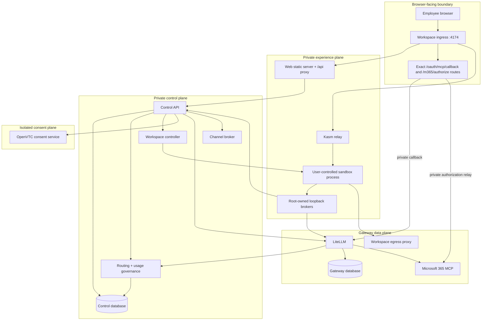
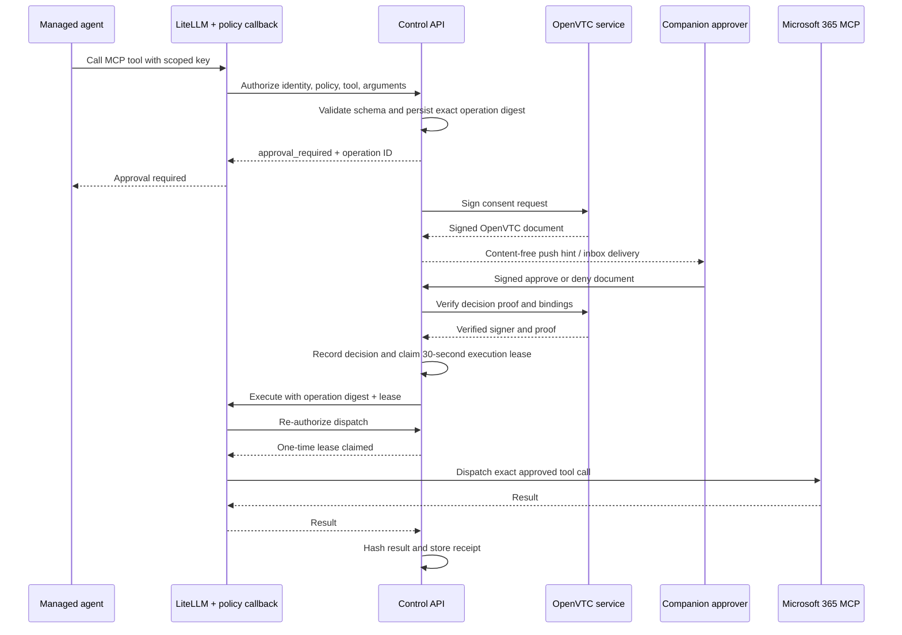

# Architecture and trust model

LemmaComputer is a policy and credential boundary around user-facing AI
applications. Its design goal is to preserve the product experience of
frontier AI tools while moving enterprise authority out of the employee's
sandbox.

## Design principles

### Credentials stay outside the workspace

The workspace must not receive provider API keys, the LiteLLM master key,
Microsoft OAuth tokens, Control service credentials, policy-signing keys, the
Docker socket, or external-channel credentials.

Control creates a short-lived LiteLLM virtual key for a specific tenant, user,
workspace, agent, model route, MCP server, tool set, policy version, and rate
limit. Governed workspaces receive the single synthetic `lemmacomputer-auto`
transport alias; the signed runtime policy and gateway metadata retain the
policy route and service-class context. A root-owned loopback broker inside the
managed image holds that scoped key. User applications authenticate to the
local broker with a non-authoritative local credential.

OAuth tokens for Microsoft 365 are held in the gateway boundary and persisted
by LiteLLM using its stable salt key. OpenAI, Anthropic, GLM, and Bedrock keys are write-only
administrator input: Control sends them directly to LiteLLM's private credential
API, which encrypts them in the gateway database. Control persists only
tenant-scoped route identifiers, lifecycle metadata, and a safe fingerprint—not
the raw provider key. Telegram bot credentials are encrypted by the
out-of-workspace channel broker before storage.

### Policy is projected, signed, and re-verified

Identity policy is persisted by Control. Before provisioning, Control derives
the effective runtime policy and signs a canonical bundle with Ed25519. The
bundle binds:

- tenant, subject, and workspace;
- policy identifier, version, and document hash;
- workspace profile, selected applications, and agents;
- model alias and MCP server;
- tool decisions and egress security-group version;
- gateway and Control endpoints;
- issue and expiry times.

The workspace controller verifies this bundle before passing it to a sandbox
adapter. The managed workspace entrypoint verifies it again before configuring
applications or starting credential brokers. A mismatch, unknown signing key,
expired bundle, or missing projection fails closed.

### Network reachability is capability

Local workspaces are attached to an internal, per-workspace Docker network.
Control attaches only the gateway, Control API, and relay that a projected
policy requires. The user environment has no general route to model providers,
Microsoft Graph, PostgreSQL, Docker, or the OpenVTC service.

When a policy assigns web egress, the controller creates a dedicated proxy
sidecar. The sidecar:

- accepts only an HMAC grant bound to the tenant, subject, workspace, agent,
  security-group version, and policy hash;
- normalizes hostnames and rejects IP literals and wildcards;
- resolves DNS before applying policy and denies private or disallowed targets;
- enforces protocol, hostname, and port rules;
- records allow and deny decisions without logging request bodies.

### Approval is bound to an exact action

An approval is not a reusable permission. A protected MCP call is canonicalized
and bound to its identity, workspace, agent, policy version, tool schema, tool
name, and arguments. After a verified approval, Control issues one 30-second
execution lease. The LiteLLM callback asks Control to claim that exact lease
before dispatching the tool. Replays, changed arguments, partial bindings, and
expired leases are denied.

## Trust boundaries

The reference deployment publishes one browser-facing product origin on port
`4174`. Workspace ingress owns that origin and exposes only the exact MCP OAuth
routes needed by browsers: `GET /oauth/mcp/callback` for private LiteLLM and
`GET /m365/authorize` for the private Microsoft connector bridge. LiteLLM and
the bridge do not publish host ports. A networked deployment terminates TLS at
the public load balancer or reverse proxy and forwards this origin to workspace
ingress; it must not expose the private upstream services directly.

See [MCP networking, egress, and OAuth callbacks](mcp-networking.md) for the
complete inbound browser flow, outbound proxy decisions, redirect handling,
and provider callback-registration contract.

### LiteLLM is an execution boundary, not the governance authority

LiteLLM has four distinct interfaces in this system:

| Interface | Caller | Purpose |
| --- | --- | --- |
| Private administrator API | Control | Create or revoke encrypted provider credentials, dynamic tenant model routes, scoped virtual keys, MCP server records, and non-authoritative Team budget projections |
| Workspace data API | Root-owned loopback broker | Submit governed model requests and discover or call only the MCP tools allowed by the current workspace-and-agent key |
| Browser OAuth surface | Employee browser through a Control-created connection flow | Complete per-user connector authorization while keeping access and refresh tokens inside LiteLLM |
| LemmaComputer callback | LiteLLM internal request hooks | Ask Control to decide and verify model routes, admit usage, authorize MCP calls, claim protected-operation leases, and record completion evidence |

Control remains authoritative for identity and tool policy, service-class
routing, approval state, Team budgets, and usage accounting. LiteLLM owns
provider and OAuth credential custody and performs the authorized upstream
operation. Its static model list is empty: managed provider deployments are
tenant-scoped database records created through the private API, and governed
workspace keys expose only the synthetic `lemmacomputer-auto` alias.

See [LiteLLM gateway architecture](litellm-gateway-architecture.md) for the
full provider lifecycle, grant projections, Auto-switching sequence, MCP/OAuth
flows, state custody, budget defense in depth, and failure matrix.

## Core flows

### Authentication and policy assignment

1. The Web server proxies `/api` to Control and adds an internal proxy token.
2. Control starts an Entra authorization-code flow with PKCE, state, and nonce.
3. Control verifies issuer, audience, tenant, nonce, and callback state.
4. The immutable external identity resolves to an account user, organization
   membership, and organization-local subject; email is display/contact data.
5. Customer-managed directory JIT creates a member. Hosted sign-in requires an
   existing membership. Only an explicitly configured immutable Entra object
   ID can perform the one-time organization-owner bootstrap.
6. A random session token is stored as a hash, bound to the selected active
   membership, and returned in an HttpOnly, SameSite cookie.
7. Control loads the membership role and fixed permission mapping for every
   protected route. Provider claims never grant product authority. Runtime
   policy assignment remains separate from organization RBAC.

The Web proxy token is not a user identity. It only identifies the trusted Web
process; the session cookie establishes the employee principal.

### Workspace provisioning

1. The employee saves a configuration constrained to applications, agents,
   the governed model route, and available default service classes assigned by
   policy.
2. Control derives the runtime policy, signs it, and creates scoped gateway and
   agent grants.
3. Control sends the signed bundle and grants to the controller over an
   authenticated internal API.
4. The controller verifies signature, expiry, policy hash, workspace binding,
   and grant projection.
5. The sandbox adapter creates a persistent home volume, an internal workspace
   network, optional egress sidecar, managed desktop, and Kasm relay.
6. The workspace entrypoint verifies policy again, writes managed application
   configuration, starts only selected applications/agents, and reports ready.

For the local driver, the controller talks to the Docker socket. For a
production Kasm deployment, it uses the Kasm Developer API adapter and does not
need host Docker authority.

### Model request

1. Chat or the managed AI client selects a requested service class. The
   workspace configuration supplies the default; Chat may apply a
   per-conversation override. Auto, Lite, Balanced, and Pro are product
   contracts rather than provider model names.
2. The root-owned loopback broker restricts paths, removes requester-supplied
   LemmaComputer and LiteLLM routing metadata, and forwards
   `lemmacomputer-auto` with its workspace-and-agent key and signed task binding.
3. LiteLLM validates key expiry, the synthetic model allowlist, trusted
   identity metadata, concurrency, and RPM limits. Token usage is metered
   without a LemmaComputer-imposed per-minute allowance.
4. The LemmaComputer callback asks Control for a routing decision. Control
   resolves the subject's default spending Team, immutable Team and identity
   policies, rollout mode, mapping, provider capability and health evidence,
   effective rate card, currency, residency, and budget eligibility.
5. Control records the decision and candidate evidence, then returns a
   short-lived signed binding for one concrete deployment. LiteLLM verifies the
   binding against the selected deployment immediately before dispatch and
   admits the exact provider attempt to the usage ledger and Team budget.
6. The callback removes governance and authentication internals from the
   provider request. LiteLLM never falls back outside the signed concrete
   deployment. Explicit Lite, Balanced, or Pro requests skip Auto
   classification but remain subject to every policy, capability, price,
   health, residency, and budget check.
7. After completion, the callback records normalized usage, cost and routing
   observation evidence. Provider availability failures temporarily mark that
   deployment unavailable; a later success clears the signal. A missing final
   usage event leaves the admission visible for reconciliation.

Raw prompts and responses are not written by the configured gateway logging
path or the governance ledger.

Claude Desktop accepts only model identifiers from its built-in model catalog.
The LiteLLM adapter therefore projects policy aliases onto a small set of
client-compatible transport aliases. Gateway key metadata retains both the
policy alias and client alias for auditability.

### Governed Microsoft 365 operation

Read operations can be assigned `allow`; protected operations use
`approval_required`; denied or unassigned capabilities never reach the
connector. Connector-side `confirm` fields are treated as defense in depth and
are excluded from the user-controlled operation fingerprint.

## Compose network topology

| Network | Members | Internet route |
| --- | --- | --- |
| `public-edge` | ingress | Yes, for the host-published product origin |
| `web-edge` | ingress, Web, Control | No |
| `lemmacomputer-control` | Control, controller, channel broker, scheduler worker, ingress, dynamic relays | No |
| `consent-private` | Control, OpenVTC | No |
| `gateway-private` | Control, LiteLLM, gateway database, M365 MCP, model egress proxy | No |
| `identity-egress` | Control | Yes, for Entra discovery and token exchange |
| `model-egress` | model egress proxy, remote-MCP egress proxy | Yes, restricted by separate model and remote-MCP policies |
| `microsoft-egress` | M365 MCP | Yes, for Microsoft identity and Graph |
| `channel-egress` | channel broker | Yes, for configured channel providers |
| dynamic workspace network | one sandbox plus selected gateway/control sidecars | No |
| dynamic egress network | per-workspace egress proxies | Yes, policy enforced |

Docker network membership limits reachability; application authentication and
signed bindings remain mandatory even on private networks.

LiteLLM is not attached to an internet-routed network. Normal model traffic
uses the model egress proxy and its static provider allowlist. Public MCP
servers use a separate, version-pinned strict client: it explicitly selects the
remote-MCP egress proxy and ignores proxy environment variables and `NO_PROXY`.
That applies to tool discovery, calls, OAuth metadata, dynamic registration,
token exchange, refresh, and every redirect. The proxy resolves every DNS
answer, rejects private or mixed answers, pins the selected public IP, checks
TLS SNI, and evaluates every redirect connection independently. The private
Microsoft MCP connector is explicitly classified as internal and stays on its
private route.

The remote-MCP proxy has its own LiteLLM service credential, a default-deny
empty static policy, and an authenticated Control callback that receives only
normalized protocol/host/port values. Errors and timeouts deny the connection.
In hosted multi-tenant mode, custom MCP origins come from the deployment-owned
`LEMMACOMPUTER_HOSTED_MCP_EGRESS_ORIGINS` allowlist rather than tenant connector
records, so a tenant administrator cannot create a gateway-wide destination.

## State and recovery

Control PostgreSQL is authoritative for identities, sessions, assignments,
workspace records, signed-policy keys, connection metadata, OpenVTC enrollment,
operations, execution leases, receipts, audit events, and channel routes.
It also owns encrypted agent schedules and their content-free run metadata.

A dedicated scheduler worker polls this database and leases due occurrences.
It sends only run identifiers and lease tokens to Control. Control decrypts the
prompt, re-evaluates current ownership and policy, and dispatches through the
existing agent-chat bridge. The worker has no Docker socket, provider
credential, prompt key, or direct workspace-network access.

LiteLLM PostgreSQL owns gateway keys, encrypted provider credentials, model
configuration stored by LiteLLM, and user OAuth state. Control PostgreSQL owns
the tenant-scoped provider route metadata needed to govern those records. It is
also authoritative for Teams and default spending assignments, rate cards,
budgets and reservations, usage admissions/events/corrections, cost-coverage
review baselines, routing mappings and policies, rollout reviews and modes,
decisions and observations, and deployment-health evidence. These records are
append-only or versioned where they form accounting or governance evidence.
Per-workspace home directories are Docker volumes for the local sandbox driver.
These state classes must be backed up and restored consistently for disaster recovery.

Operation transitions and execution claims use database concurrency controls.
An interrupted execution lease can be recovered, but a completed dispatch
cannot be replayed with the same lease.

## Security invariants

Changes must preserve these invariants:

- no provider, OAuth, channel, signing, or infrastructure credential enters a
  user process;
- every workspace grant is tenant/user/workspace/agent/policy scoped and
  revocable;
- every runtime policy is signed and independently verified;
- every governed model dispatch matches a fresh signed concrete-deployment
  decision and a durable usage admission;
- service-class choice never bypasses Team/identity policy, price integrity,
  budget, capability, health, currency, or residency controls;
- MCP policy failure is a denial, never an implicit allow;
- a protected operation executes only after verified, exact, unexpired consent;
- an execution lease is complete, short-lived, and one-time;
- egress defaults to deny and evaluates resolved destinations;
- logs redact authorization headers, tokens, arguments, request bodies, launch
  URLs, and OAuth callback query strings;
- externally reachable routes are explicit and minimal.
