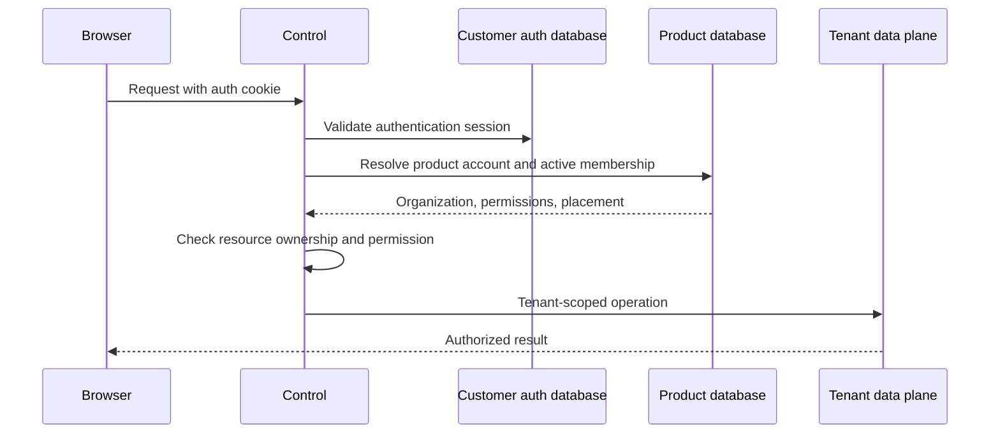

# Authentication and product access

**Current design.** Better Auth runs inside Control API for customer sign-in in
both production profiles. LemmaComputer separately authorizes product access.
See [ADR 0004](../adr/0004-better-auth-adoption-and-qualification.md) for the
original choice and [ADR 0007](../adr/0007-better-auth-only-customer-and-platform-authentication.md)
for removal of direct Microsoft identity adapters.

> Better Auth proves which account signed in. LemmaComputer decides which
> organization and resources that account may use.

## Boundaries

| Authority | Owns |
| --- | --- |
| Customer Better Auth realm | Credentials, factors, social and enterprise federation, provider links, authentication sessions |
| Product Control database | Product accounts, organizations, invitations, memberships, roles, active organization, placement, authorization and audit |
| Platform Better Auth realm | Hosted/worktree operator passkeys and sessions, isolated from customer sign-in |
| Tenant data plane | Tenant-scoped business records after authorization and placement |

Customer and platform realms have separate databases, runtime roles, secrets,
cookie namespaces, and audiences. Customer-managed installations expose no
platform operator realm. Microsoft 365 connector consent has its own
application; it is separate from customer sign-in.

The auth realm is embedded in Control API at `/api/v1/auth/customer/*`.
Hosted Control replicas share one logical customer auth database. A
customer-managed installation has its own customer auth database and exactly
one product organization; it needs no LemmaComputer-hosted identity service.
Enterprise SSO does not change tenant kind or data-plane placement.

## Protected request

Better Auth user UUIDs map to `account_users.id` without matching by email.
Provider-account links stay in the auth database. Email is mutable contact
data; provider groups, domains, and administrator claims never grant product
roles. Client-supplied organization or placement hints are not authority.

Every protected request checks an active auth session and an active product
account, organization, and membership. The product authorization context is
server-side and bound to the auth session. A suspended membership loses product
access even if its Better Auth cookie remains valid. Switching organizations
requires validating the new membership. A dedicated tenant database does not
create a second identity authority.

## Customer sign-in and admission

Supported customer methods are email/password, passkey, optional Google or
Microsoft social login, and tenant-configured SAML/OIDC. Operators enable only
the methods appropriate to their deployment. Better Auth handles protocol and
credential mechanics; LemmaComputer supplies tenant administration,
authorization, and audit. Do not implement password, MFA, OAuth, or SSO crypto
inside product code.

An invitation specifies the intended organization and product role. The
recipient follows a single-use activation flow and authenticates with an
enabled method. Control checks the current invitation, verified email,
reauthentication window, and server-side session before activating the
predetermined membership. An identity-provider role or email-domain claim
cannot redirect the invitation or raise its authority. Hosted delivery uses
transactional email; local/customer-managed deployments may use an explicitly
allowed copy-link flow.

Tenant SSO configuration is available only through a permission-checked
Control route. Test the provider before enforcement and retain an audited owner
recovery path. Better Auth's provider configuration and tokens remain in the
auth store; Control keeps non-secret status and policy. The Better Auth
Organization plugin is not the product IAM authority.

Account linking requires proof of both authenticated identities or an approved
recovery case. Matching email never links accounts. Unlinking, compromise,
recovery, and sign-out-all-devices revoke affected sessions and product
contexts. Sensitive owner, SSO, recovery, and support actions require recent
step-up. The last active owner cannot be removed.

## Platform operators

Hosted and worktree operators use an isolated, passkey-only Better Auth realm.
Initial hosted enrollment is restricted to the configured identity, one-time
secret, HTTPS origin, and a verified passkey. The temporary bootstrap
credential and sessions are deleted after enrollment. Customer sessions and
SSO cannot authenticate the operator realm. Support elevation has a target
organization, reason, scope, expiry, step-up, and audit; it is not a permanent
customer-account administrator flag.

## Storage, migration, and recovery

The four logical databases used by the full product are product Control,
customer auth, platform auth, and LiteLLM. Each has separate migration and
runtime authority as appropriate. Application startup checks compatibility;
only explicit migration jobs change schema. There are no cross-database
foreign keys.

Back up and restore a coordinated set of databases plus workspace homes,
artifact bytes, and matching secret versions. Recheck account mapping, session
revocation, tenant isolation, and schema compatibility in an isolated restore.
See [Database migrations](../guides/database-migrations.md) and
[Operations](../guides/operations.md#backup-and-restore).

Failures deny access where validation cannot complete. Auth database outage
denies sign-in/session validation; product database outage denies product
authorization; tenant data-plane outage must not select another tenant's data.
An external provider outage leaves only independently enabled methods. Never
fall back to a header, cached role, or provider claim.

## Qualification before go-live

The checked-in contract and `npm run qualify:better-auth` verify pins and
structural boundaries. A production deployment also needs live checks for its
enabled login methods, callbacks, email delivery, SSO enforcement and owner
recovery, session revocation, proxy headers, rate limits, backup/restore,
secret rotation, and cross-tenant denial. A passing structural test is not a
record of those live checks.
