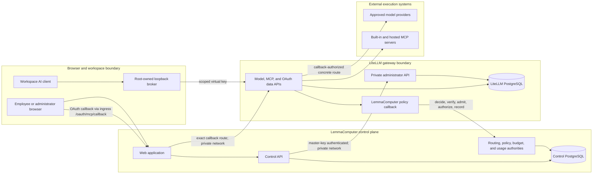
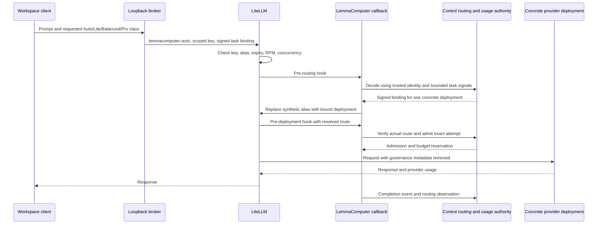

# LiteLLM gateway architecture

LiteLLM is LemmaComputer's model and MCP execution gateway. It is deliberately
not the source of truth for identity policy, service-class routing, approvals,
budgets, or usage accounting. Control decides what may happen; LiteLLM holds
the credentials and performs only the model or connector operation allowed by
the current scoped grant and Control decision.

This distinction is central to the architecture:

| Concern | Authority | LiteLLM responsibility |
| --- | --- | --- |
| Provider credentials and concrete model routes | LiteLLM stores encrypted credentials and dynamic route records; Control owns tenant-scoped lifecycle metadata | Encrypt provider keys, expose tenant-isolated deployments, and call the selected provider |
| Auto, Lite, Balanced, and Pro | Control routing policy, mappings, rollout evidence, and signed decisions | Accept the synthetic transport alias, invoke the callback, and dispatch only the signed concrete deployment |
| Workspace model access | Signed Control policy and grant projection | Enforce the short-lived virtual key's model allowlist, expiry, RPM, and concurrency |
| MCP server and tool access | Control connector policy and effective workspace policy | Store per-user OAuth state, filter discovery by the key's object permissions, and dispatch the resolved tool |
| Protected operations | Control operation state plus OpenVTC approval proof | Use an exact, short-lived execution key and call Control to claim the bound lease before dispatch |
| Spend and budgets | Control ledger, reservations, immutable prices, and Team budgets | Require admission before provider execution and maintain a non-authoritative LiteLLM Team limit mirror as defense in depth |
| Usage and routing evidence | Control PostgreSQL | Normalize provider usage and report completion and routing observations through the callback |

## Topology and interfaces

The diagram shows logical interfaces inside the LiteLLM process, not separate
containers. Control can use the master-key administrator interface from the
private gateway network. A workspace cannot: it reaches only the data API
through a root-owned loopback broker and a narrow virtual key. LiteLLM port
`4000` is private. Browser OAuth completion enters through the canonical
product origin at `GET /oauth/mcp/callback`, and workspace ingress rewrites
that exact route to LiteLLM's internal `/callback`. The built-in Microsoft 365
connector similarly uses `GET /m365/authorize` on the product origin before
ingress relays it to the private bridge on port `3000`. Neither upstream is
published directly.

## State and credential custody

The two PostgreSQL databases are separate trust domains. Control never reads or
joins against the LiteLLM schema.

| State | Stored by Control | Stored by LiteLLM | Available to a workspace process |
| --- | --- | --- | --- |
| Identity, tenant, workspace, agent, effective policy | Yes, tenant-scoped | Only bounded virtual-key metadata needed for enforcement | Only the signed projected policy needed by that workspace |
| Provider API key | No; only lifecycle metadata and a safe fingerprint | Yes, encrypted in the credential store | Never |
| Concrete provider model route | Tenant-scoped governance identifier, capability and lifecycle metadata | Dynamic model/deployment record and tenant access group | Never selected directly for governed traffic |
| User connector OAuth access/refresh token | No; only non-secret connection metadata | Yes, encrypted and user-scoped | Never |
| Workspace virtual key | Grant lifecycle and policy projection context | Hashed/enforced key record | Held only by the root-owned broker, not the user application |
| Routing decisions, prices, budgets, reservations, usage ledger | Yes; authoritative and versioned or append-only | Optional enforcement projection and transient callback context | No authority |
| Prompts, responses, hidden reasoning, raw tool arguments | Not stored in governance records | Raw request/response logging is disabled | Present only as needed for the active user request |

Provider credentials, the LiteLLM master key, OAuth tokens, and Control service
credentials must never enter a user-controlled sandbox process.

## Managed provider and model lifecycle

The static LiteLLM configuration intentionally has an empty `model_list`.
OpenAI, Anthropic, GLM (Z.ai), and Amazon Bedrock deployments are managed at
runtime from **AI control plane → Models & providers**:

1. An administrator submits a write-only provider credential and selects from
   LemmaComputer's reviewed model or Bedrock profile inventory.
2. Control sends the raw credential directly to LiteLLM's private credential
   API. LiteLLM encrypts it in its database; Control retains only safe
   tenant-scoped metadata and a fingerprint.
3. Control creates dynamic LiteLLM deployments that reference the stored
   credential. Each deployment carries an opaque tenant-specific access group
   and explicit capability metadata such as vision, tools, and streaming.
4. A temporary credential and route are used to test a candidate before the
   stable tenant route is activated.
5. Pricing, service-class mapping, Team policy, and rollout activation remain
   separate Control records. Adding a provider does not automatically make it
   eligible for governed traffic.
6. Rotation replaces the encrypted credential only after validation.
   Disabling or deleting a provider removes its routes and revokes affected
   workspace grants.

The reviewed inventory in
`packages/litellm-adapter/src/provider-settings.ts` is the code source of truth.
Operator documentation must not duplicate a model list that can drift. Static
provider routes and provider keys in Compose or environment variables are not
supported, and LiteLLM has no cross-provider fallback configuration.

## Workspace grant lifecycle

Control derives one deterministic, short-lived LiteLLM virtual key for each
workspace-and-agent projection. The record binds:

- tenant, subject, workspace, and agent identifiers;
- effective policy version and hash;
- exactly one permitted model projection;
- one or more MCP servers and a separate tool allowlist for each server;
- expiry, request-per-minute, and parallel-request limits.

Current governed workspaces are allowed only the synthetic
`lemmacomputer-auto` transport model. The key never grants every concrete model.
Trusted key metadata carries the requested policy alias, client-compatible
alias, and tenant access context so the callback can validate the later
Control decision. Legacy direct aliases remain a compatibility path and are
restricted to the tenant's access group.

When model policy, connector state, tool policy, or identity changes, Control
recomputes the projection. It updates or replaces the key only when the stored
identity and model projection match the intended scope. A failed connector
refresh revokes the grant rather than leaving stale tool access. Expired,
disabled, or disconnected connectors contribute no MCP server or tool
permissions.

## Governed model request and Auto switching

Auto, Lite, Balanced, and Pro are Control service contracts, not LiteLLM model
names. `lemmacomputer-auto` is a synthetic transport alias:

- **Auto** lets Control classify privacy-safe task signals and select an
  eligible service class.
- **Lite, Balanced, or Pro** supplies an explicit requested class, so Control
  skips Auto classification but still applies identity and Team policy,
  capability, residency, health, rate-card, currency, and budget checks.
- The signed decision binds one concrete tenant deployment. Immediately before
  provider dispatch, the callback verifies that LiteLLM resolved a route in
  the authorized tenant access group and asks Control to verify the binding.
- LiteLLM cannot silently choose another provider deployment. No eligible,
  correctly priced, healthy route means the request fails closed.

The callback removes LemmaComputer authentication, policy, routing, and
accounting metadata before provider dispatch. Raw prompts and responses are not
part of routing evidence and are not enabled in gateway logging.

## MCP grants, OAuth, and tool execution

LiteLLM also serves as the MCP aggregation and OAuth custody boundary. Model
access and connector access share the same workspace key, but they are
independent permissions: a valid model route does not imply access to any MCP
server or tool.

### Connect and discover

1. Control creates a short-lived connection key with no model access and only
   the selected connector's OAuth, status, and safe-discovery routes.
2. The browser completes the connector authorization flow through LiteLLM's
   ingress-owned `/oauth/mcp/callback` surface. LiteLLM stores the per-user
   token; Control and the browser do not receive the access or refresh token.
3. Control asks LiteLLM for connection status and performs scoped safe tool
   discovery. A Microsoft 365 connection key may additionally call only the
   non-secret `get-current-user` label lookup.
4. Control intersects discovered tools with organization, identity, and agent
   policy, then refreshes the user's workspace grants with only the remaining
   server/tool pairs.
5. Disconnect, expiry, policy disablement, or failed renewal removes that
   connector from future grants and triggers refresh or revocation of existing
   grants.

### Call a tool

For each resolved MCP call, LiteLLM first enforces the virtual key's
`mcp_servers` and per-server `mcp_tool_permissions`. The callback then sends
Control the trusted tenant, subject, workspace, agent, policy version, resolved
server, tool name, and arguments. Control can return `allow`, `deny`, or
`approval_required`; unavailable or malformed authorization fails closed.

Low-risk allowed tools can continue under the workspace grant. A protected
operation is canonicalized by Control, approved through OpenVTC, and resumed
with an exact operation digest and one-time lease. Control then creates a
separate 60-second LiteLLM execution key that allows no models and exactly one
server/tool pair. The callback asks Control to claim the operation/digest/lease
binding before dispatch, and the adapter deletes the execution key after the
call. Changed arguments, a different tool, an expired lease, or a replay is
denied.

## Usage admission and budget enforcement

Control is the accounting authority. Before a provider attempt, the callback
must obtain a usage admission bound to the tenant, actor, task, Team, concrete
deployment, price context, and routing decision. Control creates the budget
reservation and admission atomically. If routing, admission, required pricing,
or hard-budget state is unavailable, provider execution does not start.

LiteLLM Team limits are a defense-in-depth mirror only. Control projects an
opaque tenant/Team key and a blocking limit for hard budgets through LiteLLM's
Team API and can detect or repair drift. It does not project Team names, cost
centers, prompts, or user details. Control's ledger and reservation transaction
remain authoritative even when the LiteLLM projection is unavailable.

After the provider returns, the callback normalizes usage units and reports the
completion plus routing observation. This recording is best effort after a
successful provider response so telemetry failure cannot replace the user's
answer. The unmatched admission remains visible in **Data health** for
reconciliation.

## Readiness and failure behavior

| Condition | Behavior |
| --- | --- |
| Scoped key expired, mismatched, or missing the alias/tool | LiteLLM denies the request |
| Control routing or binding verification unavailable | Model request fails closed before provider dispatch |
| No eligible, priced, healthy, budget-feasible deployment | Control denies routing; LiteLLM does not fall back |
| Usage admission or hard-budget check unavailable | Provider attempt fails closed |
| Control MCP authorization unavailable or malformed | Tool call fails closed |
| Connector expired or disconnected | Its tools are removed from refreshed grants; reconnection is required |
| Optional MCP connector unavailable | Connector tools may be absent, but a healthy model route remains ready |
| Completion telemetry fails after provider success | Response is returned; the admitted attempt is flagged for reconciliation |

Readiness code must treat `lemmacomputer-auto` as a synthetic governed alias, not
as a provider model that needs a static `model_info` record. It must also keep
model-route health separate from optional connector discovery health.

## Change checklist

Changes around LiteLLM should preserve all of these boundaries:

- no master key, provider key, OAuth token, or raw Control credential enters a
  workspace user process;
- every dynamic deployment and virtual key remains tenant-scoped;
- governed workspace keys expose only `lemmacomputer-auto`, never the concrete
  provider inventory;
- MCP grants name every allowed server and every allowed tool per server;
- protected operations use an exact one-time lease and execution grant;
- Control remains authoritative for policy, routing, budgets, and accounting;
- routing, admission, and MCP authorization fail closed before execution;
- static provider models, provider secrets in environment variables, raw
  request/response logging, and cross-provider fallback remain disabled.

See [Architecture and trust model](overview.md), [AI control
plane](../product/ai-control-plane.md), [Governed model routing](../product/model-routing.md),
[AI usage and cost ledger](../product/ai-usage-ledger.md), [Team spend
budgets](../product/team-budgets.md), and [Configuration and
operations](../guides/operations.md) for the authorities on either side of the gateway.
