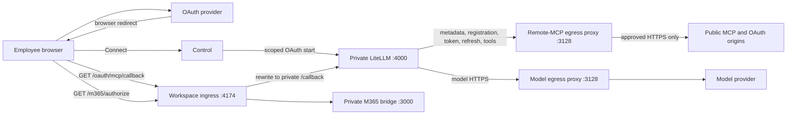

# MCP networking, egress, and OAuth callbacks

This document is the canonical network-flow description for MCP connectors.
It separates two directions that must not be collapsed into one component:

- **outbound connector traffic** originates inside LemmaComputer and leaves
  through a controlled forward proxy;
- **inbound browser callbacks** return through the normal product ingress on
  the canonical LemmaComputer origin.

The remote-MCP egress proxy is not a reverse proxy and is never a public OAuth
listener. Workspace ingress is not a general egress proxy. Each has one narrow
job.

## Logical flow



The provider does not open a server-to-server connection to the callback. It
redirects the employee's browser. A VPN-only deployment therefore works when
the browser can still resolve and reach the canonical LemmaComputer origin over
the VPN after visiting the provider.

## Outbound paths are deliberately separate

| Originating component | Destination class | Enforced path | Why it is separate |
| --- | --- | --- | --- |
| LiteLLM model client | Configured model providers | `gateway-egress-proxy` | Static, deployment-owned provider destinations; no custom-MCP authorization |
| LiteLLM strict MCP client | Public MCP endpoints and their OAuth origins | `remote-mcp-egress-proxy` | Dynamic connector destinations require public-address validation and Control authorization |
| Microsoft 365 bridge | Microsoft identity and Graph | `microsoft-egress` boundary | Built-in internal connector with a fixed provider family; it does not traverse the public/custom MCP proxy |
| Control | Entra discovery and token endpoints | `identity-egress` boundary | Product sign-in is independent of connector and model traffic |
| Channel broker | Telegram and configured push/channel providers | `channel-egress` boundary | Channel export policy and credentials are independent of MCP policy |
| Workspace egress sidecar | Policy-approved web destinations | Per-workspace egress network | Carries a signed workspace/agent/security-group grant, which gateway service proxies do not accept |

The local Compose reference uses separate network attachments to express these
boundaries. A cloud deployment must preserve the intent with distinct workload
identities, security groups, route tables, and egress policies. Placing every
service behind one unrestricted NAT gateway would erase the important part of
the design.

## Remote-MCP egress decision

LiteLLM has no direct internet-routed network attachment. Its version-pinned
strict MCP client explicitly selects the remote-MCP proxy with environment
proxy inheritance disabled. This prevents `NO_PROXY` or a redirected request
from silently bypassing the proxy.

For every discovery, metadata, dynamic registration, authorization-server,
token, refresh, and MCP-tool connection:

1. The proxy authenticates LiteLLM with the dedicated remote-MCP service
   credential. It does not accept workspace egress grants.
2. It normalizes the protocol, fully qualified host, and port. IP-literal
   destinations are denied.
3. It resolves every A and AAAA answer. Empty, malformed, private, loopback,
   link-local, ULA, documentation, transition, multicast, or mixed
   public/private answer sets are denied.
4. A static deny always wins. A destination that merely misses the static
   allowlist can proceed only when the internal Control authorizer returns the
   exact shape `{ "allowed": true }` within its timeout.
5. In hosted mode, Control authorizes only origins from the deployment-owned
   `LEMMACOMPUTER_HOSTED_MCP_EGRESS_ORIGINS` inventory. A tenant connector record
   cannot widen the shared network boundary.
6. The proxy connects to a validated resolved address and checks that HTTPS
   SNI matches the requested host. Tunnel lifetime and idle time are bounded.
7. Redirects use the same explicit proxy, so each new host is independently
   resolved and authorized.
8. The audit event contains the normalized destination and reason code, not
   URL paths, query strings, credentials, OAuth codes, or tokens.

Application checks and the proxy are defense in depth. The production network
must additionally prevent the proxy from reaching VPC CIDRs, instance/task
metadata, loopback, link-local, and other internal destinations even if the
application regresses.

## OAuth browser flow

`LEMMACOMPUTER_PUBLIC_WEB_URL` is the only browser-facing origin. The service
projection derives these exact routes from it:

```text
https://<lemmacomputer-origin>/oauth/mcp/callback
https://<lemmacomputer-origin>/m365/authorize
```

The sequence is:

1. The browser requests
   `/api/v1/connections/<connector>/authorize` from Control through the product
   origin.
2. Control creates a short-lived, user- and connector-bound OAuth state and a
   scoped LiteLLM connection key.
3. LiteLLM uses its strict outbound MCP client for provider discovery,
   registration, and authorization preparation.
4. Control returns the provider authorization location and LiteLLM's HttpOnly
   relay-state cookie to the browser. With
   `PROXY_BASE_URL=https://<origin>/oauth/mcp`, the cookie path is
   `/oauth/mcp`, so the browser sends it only to that route family.
5. The browser authenticates at the provider. The provider redirects the
   browser to `GET /oauth/mcp/callback` on the same product origin.
6. Workspace ingress accepts only that exact GET route on the configured
   authority, rejects other methods and other `/oauth/mcp/*` paths, and
   forwards it privately to LiteLLM's internal `/callback` route.
7. LiteLLM validates its relay state, completes the provider flow, keeps the
   usable access and refresh tokens in its credential store, and redirects the
   browser to Control's connection callback/result page.
8. Control discovers the user's tools and projects only reviewed, explicitly
   allowed server/tool pairs into workspace grants. Unknown or changed tools
   remain denied pending review.

LiteLLM port `4000` and the Microsoft bridge port `3000` are container-private.
They must not be published through a load balancer, ingress controller, host
port, or public security group.

### OAuth application registration

Provider OAuth applications must register the derived callback exactly,
including scheme, authority, and path:

```text
https://<lemmacomputer-origin>/oauth/mcp/callback
```

The product sign-in callback is different and remains:

```text
https://<lemmacomputer-origin>/api/v1/auth/callback
```

Changing `LEMMACOMPUTER_PUBLIC_WEB_URL` requires updating both registrations.
Old direct callbacks such as `http://localhost:4000/callback` and
`https://<origin>/callback` should be removed after the new route is verified
and any rollback window closes.

## Failure behavior

| Failure | Result |
| --- | --- |
| LiteLLM tries direct internet access | Network path is absent; request fails |
| Proxy authentication is missing or wrong | `407` denial |
| DNS has any private or reserved answer | Connection denied |
| Control authorizer times out, errors, or returns another shape | Connection denied |
| Redirect targets another unapproved origin | New proxy decision denies it |
| Callback uses another host, path, or method | Ingress rejects it or does not route it to LiteLLM |
| OAuth state/cookie is absent, expired, or invalid | LiteLLM refuses completion |
| Newly discovered tool has no approved definition | Tool remains denied and is not projected |

## Production acceptance checks

- Only the canonical product origin is browser reachable.
- Direct connections to LiteLLM, its administrator interface, and the M365
  bridge fail from user and internet networks.
- The product origin forwards the exact MCP callback and M365 authorization
  routes while rejecting the rest of the reserved path.
- LiteLLM has no direct default route to the internet.
- Model and remote-MCP traffic use different proxy identities and destination
  policies.
- Hosted custom connectors cannot use an origin absent from the
  deployment-owned inventory.
- IPv4, IPv6, DNS-rebinding, mixed-answer, redirect, SNI-mismatch, timeout, and
  proxy-bypass tests fail closed.
- Application, proxy, firewall, and audit logs omit OAuth callback query
  strings and tokens. WAF logging redacts the query string. If ALB access logs
  are enabled, treat their preserved request URI as sensitive: encrypt and
  tightly restrict the S3 destination, apply a short reviewed retention, and
  sanitize the request target before exporting records to a broader SIEM.
- `npm run qualify:oauth` passes for the pinned LiteLLM image before release.

See [AWS deployment architecture](../guides/deployment/aws-deployment.md) for one cloud
mapping of these logical boundaries.
