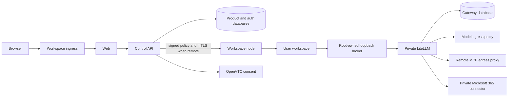

# Architecture and trust model

LemmaComputer lets members run AI applications in managed workspaces. Control
owns identity, policy, placement, authorization, and audit; user processes run
in a separate sandbox with narrow grants. This is the starting point for the
current architecture. Use the linked topic pages for details.

## Four rules

1. **Keep credentials out of user processes.** Provider keys, gateway master
   keys, OAuth tokens, signing keys, channel secrets, and Docker authority stay
   in their owning services. A workspace agent reaches a root-owned loopback
   broker, which holds a short-lived, scoped gateway key.
2. **Sign and verify runtime policy.** Control derives a bundle for the tenant,
   member, workspace, selected apps/agents, routes, tools, egress policy,
   version, and expiry. The controller and workspace entrypoint verify it.
   Missing or changed policy fails closed.
3. **Treat reachability as a permission.** Each workspace has an internal
   network and only the relays and egress sidecars its policy requires. In a
   remote placement the controller runs with node-local Docker authority;
   Control calls it over mTLS and an application credential. Control never
   receives the remote Docker socket.
4. **Bind approvals to exact actions.** Protected tool calls carry an operation
   digest covering the identity, workspace, policy, tool, and arguments.
   Verified approval yields one short-lived execution lease. A replay or
   changed request is denied.

## Authority by component

| Component | Authority | Must not become |
| --- | --- | --- |
| Better Auth inside Control | Verify customer identity and sessions | Product organization or role authority |
| Product Control | Membership, policy, placement, authorization, approvals, usage and budgets | Credential store for model providers or MCP OAuth |
| Workspace node | Local sandbox lifecycle and signed-policy enforcement | Cross-tenant scheduler or public API |
| LiteLLM | Store encrypted provider/OAuth credentials; execute authorized model and MCP requests | Tenant policy, routing, or accounting authority |
| Egress proxies | Enforce destination policy on user/tenant influenced traffic | Public OAuth callback listener |
| Workspace ingress | One browser origin and exact private callback relays | General proxy to private service ports |

Customer and platform authentication are separate realms. Control validates an
authenticated customer, then resolves active product membership and resource
ownership for every protected request. Provider groups, email, and browser
placement hints have no product authority. See
[Authentication](authentication.md) and [Tenant isolation](tenant-isolation-matrix.md).

## Core flows

**Workspace start.** Control validates membership and policy, creates the
scoped gateway grant, signs the runtime bundle, and calls the owning workspace
node. The node verifies the bundle, attaches only allowed services, creates
persistent storage and optional egress, then starts selected applications.
[Workspace node](workspace-node.md) records the remote trust and storage
contract.

**Model request.** Chat or the agent requests a service class. The workspace
broker forwards through LiteLLM's synthetic `lemmacomputer-auto` transport
alias with a signed task binding. Control decides the exact tenant deployment
from policy, capability, health, price, residency, and budget; the gateway
callback verifies it and obtains a usage admission before dispatch. LiteLLM
cannot silently fall back to another deployment. The callback records
completion and usage; a missing completion remains visible for reconciliation.
See [LiteLLM gateway](litellm-gateway.md) and [Model routing](../product/model-routing.md).

**MCP tool.** A workspace key permits only the projected connector servers
and tools. Control checks arguments against current policy. Low-risk calls may
proceed. Protected calls require exact OpenVTC consent and a one-time lease.
No connector token enters the workspace. See [MCP networking](mcp-networking.md).

**Browser ingress.** One product origin reaches workspace ingress, Web, and
Control. It exposes only exact connector callback paths to private services:
`GET /oauth/mcp/callback` and `GET /m365/authorize`. LiteLLM and the M365 bridge
must not be public. A load balancer or reverse proxy terminates external TLS.

## Compose network topology

The local Compose names below describe *reachability*, not authorization. A
cloud deployment must preserve the boundaries with workload identities,
security groups, routes, and egress policy.

| Network | Main members | Internet path |
| --- | --- | --- |
| `public-edge` | Ingress | Product origin |
| `web-edge` | Ingress, Web, Control | None |
| `control-private` (Docker name from `LEMMACOMPUTER_CONTROL_NETWORK`) | Control, controller, channel broker, scheduler, ingress, relays | None |
| `consent-private` | Control, OpenVTC | None |
| `gateway-private` | Control, LiteLLM, gateway DB, M365, model proxy | None |
| `mcp-client-private`, `mcp-egress-private`, `litellm-admin-private` | Narrow MCP and admin links | None |
| `identity-egress` | Control | Configured social/SSO provider calls |
| `model-egress` | Model and remote-MCP proxies | Separate restricted provider/MCP policies |
| `microsoft-egress` | M365 connector | Microsoft identity and Graph |
| `channel-egress` | Channel broker | Configured channel providers |
| Dynamic workspace/egress networks | One sandbox and its selected sidecars | Only signed-policy egress |

LiteLLM itself has no direct internet-routed network. Its model and public-MCP
traffic use separate proxies. Remote-MCP destinations are resolved and
rechecked on redirects; private and mixed public/private results deny. Hosted
custom MCP origins also need deployment-owned approval. The M365 connector is
a private built-in path. See [MCP networking](mcp-networking.md) for exact
callback and egress behavior.

## State and recovery

Product Control, customer-auth, platform-auth, and LiteLLM are four logical
databases. Product Control also owns conversations, artifact metadata,
placement, policy, approvals, audit, usage, Teams, budgets, and schedules.
LiteLLM owns encrypted provider credentials, scoped keys, and connector OAuth
tokens. Workspace homes and artifact bytes are additional state. Restore a
coordinated set with matching secret versions; see
[Operations](../guides/operations.md#backup-and-restore).

## Security invariants

- Every customer-owned record and grant is tenant-scoped, including in a
  customer-managed installation.
- No user process receives a provider, OAuth, channel, signing, or
  infrastructure credential.
- Runtime policy is signed, scoped, revocable, and verified by each trust
  boundary.
- A model dispatch requires a fresh exact-deployment decision and durable
  usage admission; policy, price, budget, or routing failure denies dispatch.
- MCP authorization failure denies the call. Protected actions require exact,
  unexpired consent and a one-time execution lease.
- External routes are explicit; egress defaults to deny for user-influenced
  destinations. Logs omit tokens, launch URLs, request bodies, tool arguments,
  and OAuth callback query strings.
