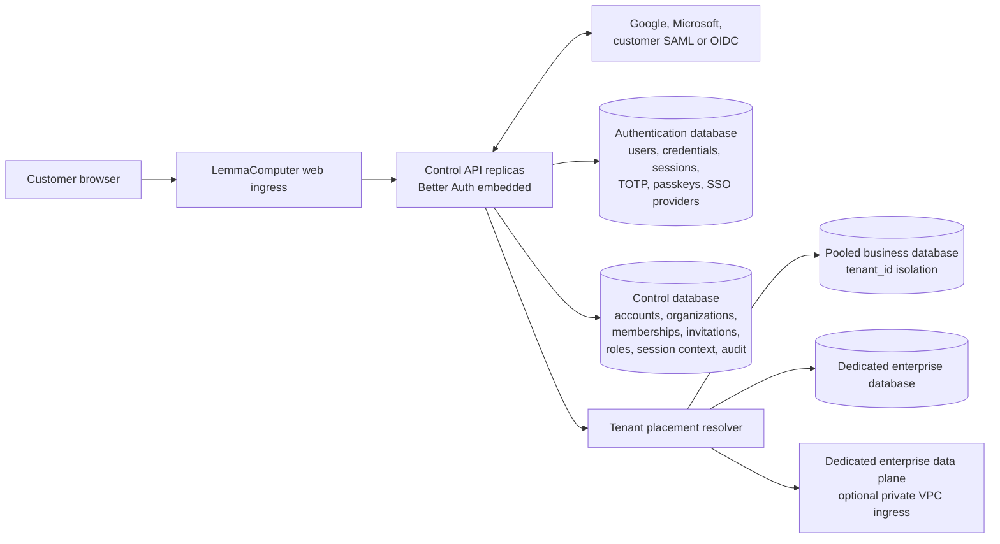
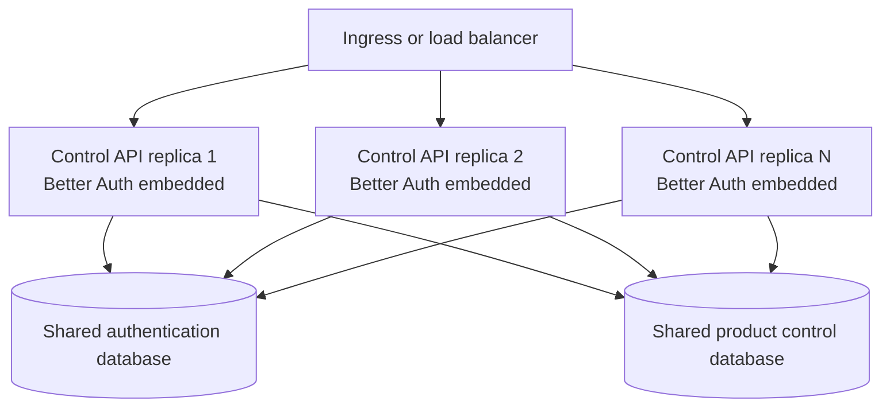
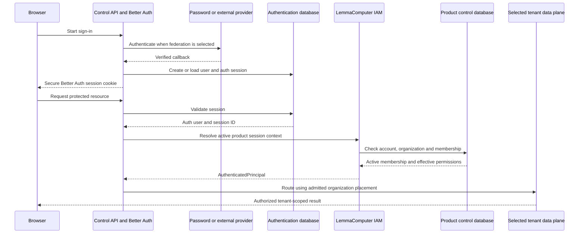
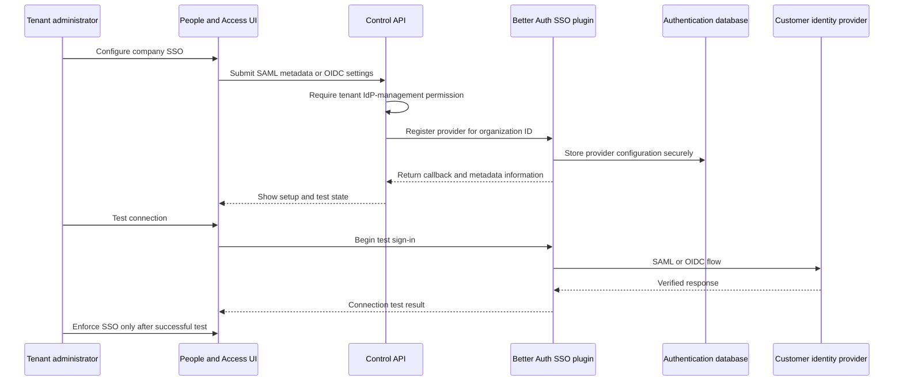

# Customer authentication architecture

Status: **Accepted architecture for Epic #1 / issue #51**

Decision date: **2026-08-09**

This document is normative for customer authentication, account admission, and
the boundary between authentication and LemmaComputer authorization. Agents
implementing Epic #1 identity work must read it before changing authentication,
sessions, invitations, organization admission, enterprise SSO, or deployment
profiles.

## Decision summary

LemmaComputer will use [Better Auth](https://better-auth.com/) as the customer
authentication framework. Better Auth is embedded in the existing Control API
at first; it is not a separate service or a per-tenant container. Horizontally
scaled Control API replicas share one logical authentication database in the
hosted profile.

Better Auth owns customer authentication mechanics:

- email and password authentication, verification, reset, and recovery;
- TOTP, passkeys, backup codes, and authentication sessions;
- Google and Microsoft social OAuth;
- tenant-configured SAML and OIDC protocol handling;
- authentication-provider account links and provider token custody.

LemmaComputer remains authoritative for:

- stable product accounts;
- organizations and protected ownership;
- invitations and membership lifecycle;
- organization roles, permissions, and resource scopes;
- active-organization selection and product-session authorization context;
- tenant placement into pooled or dedicated data planes;
- platform-operator authority and tenant-support elevation;
- product authorization and audit decisions.

The defining rule is:

> Better Auth proves who authenticated. LemmaComputer decides which
> organization and resources that account may use.

Run multiple Better Auth-bearing Control replicas for availability, not one
Better Auth deployment per hosted tenant. A distinct Better Auth realm is
reserved for a customer-managed installation or an explicitly contracted
identity-silo deployment.

## Context

The current Control API implements Microsoft Entra OIDC directly in
`apps/control-api/src/auth.ts`. After Microsoft authenticates a person, Control
maps the immutable provider identity into the existing product domain:

- `account_users` is the stable product account;
- `external_identities` records immutable provider identity links;
- `organizations` and `organization_memberships` own tenant access;
- `browser_sessions` bind product access to an active membership;
- the product permission catalog and policies own authorization.

That domain foundation is valuable and remains in place. Better Auth replaces
the provider-specific customer authentication mechanics; it does not replace
the product organization and authorization model.

This decision deliberately changes the earlier managed-CIAM trust boundary.
The open-source Better Auth framework implements password hashing, TOTP,
passkeys, OAuth, SAML, OIDC, session security, and secret encryption, while the
LemmaComputer deployment operates the database, encryption keys, email
delivery, availability, backup, monitoring, abuse defenses, and incident
response. LemmaComputer must never replace Better Auth's cryptographic and
protocol implementations with bespoke password or MFA code.

Better Auth's core repository and `@better-auth/sso` package are MIT licensed:

- [Better Auth repository](https://github.com/better-auth/better-auth)
- [Better Auth SSO documentation](https://better-auth.com/docs/plugins/sso)

## Goals

- A customer can create and recover an account without a Microsoft account.
- Email/password, TOTP, passkeys, Google, and Microsoft are compatible login
  methods for the same stable product account.
- A tenant can configure its own SAML or OIDC provider without changing product
  roles or authorization semantics.
- One account can belong to multiple organizations and explicitly select one
  active membership per product authorization context.
- Standard hosted tenants can use pooled data; enterprise tenants can use
  dedicated databases or VPCs without duplicating authentication by default.
- Hosted and customer-managed profiles use the same Better Auth integration and
  product authorization contracts from the same product codebase.
- Authentication, organization admission, and resource authorization fail
  closed and remain independently testable.

## Non-goals

- Better Auth does not become the product policy engine.
- Identity-provider groups, roles, or email domains do not grant LemmaComputer
  permissions.
- A dedicated enterprise data plane does not automatically imply a dedicated
  identity realm.
- Platform operators do not receive authority from the customer account realm.
- Application startup does not run Better Auth database migrations.
- The first implementation does not attempt active-active, globally replicated
  authentication across regions.

## Logical architecture



Better Auth belongs to the customer identity control plane. Pooled and
dedicated customer business stores are data-plane placement choices. Changing
an organization's data-plane placement must not require changing its stable
account or authentication-provider links.

## Runtime component decision

### Embed Better Auth in Control API initially

Better Auth is a TypeScript framework and can be mounted inside the current
Fastify-based Control API under a customer-authentication route namespace such
as `/api/v1/auth/customer/*`.

This is preferred initially because it:

- introduces no new app-to-auth network call or service-discovery dependency;
- requires no mTLS boundary between Control and Better Auth;
- reuses the existing authentication boundary and ingress;
- packages cleanly in both hosted and customer-managed profiles;
- lets every Control replica use the same durable authentication store;
- avoids another independently deployed service before scale justifies it.



### Extract an identity service only when justified

A future dedicated identity service is allowed behind the same internal
authentication contract if independent scaling, multiple products, regional
identity planes, separate security ownership, or a contractual isolation
boundary justifies the operational cost. That later service boundary requires
explicit service authentication, network policy, failure behavior, deployment
ownership, and potentially mTLS. It is not part of the initial decision.

## Persistence architecture

Better Auth requires durable storage for users, credential accounts, provider
accounts, sessions, verification records, TOTP material, passkeys, and SSO
provider configurations. See the
[Better Auth database documentation](https://better-auth.com/docs/concepts/database).

Use two logical databases with separate roles in one PostgreSQL cluster at
first:

```text
PostgreSQL cluster
├── lemmacomputer_auth
│   └── Better Auth-owned schema and migrations
└── lemmacomputer_control
    └── LemmaComputer product domain and migrations
```

| Store | Authority | Contents |
| --- | --- | --- |
| `lemmacomputer_auth` | Better Auth integration | Users, credentials, provider accounts, auth sessions, verifications, TOTP, passkeys, SSO provider configuration |
| `lemmacomputer_control` | LemmaComputer | Product accounts, organizations, memberships, invitations, product session context, roles, permissions, placement, audit |
| Pooled business database | LemmaComputer data plane | Standard-tier customer records, all explicitly tenant-scoped |
| Dedicated business database | LemmaComputer data plane | One contracted enterprise tenant or deployment stamp |

The local Compose profile may use the existing PostgreSQL container for both
logical databases. Production may initially use the same managed PostgreSQL
cluster, with separate database credentials and privileges. A later dedicated
authentication cluster is an operational scaling or blast-radius choice, not a
tenant-model requirement.

Do not create cross-database foreign keys. Control enforces the account mapping
idempotently. Prefer UUID Better Auth user identifiers and use the same UUID as
`account_users.id` so the stable mapping is direct and provider-neutral.

Better Auth and product schema changes use separate migration streams and
separate migration roles. Better Auth's CLI may generate candidate schema, but
generated SQL must be reviewed and incorporated into a pinned, forward-only
authentication migration job. Application startup checks compatibility and
never migrates either database.

## Product identity mapping

```text
Better Auth user.id
    -> account_users.id
        -> organization membership A
        -> organization membership B
        -> organization membership C
```

Better Auth's provider-account table is authoritative for login methods and
credential-provider links. The existing `external_identities` table remains as
a compatibility and audit projection during migration. It must not create a
second independent provider-account authority.

Email remains mutable display/contact data. Never merge identities, choose a
tenant, accept an invitation, or grant a role based only on matching email.
Account linking requires authenticated proof of both identities or an explicit,
audited recovery process.

## Authentication and authorization session flow

The target has one Better Auth browser session cookie. LemmaComputer maintains
a server-side product authorization context keyed to the validated Better Auth
session identifier. It does not copy the raw authentication token.



The product authorization context records at minimum:

- Better Auth session identifier;
- `account_user_id`;
- active `organization_membership_id`;
- creation, last-seen, and recent-step-up timestamps;
- revocation state.

Every protected request must still verify that the account, organization, and
membership are active; compute permissions server-side; and prove the requested
resource belongs to the active organization. Suspending a membership therefore
denies product access immediately even when the underlying authentication
session is still valid.

Product logout revokes the product authorization context. Full logout, account
disablement, password compromise, and "sign out all devices" also invoke Better
Auth session revocation. The current `lemmacomputer_session` may remain during a
bounded migration, but two independent long-term browser authentication cookies
are not the target.

## Hosted multitenancy

The default hosted identity plane is pooled. One stable Better Auth account may
hold multiple organization memberships with different roles. The explicitly
selected active membership determines authorization and data-plane routing.

```text
Better Auth user
├── Organization A: owner -> pooled data plane
├── Organization B: member -> pooled data plane
└── Organization C: auditor -> dedicated enterprise data plane
```

A tenant-specific business database or VPC does not require a tenant-specific
Better Auth container. Authentication remains in the control plane unless the
customer specifically contracts for identity-plane isolation or residency.

An optional identity-silo tier may deploy a separate Better Auth realm when a
customer requires a fully private login path, customer-specific identity keys,
strict identity-data residency, no shared identity database, or air-gapped
operation. It is a premium exception because it fragments accounts, migrations,
provider registrations, backup, recovery, patching, and multi-organization
membership.

## Customer-managed profile

Every customer-managed installation naturally runs its own Control API with
embedded Better Auth and its own authentication database. It supports exactly
one product organization and has no required call to a LemmaComputer-hosted
identity plane.

The customer operator may enable the methods appropriate to the environment:

- local email/password and TOTP;
- passkeys;
- Google or Microsoft OAuth where Internet access is allowed;
- internal or external SAML/OIDC;
- invitation-only admission with public signup disabled.

This preserves the same-product-codebase invariant while keeping identity,
secrets, database, backup, and network custody inside the customer deployment.

## Enterprise SSO

The open-source `@better-auth/sso` package provides SAML and OIDC protocol
functionality, provider registration, callbacks, provider discovery, and
provisioning hooks. Better Auth's hosted self-service SSO product is not a
dependency: LemmaComputer builds and operates the tenant-facing configuration,
test, enforcement, recovery, and rotation UI on top of the package APIs.



Do not expose Better Auth's provider-registration endpoints directly to the
browser. A Control route guarded by LemmaComputer's tenant-local IdP-management
permission invokes them server-side. Better Auth stores credential material;
the product control database stores non-secret status, organization association,
enforcement policy, and audit references.

The Better Auth Organization plugin is not the LemmaComputer authorization
authority. LemmaComputer already has the richer organization, invitation,
last-owner, session-revocation, permission-catalog, and resource-scope domain.
SSO provisioning hooks may resolve a verified Better Auth account, but product
membership admission remains an explicit LemmaComputer transaction. Provider
groups and claims never assign product roles automatically.

SSO must be tested before enforcement and retain an audited owner recovery path
to prevent tenant lockout. SAML configuration must enable production-strict
timestamp, request, signature, size, and replay validation.

## Invitation admission

LemmaComputer invitations continue to bind the intended organization and role.
They do not create a Better Auth credential and do not choose a password.

1. An authorized tenant administrator creates an invitation.
2. LemmaComputer sends a single-use, expiring activation link.
3. The recipient authenticates or creates a Better Auth account using any
   enabled method.
4. Control validates the Better Auth identity and invitation token.
5. LemmaComputer atomically activates the predetermined membership.
6. The role comes only from the invitation and product transaction.

An identity-provider email or role claim cannot redirect the invitation into a
different organization or increase its authority.

## Platform-operator realm

Platform operators remain outside the customer Better Auth realm. Retain a
separate workforce identity application, callback, cookie, session audience,
and role model. The current workforce Entra adapter may continue serving this
realm after the customer External ID adapter is retired.

```text
Platform operator
    -> workforce Entra
    -> separate platform session
    -> platform role
    -> time-bound audited support elevation

Customer
    -> Better Auth
    -> product account
    -> organization membership
    -> tenant-local permission
```

Never add a permanent customer-account `is_global_admin` bypass. Platform
support access requires target tenant, reason, scope, expiry, recent step-up,
audit, and configured approval.

## Security baseline

The implementation must follow the
[Better Auth security reference](https://better-auth.com/docs/reference/security)
and apply the following deployment controls:

- pin Better Auth and plugin versions and monitor security advisories;
- set exact HTTPS base URLs and trusted origins;
- never disable CSRF, origin, state, nonce, or PKCE protections;
- keep browser cookies secure, HttpOnly, SameSite, and host-only unless a
  reviewed flow requires otherwise;
- store Better Auth encryption secrets outside PostgreSQL and rotate them with
  versioned keys;
- enable `account.encryptOAuthTokens`; token encryption is not enabled by
  default;
- require email verification before credential-account activation and use
  non-enumerating signup and recovery responses;
- require verified TOTP enrollment and protected single-use backup codes;
- require MFA and recent step-up for ownership, SSO enforcement, recovery,
  billing ownership, tenant closure, and platform-sensitive actions;
- revoke relevant sessions after password reset, account disablement, identity
  unlinking, recovery, or compromise;
- use shared rate-limit storage across replicas plus edge WAF and abuse controls;
- trust forwarding headers only from explicitly trusted proxies;
- use TLS and least-privilege database roles; mTLS is required only when a
  separately reviewed service or cross-boundary topology needs it;
- encrypt backups, test restoration, and include the authentication database in
  recovery objectives;
- audit signup, login, failure, logout, account link/unlink, MFA changes,
  recovery, SSO configuration, invitation activation, and session revocation;
- keep passwords, OTPs, TOTP QR material, raw session tokens, provider tokens,
  client secrets, and private keys out of application logs and product audit
  payloads.

## Failure and recovery behavior

- Better Auth or authentication-database outage denies new login and session
  validation; it must not fall back to unauthenticated access.
- Product-control-database outage denies organization authorization even when a
  Better Auth session is valid.
- Tenant data-plane outage affects only tenants placed on that data plane and
  does not grant access to another placement.
- External provider outage leaves independent enabled methods available where
  policy permits; enforced enterprise SSO requires a documented owner recovery
  process.
- Authentication secret rotation uses Better Auth's versioned secret support so
  in-flight sessions and encrypted records have a bounded migration path.
- A suspected database and encryption-key compromise is treated as credential,
  provider-token, MFA-secret, and session compromise, with forced revocation and
  recovery.

## Migration from the current state

### Phase 1: provider-neutral boundary

- Record this decision in issue #51 and its threat model.
- Introduce a provider-neutral `AuthenticatedPrincipal` and authentication
  capability contract.
- Keep existing Entra and External ID adapters operational behind the boundary.

### Phase 2: Better Auth foundation

- Add the logical authentication database and explicit migration job.
- Embed Better Auth in Control API.
- Add UUID account mapping and product authorization session context.
- Add email verification/reset delivery, password authentication, TOTP,
  passkeys, session revocation, and recovery audit.

### Phase 3: universal customer login

- Add provider-neutral login UI.
- Add email/password, Google, and Microsoft methods.
- Add explicit proof-based account linking and unlinking.
- Add self-service organization creation with protected owner bootstrap.

### Phase 4: provider-neutral invitations

- Preserve current invitation and membership lifecycle behavior.
- Activate the predetermined membership through any enabled Better Auth method.
- Remove the requirement to pre-create a customer in Microsoft External ID.

### Phase 5: tenant-configured enterprise SSO

- Add tenant-admin SAML/OIDC configuration and test UI.
- Add domain verification, test-before-enforcement, recovery, audit, and secret
  or certificate rotation.

### Phase 6: Microsoft customer-adapter contraction

- Stop creating new External ID-only customer identities.
- Link existing Microsoft identities only after authenticated proof.
- Never attempt to migrate Microsoft passwords or MFA secrets.
- Retire External ID routes and configuration only after Better Auth recovery,
  rollback, and release qualification pass.
- Keep workforce Entra for the separate platform-operator realm unless a later
  ADR replaces it.

## Alternatives considered

| Alternative | Decision |
| --- | --- |
| Microsoft Entra External ID | Retain only as a transitional customer adapter; reject as the mandatory universal customer identity plane |
| Amazon Cognito | Reject as the default because hosted and customer-managed profiles would not share the same complete authentication implementation and operational contract |
| Auth0 or WorkOS | Do not select as the default because managed convenience increases vendor and pricing dependency; they remain future adapters if justified |
| Custom password, MFA, SAML, or OIDC implementation | Reject because the cryptographic and protocol risk is unacceptable |
| Better Auth | Select for qualification because it is MIT licensed, TypeScript-native, database-backed, and supports local credentials, TOTP, passkeys, social OAuth, SAML, and OIDC across both product profiles |

## Consequences

Benefits:

- one authentication implementation across hosted and customer-managed
  profiles;
- no Microsoft or AWS account requirement for ordinary customers;
- optional Google, Microsoft, and enterprise SSO;
- no per-user customer provisioning in an external CIAM console;
- support for public, private, and customer-managed login topologies;
- no need to discard the existing product organization and RBAC foundation;
- enterprise data-plane isolation does not fragment authentication by default.

Costs and risks:

- LemmaComputer operates credential and MFA-secret custody;
- authentication availability, email delivery, abuse handling, backup,
  monitoring, and incident response become LemmaComputer responsibilities;
- a second reviewed database migration stream is required;
- dependency and security updates require an urgent, tested rollout path;
- Better Auth is a library dependency with schema and semantic versioning risk,
  even though it reduces external provider lock-in;
- compliance evidence must cover the complete LemmaComputer operation, not just
  Better Auth's implementation.

## Required qualification gates

The Better Auth decision is implementation-ready only after automated and human
qualification proves:

- email signup, verification, password reset, and non-enumerating responses;
- TOTP enrollment, challenge, trusted-device policy, backup-code consumption,
  recovery, and session revocation;
- Google and Microsoft login plus explicit safe account linking;
- invitation activation into the predetermined organization and role;
- one account with multiple memberships and explicit active-organization
  switching;
- tenant suspension, account disablement, last-owner protection, and immediate
  product-access denial;
- SAML and OIDC registration, strict validation, provider rotation,
  test-before-enforcement, and tenant lockout recovery;
- no role grants from provider claims;
- pooled and dedicated data-plane routing from the same identity plane;
- customer-managed operation without a required LemmaComputer-hosted identity
  dependency;
- migration, backup/restore, secret rotation, rate limiting, proxy-header
  handling, audit redaction, and dependency upgrade rollback;
- adversarial cross-account, cross-session, cross-organization, and cross-data-
  plane isolation tests.

## Decision ownership

Issue #51 owns adoption of this architecture and its threat model. Downstream
issues implement it in dependency order. If an issue body conflicts with this
document, implementation must stop until issue #51 and this document are
reconciled; agents must not silently choose a different authentication or
tenancy model.
