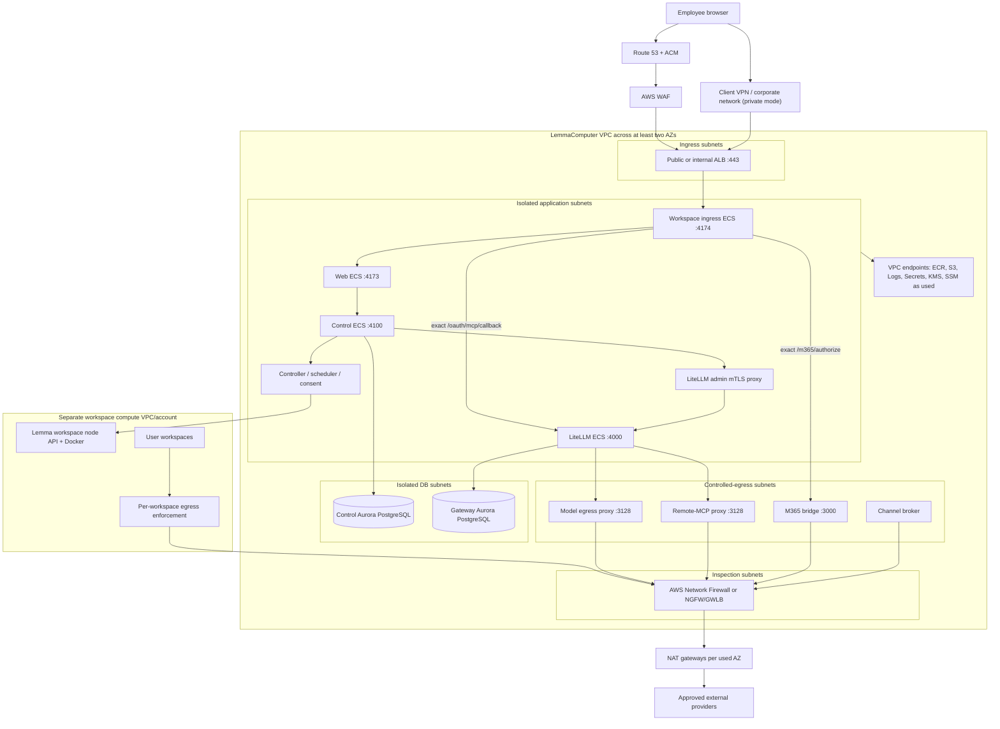

# AWS deployment architecture

Status: **reference design for production planning**. This document does not
claim that a deployed account, firewall, secret manager, database, or identity
configuration has been assessed. Convert the chosen design into reviewed IaC,
threat-model it, and validate it in the target AWS organization before use.

This design supports both LemmaComputer deployment profiles:

- `customer-managed`: one customer operates a single-tenant installation in
  its AWS environment;
- `hosted`: LemmaComputer operates shared services with organization isolation
  enforced in every persisted record, cache, policy, credential, and grant.

## Recommended starting point

Run the stateless product services as separate Amazon ECS services on AWS
Fargate, use an Application Load Balancer as the single HTTP ingress, place
state in two private Aurora PostgreSQL trust domains, and run user workspaces
on Lemma-owned remote Docker/KasmVNC nodes in a separate workspace compute boundary.

Do not mount the Docker socket in a control-plane ECS service. The socket is
host-root-equivalent authority. Run the workspace controller beside Docker on
private workspace compute, and let Control reach only its mTLS API.

AWS WAF, a network firewall, and security groups solve different problems:

- **AWS WAF** filters inbound HTTP(S) requests at the ALB. It is not an egress
  firewall and cannot stop SSRF from a backend service.
- **Security groups** enforce which workload identity may connect to which
  other workload and port. They are not a domain-name allowlist.
- **AWS Network Firewall** or an approved third-party NGFW such as FortiGate
  inspects routed north-south/east-west traffic. It complements, but does not
  replace, LemmaComputer's application-aware MCP and workspace forward proxies.

## Reference topology



The arrows show allowed classes of traffic, not blanket routes. Each arrow
must have a corresponding security-group rule, workload identity, application
credential, and—where it leaves the VPC—firewall/forward-proxy policy.

## Account and VPC boundaries

The minimum viable design is one AWS account per environment with a dedicated
VPC. A stronger hosted/compliance design uses an AWS Organizations landing
zone with separate production, security/log-archive, network/inspection, and
non-production accounts. Put workspace compute in a separate account or at
least a separate VPC so a compromised user workspace cannot share control-plane
ENIs, route tables, security groups, instance profiles, or metadata paths.

For customer-managed installations, use the customer's existing inspection,
identity, DNS, and log-archive standards where they provide equivalent
controls. Do not fork the LemmaComputer application code to fit the topology;
select the deployment profile and implement infrastructure-specific adapters.

## Browser ingress options

Choose one access mode and keep the product on one canonical HTTPS origin.

### Public hosted access

Use Route 53, ACM, an internet-facing ALB in two or more public ingress
subnets, and an AWS WAF web ACL. The ALB forwards only to the workspace-ingress
target group on port `4174`; no other ECS service has a public IP or public
target group.

Start managed WAF rules and custom rate limits in count mode, review false
positives, then enforce them. Keep the default WAF/ALB fail-closed behavior;
do not enable WAF fail-open without an explicit availability-versus-security
decision. Redact query strings in WAF logs. ALB access logs preserve the
client's request URI, so an OAuth callback code can appear there; if those logs
are enabled, encrypt and tightly restrict their S3 bucket, use a short reviewed
retention, and sanitize the request target before broader SIEM export.

### Corporate/VPN-only access

Use an internal ALB reachable through AWS Client VPN, Site-to-Site VPN, Direct
Connect, or an existing Transit Gateway. With Client VPN split tunneling, push
only the LemmaComputer/private DNS CIDRs and create matching authorization rules.
Client Route Enforcement is recommended where supported by the managed client.

MCP OAuth still works in this mode. The external identity/provider page
redirects the browser—not the provider's backend—to the callback. The browser
must keep its VPN route and private DNS resolution for the LemmaComputer origin
while completing the provider flow.

An internal NLB is a valid smaller option only when the deployment needs a
single TCP/TLS entry point and supplies HTTP routing/security elsewhere. Use an
ALB when AWS WAF, HTTP-aware health checks, headers, or path controls are part
of the design. LemmaComputer itself still performs exact callback-path routing.

## Public routes

The ALB should forward the canonical origin to workspace ingress rather than
creating public target groups for internal services. Required browser routes
include:

```text
/
/api/*
/api/v1/auth/callback
/oauth/mcp/callback
/m365/authorize
```

Workspace ingress accepts only `GET /oauth/mcp/callback` for LiteLLM and
`GET /m365/authorize` for the M365 bridge. Do not expose LiteLLM `:4000`, its
administrator interface, or the M365 bridge `:3000` directly. Register this
exact MCP callback with Entra, GitHub, and any provider-owned OAuth app:

```text
https://<lemmacomputer-origin>/oauth/mcp/callback
```

## Subnets and route tables

Create each subnet class in at least two Availability Zones. Do not use one
shared private route table for every task.

| Subnet class | Default route | Intended resources |
| --- | --- | --- |
| Public ingress | Internet gateway for ALB nodes | Internet-facing ALB only; no ECS task |
| Isolated application | No internet/NAT default route | Ingress, Web, Control, LiteLLM, admin proxy, scheduler, consent, controller |
| Controlled egress | Default route to an AZ-local firewall/GWLB endpoint | Model proxy, remote-MCP proxy, M365 bridge, channel broker, other explicitly approved egress clients |
| Inspection | Routes that preserve symmetric inspection | AWS Network Firewall endpoints or third-party appliances |
| Public egress | Internet gateway | NAT gateways or approved firewall egress interfaces |
| Isolated database | No internet/NAT default route | Aurora/RDS subnet groups only |

Use VPC endpoints so isolated Fargate tasks can pull ECR images, retrieve
secrets, and write logs without receiving general internet access. At minimum,
plan for ECR API, ECR Docker, the S3 gateway used for ECR layers, CloudWatch
Logs, and Secrets Manager. Add KMS and `ssmmessages` endpoints when the task
uses them. Endpoint security groups should allow HTTPS only from the task
security groups that require the endpoint.

For small customer-managed deployments, a NAT gateway plus strict forward
proxies may be acceptable. For hosted or regulated environments, route only
the controlled-egress subnets through AWS Network Firewall or an approved NGFW
before an AZ-local NAT gateway. Preserve symmetric forward and return routing;
stateful firewalls cannot correctly inspect asymmetric flows.

For a multi-VPC organization, centralize inspection/egress through Transit
Gateway and an egress/inspection VPC. VPC peering is not transitive and cannot
be used to borrow a peer VPC's NAT gateway or internet gateway.

## ECS service placement

Use Fargate `awsvpc` networking. Components with different trust or egress
requirements must be separate ECS tasks/services so they receive separate
ENIs, security groups, task roles, and deployment lifecycles. Do not put
LiteLLM and either egress proxy in one task/network namespace.

| Service group | Subnet | Direct internet | Notes |
| --- | --- | --- | --- |
| Workspace ingress | Isolated application | No | Only ALB target; private calls to Web, LiteLLM callback, M365 authorization, and workspace relays |
| Web | Isolated application | No | Static UI and private API proxy only |
| Control | Isolated application | No | Uses private DB/services; Entra/Kasm outbound must use a dedicated inspected path or proxy |
| LiteLLM | Isolated application | No | Uses model and MCP proxies; private DB, Control callbacks, and M365 only |
| Model proxy | Controlled egress | Through inspection only | Static exact-host provider policy; cannot invoke custom-MCP destination authorization |
| Remote-MCP proxy | Controlled egress | Through inspection only | Default deny plus Control authorization of normalized public destinations |
| M365 bridge | Controlled egress | Through inspection only | Restrict to Microsoft identity and Graph destination policy |
| Channel broker | Controlled egress | Through inspection only | Separate channel/export policy and credentials |
| Scheduler/consent | Isolated application | No | Add no internet route unless a reviewed feature requires it |
| Workspace controller | Separate workspace compute | Governed workspace egress only | Node-local Docker socket; private mTLS API from Control |

The local Compose `identity-egress` path means Control currently needs outbound
Entra discovery/token access. In AWS, do not solve this by placing all of
Control in a broadly routed subnet. Give it an explicit forward-proxy path or
a dedicated inspected route with an identity-provider allowlist. Treat remote
Kasm API, Web Push, Telegram, and other channel endpoints the same way: each
needs a named egress owner and reviewed destination policy.

## Security-group intent

Use security-group references as sources/destinations instead of broad VPC
CIDRs wherever AWS supports it. The table is an intent matrix; validate exact
ports against the deployed task definitions.

| Destination SG / port | Allowed source SGs | Purpose |
| --- | --- | --- |
| ALB `443` | Internet, corporate CIDR, or Client VPN according to access mode | Single browser entry point |
| Ingress `4174` | ALB only | Product and callback ingress |
| Web `4173` | Ingress only | UI/API proxy |
| Control `4100` | Web and named internal callers only | Product APIs and internal authorization callbacks |
| LiteLLM `4000` | Ingress callback, approved internal brokers, admin proxy | OAuth completion and governed data plane; never public |
| LiteLLM admin proxy `8443` | Control only, with workload mTLS | Administrator API |
| Model proxy `3128` | LiteLLM only | Provider egress |
| Remote-MCP proxy `3128` | LiteLLM only | Public MCP/OAuth egress |
| M365 bridge `3000` | LiteLLM and ingress only | Internal MCP plus browser authorization relay |
| Control DB `5432` | Control and migration task only | Authoritative application data |
| Gateway DB `5432` | LiteLLM only | Gateway routes and encrypted credentials |
| VPC endpoints `443` | Explicit task SGs | AWS control-plane APIs without NAT |

Security groups alone cannot enforce hostnames. The egress proxy and routed
firewall must still reject metadata, loopback, link-local, private VPC, ULA,
mixed DNS, and unapproved public destinations.

## Database design

Routing to **Aurora PostgreSQL full configuration** because this production
design requires customer VPC connectivity, private DB subnet groups, security
groups, and customer-controlled encryption/backup policy. Express
configuration does not preserve those network boundaries.

Use two private Aurora PostgreSQL clusters—or equivalently strong separately
operated database trust domains—for hosted production:

- **Control cluster:** identities, tenants, workspace records, policy,
  approvals, schedules, audit events, channel routing, and usage/accounting.
- **Gateway cluster:** LiteLLM routes, virtual keys, OAuth state, and encrypted
  provider/connector credential material.

Each DB subnet group spans at least two Availability Zones and contains only
private DB subnets with no NAT or internet-gateway route. Set database
instances non-public, encrypt storage/snapshots with approved KMS keys, require
TLS, use different Secrets Manager secrets and DB roles, enable deletion
protection, configure automated backups/PITR, export reviewed PostgreSQL logs,
and test restore procedures. The Control task must not receive network or
credential access to the gateway schema, and vice versa.

RDS for PostgreSQL Multi-AZ is the credible lower-cost/greater-portability
alternative when measured load does not justify Aurora's storage/failover and
scaling characteristics. Revisit the choice with workload, recovery-time,
recovery-point, extension, connection, and cost measurements before IaC is
approved. Do not combine the two logical databases into one user/schema for
hosted production merely to reduce cost; that weakens credential-custody and
blast-radius separation.

Application startup validates schema compatibility and never migrates. Run the
repository's explicit migration job as a one-shot ECS task before deploying
new Control services. Give that task temporary network access and a dedicated
secret for the Control database only.

## IAM and secret custody

Create a distinct ECS task role and execution role for each service family:

- the **execution role** pulls ECR images, retrieves only that task's launch
  secrets, and writes to its log group;
- the **task role** contains only AWS API permissions used by the application.

Do not share one powerful task role across Control, LiteLLM, proxies, channel
broker, migrations, and workspace node. Scope `iam:PassRole` to named role
ARNs and the intended ECS service. Use AWS IAM Access Analyzer and CloudTrail
to review access and role assumption.

Store secrets in Secrets Manager with separate KMS keys/policies where the
trust domains warrant it. Examples include database credentials, LiteLLM
master/credential secrets, policy-signing material, proxy credentials, Entra
and GitHub clients, M365 credentials, channel material, and Kasm API secrets.
ECS secret injection happens at task launch, so rotation requires a controlled
new deployment. Do not print secrets in task definitions, deployment output,
firewall logs, or application logs. Treat ALB access logs as sensitive because
the preserved OAuth callback request URI can contain a short-lived
authorization code.

The hosted LiteLLM administrator path should use workload mTLS in addition to
the Control task identity and security-group rule. Continue using separate
keys for model proxy, remote-MCP proxy, admin, session, ingress, and bridge
purposes.

## Availability and deployment

- Run ALB, NAT/firewall endpoints, Fargate services, and database subnet groups
  across at least two Availability Zones.
- Start stateless services at a desired count of at least two where their
  application semantics support concurrency. Keep state in the managed
  databases, not task filesystems.
- Enable ECS deployment circuit-breaker rollback and health-check grace
  periods. Use `minimumHealthyPercent=100` and `maximumPercent=200` when
  capacity allows zero-downtime rolling deployment.
- Use target type `ip` for Fargate/`awsvpc`. Set ALB deregistration delay to a
  measured 30–60 seconds or longer than the longest relevant request.
- Pin immutable ECR image digests, scan images, retain an SBOM/provenance, and
  promote the exact verified release. Do not deploy a moving `main` tag.
- Scale workers only after verifying their database claim/lease semantics;
  desired count is not a substitute for concurrency correctness.

## Logging and detection

Enable and retain, with tenant/data-residency requirements applied:

- CloudTrail organization/account trails and IAM Access Analyzer;
- WAF logs with query-string redaction, plus restricted and encrypted ALB
  access logs with short retention and sanitized downstream export;
- VPC Flow Logs for ingress, application, egress, inspection, database, and
  workspace boundaries;
- Network Firewall/NGFW allow and deny events;
- ECS/CloudWatch service logs with explicit blocking delivery where audit loss
  is unacceptable;
- Aurora events, audit/connection logs, backup and restore evidence;
- LemmaComputer normalized egress and policy audit events in an append-protected
  destination.

Alert on direct internet-route drift, public ENIs, public DB changes, security
group widening, WAF/firewall fail-open changes, denied MCP origins, repeated
reserved-address attempts, callback anomalies, secret access, task-role
changes, and disabled/degraded logging.

## Deployment phases and release gates

1. **Decide access and tenancy:** hosted/customer-managed, public/VPN-only,
   Region, AZ count, RTO/RPO, data residency, and workspace account/VPC split.
2. **Build the network skeleton:** subnet classes, route tables, VPC endpoints,
   inspection, NAT, private DNS, security groups, and flow logs.
3. **Create data/secret foundations:** two DB trust domains, KMS, Secrets
   Manager, backup/restore, task roles, and log groups.
4. **Deploy private services first:** databases, Control, LiteLLM, admin proxy,
   egress proxies, workers, and remote workspace-node integration. Prove no-direct-egress
   invariants before adding public ingress.
5. **Add the single ingress:** ACM, ALB, WAF, workspace ingress, canonical DNS,
   and exact OAuth registrations.
6. **Qualify paths:** sign-in, MCP discovery/registration/token/refresh/tool
   call, model provider calls, M365, channel delivery, workspace web egress,
   callback completion, and every fail-closed case.
7. **Run release gates:** repository release verification, database migration
   verification, restore drill, multi-AZ/failure exercise, secret rotation,
   WAF/firewall tests, log-redaction review, vulnerability scan, and incident
   rollback.

Do not call the environment production-ready until deployed route tables,
security groups, firewall rules, WAF behavior, task roles, secret policies,
database restore, OAuth registrations, and live provider flows have been
verified. Source and configuration tests are necessary but do not prove those
external controls.

## Open decisions for the infrastructure ADR

- Public hosted origin or VPN/internal-only origin?
- AWS Network Firewall or the organization's FortiGate/other NGFW standard?
- Single application VPC or centralized Transit Gateway inspection/egress?
- Separate workspace account/VPC and how Kasm private connectivity is exposed?
- Aurora PostgreSQL or RDS for PostgreSQL after load and recovery modeling?
- One Region with tested restore, warm standby, or a formal multi-Region DR
  design?
- Per-tenant dedicated gateway/data plane for regulated customers, or shared
  hosted services with the existing tenant controls?

Record these choices in an ADR before creating production IaC.

## AWS references

- [AWS WAF integration with Application Load Balancer](https://docs.aws.amazon.com/elasticloadbalancing/latest/application/load-balancer-integrations.html)
- [Application Load Balancer access-log fields](https://docs.aws.amazon.com/elasticloadbalancing/latest/application/load-balancer-access-logs.html)
- [AWS WAF log field redaction](https://docs.aws.amazon.com/waf/latest/developerguide/logging-management.html)
- [ECS network security best practices](https://docs.aws.amazon.com/AmazonECS/latest/developerguide/security-network.html)
- [Amazon ECS VPC endpoints](https://docs.aws.amazon.com/AmazonECS/latest/developerguide/vpc-endpoints.html)
- [Centralized egress with AWS Network Firewall and NAT Gateway](https://docs.aws.amazon.com/whitepapers/latest/building-scalable-secure-multi-vpc-network-infrastructure/using-nat-gateway-with-firewall.html)
- [Avoid asymmetric routing with AWS Network Firewall](https://docs.aws.amazon.com/network-firewall/latest/developerguide/asymmetric-routing.html)
- [AWS Client VPN split tunnel](https://docs.aws.amazon.com/vpn/latest/clientvpn-admin/split-tunnel-vpn.html)
- [Aurora PostgreSQL](https://docs.aws.amazon.com/AmazonRDS/latest/AuroraUserGuide/Aurora.AuroraPostgreSQL.html)
- [IAM security best practices](https://docs.aws.amazon.com/IAM/latest/UserGuide/best-practices.html)
- [Using Secrets Manager secrets in ECS tasks](https://docs.aws.amazon.com/AmazonECS/latest/developerguide/secrets-envvar-secrets-manager.html)

See [MCP networking, egress, and OAuth callbacks](../../architecture/mcp-networking.md) for the
application-level flow that this AWS design must preserve.
