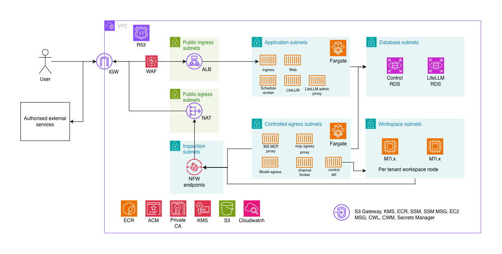

# Initial customer AWS deployment candidate

Status: **proposed initial deployment, not a deployed or qualified environment**.
This page incorporates the supplied *LemmaComputer AWS Architecture* overview
and its companion text. The attachment is design input, not an instruction to
operate AWS or evidence that these resources exist. The repository contains no
AWS infrastructure-as-code for this candidate. Use the broader [AWS reference
architecture](aws-deployment.md) for security controls and alternatives, and
the [deployment profiles](../deployment-profiles.md) for product behavior.
Begin with the [evaluation, development, and remote workspace workflow](../development-workflow.md#choose-the-workflow-first)
to select the right setup for development and qualification.

*Proposed AWS overview from the supplied architecture document. Each logical
subnet class represents a subnet in each of two Availability Zones; the picture
compresses them into one box. Arrows show traffic classes, not blanket subnet
permissions. Use the tables below for the actual service and data boundaries.*

## Deployment order

This is the order for turning the candidate into a deployment. It is not an
executable AWS runbook yet: the repository has no AWS infrastructure-as-code,
ECS task definitions, or command that provisions these resources. The
[development workflow](../development-workflow.md) covers local evaluation and
remote-node qualification; its Compose commands do not create hosted AWS
infrastructure.

1. **Choose the production contract.** Select `hosted` or `customer-managed`,
   the operator, Region, origin, account/VPC split, node allocation, recovery
   targets, and the open network and database choices below. Record the choices
   in an infrastructure ADR. Use [deployment profiles](../deployment-profiles.md)
   for the application contract.
2. **Qualify the product before provisioning.** Develop in an isolated task
   worktree and exercise the remote-node/Cowork path through the
   [workflow guide](../development-workflow.md#remote-workspace-node-and-cowork-qualification).
   This checks application routing and mTLS behavior, not AWS network or host
   readiness.
3. **Provision the selected AWS design with reviewed infrastructure code.**
   Create the account/VPC boundary, two-AZ subnet and inspected-egress routes,
   endpoints, security groups, DNS/certificates, WAF/ALB, two private PostgreSQL
   trust domains, S3 artifact storage, secret custody, logging, ECS services,
   and private workspace nodes. The [AWS reference architecture](aws-deployment.md)
   supplies the service and network controls; the account-specific IaC and
   operator procedure still need to be written and reviewed.
4. **Promote one immutable application release.** On a clean, pushed `main` or
   `release/*` commit, run `npm run verify:release`, then
   `npm run release:tag -- --push` under the [full release procedure](../demo-release.md#full-release-path).
   Publish the qualified first-party images to the target registry and record
   their repository digests. Do not use the demo update command for AWS go-live.
5. **Install and validate production configuration.** Supply the selected
   profile's exact values from deployment secret custody, keep customer and
   platform auth secrets distinct, pin image digests, and run the
   [profile preflight](../deployment-profiles.md#operator-preflight) against that
   configuration. The [deployment catalog](../../../scripts/deployment-config.mjs)
   defines variable names and per-service projections; production secret
   injection and ECS task definitions remain infrastructure work.
6. **Initialize data, then start private services.** Create separate roles and
   the databases required by the chosen profile; hosted includes all four
   logical databases shown below. Capture a coordinated recovery set. Run the
   explicit product and customer-auth migrations, plus the platform-auth
   migration for hosted, as one-shot jobs before Control starts. Qualify the
   gateway database initialization separately before LiteLLM serves traffic.
   Deploy Control, LiteLLM, proxies, workers, and workspace-node connectivity.
   Verify private mTLS routes, inspected egress, S3 access, and no-direct-internet
   boundaries.
7. **Open the single browser entry and qualify live behavior.** Attach the
   canonical HTTPS origin to the ALB and WAF, register exact OAuth callbacks,
   and test sign-in, model/MCP and channel flows, workspace persistence and
   purge, backup/restore, failure recovery, and rollback on the target AWS
   infrastructure. Apply the [release gates](aws-deployment.md#deployment-phases-and-release-gates)
   before declaring the environment ready.

## What this candidate chooses

| Area | Proposed initial deployment | Product contract or qualification limit |
| --- | --- | --- |
| Profile | Decide `hosted` if LemmaComputer operates a multi-organization service, or `customer-managed` if the customer operates one tenant. | Both use one codebase. `worktree` is a development harness and the existing EC2 demo is not a production profile. |
| Account and VPC | The attachment draws one regional VPC with private workspace subnets. | A separate workspace VPC or account is the stronger reference boundary. Choose the isolation level and private routing before approving infrastructure code. |
| Ingress | Route 53, ACM, WAF, and one public ALB forwarding to workspace ingress. | The canonical HTTPS origin must preserve exact `/oauth/mcp/callback` and `/m365/authorize` browser routes; LiteLLM and Microsoft 365 MCP remain private. |
| Application compute | Separate ECS/Fargate services and task roles for ingress, Web, Control, LiteLLM, workers, OpenVTC consent, Microsoft 365 MCP, channel broker, and named egress proxies. | Compose describes service boundaries, not a deployable ECS task definition. Migrations are explicit one-shot jobs before application startup. |
| Data | Two private RDS for PostgreSQL Multi-AZ deployments: Control and LiteLLM trust domains. | The current application has **four logical databases**, including separate customer and platform Better Auth databases in the Control trust domain. |
| Workspace compute | Private EC2 nodes with encrypted persistent storage and the Lemma-owned Docker/KasmVNC runtime. M7i is the attachment's sizing proposal. | Hosted requires remote nodes, mTLS relays, governed egress, sticky workspace ownership, and a qualified Cowork-capable host. Instance size and capacity remain unqualified. |
| Node allocation | The picture labels one workspace node per tenant. | The implemented placement registry also supports a shared default node. Dedicated allocation must be an explicit operator policy and capacity decision, not an inferred product invariant. |
| Egress | Application services have no general internet route. Named controlled-egress services and workspace nodes traverse zonal Network Firewall endpoints and NAT. | LiteLLM must use separate model and remote-MCP forward proxies. Control, channel, Microsoft identity/Graph, email, Web Push, and security webhooks each need reviewed routes and destination policy. |
| Email | The attachment lists SES as an optional endpoint. | The current production configuration accepts Postmark for authentication and invitation email. A switch to SES requires a separate application change and qualification. |
| Artifacts | Private S3 access through a gateway endpoint. | Hosted requires the Control-owned S3 artifact backend. The diagram's broader list of exports and backups is a proposed storage plan, not proof those flows are implemented. |

## Network and service boundaries

Create public ingress, public egress, private application, controlled egress,
inspection, database, workspace, and endpoint subnet classes in both selected
Availability Zones. The ALB is the only public application entry. Fargate tasks,
RDS instances, and workspace nodes receive no public IP. The proposed routing
keeps controlled-egress and workspace traffic on the same-AZ Network Firewall
endpoint and NAT path, including the return path. Security groups allow named
service-to-service connections; a subnet route does not authorize every
workload in that subnet.

The attachment places Control and the channel broker in controlled-egress
subnets. The [broader AWS reference](aws-deployment.md#ecs-service-placement)
places Control in an isolated application subnet with a named outbound path.
Both sketches express the same needed boundary: Control's identity, email,
push, webhook, and node calls must have explicit egress ownership without
giving LiteLLM direct internet access. Choose and test one routing design in
the infrastructure ADR.

| Source | Allowed destination | Required boundary |
| --- | --- | --- |
| ALB | Workspace ingress `:4174` | Public browser entry only; WAF and TLS terminate at the edge. |
| Workspace ingress | Web `:4173`, exact OAuth routes to LiteLLM and Microsoft 365 MCP, selected private desktop relay | No database access; relay traffic uses mTLS. |
| Web | Control `:4100` | No direct database or public egress. |
| Control | Control RDS, node API `:4101`, OpenVTC, LiteLLM admin proxy, approved external destinations | Node and admin calls use private mTLS; external traffic uses its reviewed egress path. |
| Scheduler and channel broker | Control API and the permitted Control RDS roles | Separate runtime roles and reviewed channel-provider egress. |
| LiteLLM | LiteLLM RDS, model proxy, remote-MCP proxy, Microsoft 365 MCP | No direct internet route or Control database credential. |
| Workspace node and relays | Node-local Docker, selected Control/LiteLLM private relays, governed egress path | Control owns lifecycle; workspace processes never receive RDS credentials. |

## Data and recovery boundary

The Control RDS trust domain must retain `lemmacomputer` (tenant/product state),
`lemmacomputer_auth` (customer Better Auth), and
`lemmacomputer_platform_auth` (separate platform-operator Better Auth in hosted
mode), with distinct runtime and migration roles. The LiteLLM RDS trust domain
retains `litellm` and its separate credential custody. The reference Compose
stack uses two PostgreSQL engines but creates all four logical databases.
Backups and restore tests must account for all four, matching encryption and
signing secret versions, Control-owned S3 artifacts, and each workspace's
persistent disk. See [operations persistence](../operations.md#persistence) and
[workspace node storage](../../architecture/workspace-node.md#storage-and-removal).

The attachment proposes two Availability Zones, Multi-AZ RDS, and a node per
tenant. These do not by themselves provide cross-Region recovery, automatic
workspace failover, or active capacity in both AZs. An ECS service at desired
count one has only one running task. The current node registry intentionally
keeps a workspace on its recorded owner and has no automatic migration or
capacity scheduler. Define recovery targets, backups, restore tests, node
replacement, and service task counts before making an availability commitment.

See [workspace node deployment](../../architecture/workspace-node.md) for the
implemented sticky placement and remote trust contract.
