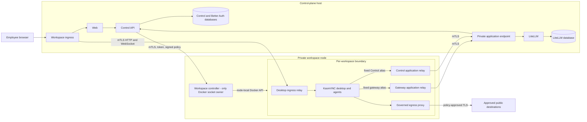

# Evaluation, development, and remote workspace workflow

This is the single setup and workflow guide for LemmaComputer. Start by choosing
the outcome you need; do not combine commands from different rows.

## Choose the workflow first

| Goal | Checkout and profile | First command path | Workspace topology |
| --- | --- | --- | --- |
| Read, review, or run unit tests | Any clean checkout | Install dependencies only if required | No stack |
| Evaluate the product without changing code | Dedicated disposable clone using the `worktree` profile | [`env:init`](#evaluate-a-single-checkout) | Colocated |
| Change code or documentation | One branch in one Git worktree using the `worktree` profile | [`worktree:init`](#develop-in-an-isolated-task-worktree) | Colocated by default |
| Exercise remote-node routing or Claude Cowork | Initialized task worktree | [Remote qualification command](#remote-workspace-node-and-cowork-qualification) | Locally split with mTLS |
| Exercise customer-managed Microsoft integration | Keep `worktree` for code changes; use a dedicated `customer-managed` evaluation deployment for operator qualification | [Microsoft integration runbook](local-deployment.md) | Deployment-specific |
| Qualify a real hosted release | Representative hosted infrastructure | Deployment and release tooling, not local Compose | Physically separate private nodes |

If a request says only "set it up", "run it", or "test it" and the choice
would change data ownership, ports, topology, or required infrastructure, ask
whether the user wants: a disposable evaluation, an isolated development
worktree, local remote-node/Cowork qualification, or a production-profile
deployment. Do not ask when the requested outcome already makes the choice
clear.

The primary `main` checkout is an integration checkout. It does not own a local
development stack. A dedicated evaluation clone may be checked out at `main`
because it is disposable and never used to edit or integrate code; do not turn
the primary integration checkout into that evaluation clone.

## Host requirements

Node.js development and non-containerized tests can run on macOS. The complete
reference stack and managed desktop require:

- Linux `amd64`/`x86_64`;
- Node.js 22 or later;
- Docker Engine and Docker Compose v2.30.0 or later; and
- enough Docker address-pool capacity for the isolated networks.

Claude Cowork additionally requires usable `/dev/kvm` and
`/dev/vhost-vsock`. On a Mac, use a Linux x86_64 host or VM for full workspace
runtime checks. Docker Desktop emulation is not a qualified deployment path.

## Evaluate a single checkout

Use this path only for a person who wants to explore one local stack and will
not change the repository:

```bash
git clone <repository-url> lemmacomputer-eval
cd lemmacomputer-eval
npm ci
npm run env:init -- --profile=worktree
npm run compose:up
```

Open the URL in `LEMMACOMPUTER_PUBLIC_WEB_URL`; the dedicated evaluation default
is `http://localhost:4174`:

```bash
grep LEMMACOMPUTER_PUBLIC_WEB_URL .env
```

To launch a managed desktop, build the large workspace image once:

```bash
npm run image:workspace
```

`env:init` creates `.env` with mode `0600`, fresh internal credentials, and the
selected profile. It refuses to overwrite an existing file. It does not create
unique names for parallel stacks, so run only one evaluation stack per Docker
host unless each checkout is isolated manually.

Do not use `env:init --force` casually. Rotating those values can invalidate
sessions, encrypted records, signatures, service trust, and persisted data.

## Develop in an isolated task worktree

Every change gets one branch and one Git worktree. From a clean primary
checkout:

```bash
git fetch origin
mkdir -p ../onecomputer-worktrees
git worktree add ../onecomputer-worktrees/<task-name> \
  -b <issue>-<short-name> origin/main
cd ../onecomputer-worktrees/<task-name>
npm run worktree:init
npm run dev:doctor
```

When there is no issue, use a short descriptive branch name. Follow an explicit
user-supplied branch name when provided.

Do not run `npm ci` or `env:init` separately in a task worktree.
`worktree:init`:

- refuses `main`;
- runs `npm ci` if dependencies are absent;
- creates `.env` with fresh secrets if it is absent;
- selects `LEMMACOMPUTER_INSTALLATION_KIND=worktree` and development runtime
  behavior;
- derives a stable `oc-*` worktree identity;
- assigns unique ports, Compose projects, networks, image tags, databases, and
  volumes; and
- prints the worktree's Web URL.

Never copy `.env`, database volumes, generated PKI, or runtime environment
files from another checkout. Each worktree owns its trust and persistence.

At the start of every later session:

```bash
git status --short
npm run dev:doctor
```

After bringing in changes from `main`, run `npm run env:check`. If the canonical
environment gained variables, run `npm run env:update`; it adds missing values
without rotating existing secrets.

## What the setup commands do

| Command | Mutates state? | Purpose |
| --- | --- | --- |
| `npm run worktree:init` | Yes, once | Installs missing dependencies, creates the worktree-owned `.env`, and assigns isolated names and ports. |
| `npm run dev:doctor` | No | Checks branch identity, dependencies, `.env`, `oc-*` isolation values, Docker context safety, and bind-mounted file readability. |
| `npm run env:check` | No | Checks `.env` parity and validates profile, URL, secret, and coupled configuration such as complete mTLS groups. |
| `npm run env:update` | Yes | Merges newly registered variables into `.env` while preserving existing values and reporting extras. |
| `npm run compose:config` | Only generated projections | Writes least-privilege `.runtime-env/<service>.env` files, then validates the resolved Compose model without starting containers. |
| `npm run image:workspace` | Yes, Docker image cache | Builds the large managed desktop image. It is needed for desktop workspaces, not merely to sign in. |
| `npm run compose:up` | Yes | Renders service environments, builds application images, applies explicit migration jobs, starts services, and waits for health. |
| `npm run compose:down` | Yes | Stops the worktree stack while preserving volumes by default. Pass `-- --volumes` only when deletion is intentional. |

`compose:up` repeats environment rendering, but `env:check` and
`compose:config` are useful separate diagnostics: they catch contract and
Compose errors before partially changing the running stack.

## Start and use the development stack

From the initialized task worktree:

```bash
npm run env:check
npm run compose:config
npm run compose:up
```

Build the workspace image before testing managed desktops or packaged desktop
software:

```bash
npm run image:workspace
```

Read the worktree-specific URL instead of assuming a port:

```bash
grep LEMMACOMPUTER_PUBLIC_WEB_URL .env
```

Create the first account in the Web UI. Configure model-provider deployments
under **AI control plane -> Models & providers**, then configure Pricing, Model
routes, Team rollout, and workspace policy. Provider credentials belong in the
product UI, not `.env`.

### Local configuration ownership

| Path | Owner and role |
| --- | --- |
| `compose.yaml` | Canonical ordinary topology; use it through `npm run compose:*`. |
| `compose.hosted.yaml` | Empty compatibility marker; it does not turn local Compose into hosted infrastructure. |
| `compose.oauth-qualification.yaml` | Tool-owned isolated OAuth qualification stack. |
| `compose.provider-qualification.yaml` | Tool-owned isolated provider qualification stack. |
| `.env` | Ignored, secret, checkout-specific operator configuration. |
| `.env.example` | Generated reference from `scripts/deployment-config.mjs`; never hand-edit. |
| `.env.qualification.example` | Generated inputs for qualification tooling, not a deployment environment. |
| `.runtime-env/` | Ignored least-privilege service projections generated by repository commands. |
| `.runtime-remote-workspace-node/` | Ignored, disposable PKI and state for local split-node qualification. |

### Environment-variable ownership

There are three different environment surfaces; do not combine them:

1. `.env.example` is the complete deployment-operator contract. Every value an
   operator may place in deployment `.env` appears there exactly once, with its
   purpose, accepted format, secret handling, and conditional requirement.
2. `.env.qualification.example` inventories disposable inputs generated by the
   qualification commands. It is documentation only; do not copy it to `.env`.
3. `.runtime-env/<service>.env` and per-workspace container specifications
   contain service-local names derived from the deployment contract. Repository
   commands generate least-privilege projections so, for example, the Web
   service does not receive database or provider secrets.

Model-provider API keys and tenant MCP OAuth tokens are configured through the
product UI and encrypted persistence, not `.env`. Temporary shell controls used
by an individual diagnostic command are documented with that command and are not
deployment inputs.

Do not edit either example manually. The canonical definitions are in
`scripts/deployment-config.mjs`:

```bash
npm run env:example
npm run env:qualification:example
npm run env:check
```

The first two commands detect generated-file drift. `env:check` validates the
actual `.env`, including profile-specific requirements and complete certificate
or OAuth credential groups. After pulling a contract change, use
`npm run env:update` to merge new keys without rotating existing secrets.
Maintainers regenerate a changed reference with
`npm run env:example -- --write` or
`npm run env:qualification:example -- --write`.

## Human-supplied values

The generated worktree environment is sufficient for builds, automated tests,
Compose validation, stack health, and fixture-based multi-tenant tests. Ask for
external values only when the requested flow needs them:

| Test goal | Human supplies |
| --- | --- |
| Build, unit tests, Compose health, fixture-based tenant testing | Nothing |
| Real email delivery | Postmark server token, sender, and the Postmark transport setting |
| Transitional workforce Entra or Microsoft 365 using the same app | Entra tenant ID, client ID, client secret, and bootstrap owner object IDs |
| Separate Microsoft 365 connector application | Microsoft 365 tenant ID, client ID, and client secret |
| Google or Microsoft social login | The selected provider's complete client-ID and client-secret pair |
| Local remote-node qualification | Nothing; the command generates disposable certificates |
| Production remote node | Private networking plus complete workload identities and CA-managed certificates |

The worktree profile intentionally permits unresolved Entra placeholders. Use
the [Microsoft integration runbook](local-deployment.md) only when the task
actually exercises those flows.

## Remote workspace-node and Cowork qualification

Ordinary evaluation and development are colocated. Use the remote qualifier
only when the task must exercise the real controller, relay, and mTLS boundary
or Claude Cowork. It requires an initialized, non-`main` task worktree; a
disposable evaluation clone is not sufficient.

### Remote workspace-node architecture

Remote mode moves employee-controlled desktops to a private workspace compute
node while identity, policy, provider credentials, OAuth custody, and product
databases remain in the control plane. It uses the LemmaComputer
Docker/KasmVNC adapter—not the commercial Kasm control plane.

| Mode | Current status |
| --- | --- |
| Colocated `worktree` | Supported local default |
| Remote-node worktree qualification | Repeatable local integration test on one physical Docker host |
| `customer-managed` remote | Configuration contract supported; customer supplies networking, PKI, storage, and operations |
| `hosted` remote | Required architecture, including Cowork, but not yet production-qualified |

The boundary is provider-neutral. A future E2B or Daytona adapter can implement
the same controller, signed-policy, isolation, routing, and purge contracts
without forking the product.



For each running workspace the controller normally creates:

| Runtime | Count | Purpose |
| --- | ---: | --- |
| Sandbox | 1 | Desktop, applications, and local agent brokers |
| Desktop relay | 1 | Authenticated ingress to this sandbox's KasmVNC port |
| Gateway relay | 0-1 | Fixed local alias to the private LiteLLM endpoint |
| Control relay | 0-1 | Fixed local alias to the private agent bridge and authorization endpoint |
| Egress proxy | 0-1 | Signed, policy-governed public destination access |

The relays form one logical workspace network gateway but stay separate
per-workspace containers. Combining ingress, private application routing, and
public egress into one shared service would merge credentials, directions, and
failure domains and could bridge workspaces.

`/var/run/docker.sock` is root-equivalent authority over the workspace node.
Only the workspace controller mounts the node-local socket:

```yaml
services:
  workspace-controller:
    networks:
      node-transport:
        aliases: [workspace-node]
    volumes:
      - /var/run/docker.sock:/var/run/docker.sock
```

Control never mounts or proxies that socket. It sends a bounded lifecycle
request; the controller validates workload identity, bearer token, signed
policy, workspace identity, and provider labels before using Docker locally.
The normative node security and purge contract is in
[Workspace node deployment](../workspace-node.md).

### Remote mTLS identities

| Caller | Listener | Authentication and key custody |
| --- | --- | --- |
| Control API | Workspace controller | Node server TLS, Control client certificate with expected CN, and bearer token; each leaf key stays with its workload. |
| Workspace ingress | Per-workspace desktop relay | Relay server TLS and ingress client certificate with expected CN. |
| Per-workspace application relays | Private LiteLLM and Control endpoints | Application endpoint TLS and node application-gateway client certificate with expected CN. |
| Control API | LiteLLM admin proxy | Separate administrator mTLS identity. |

Browser authentication is normal HTTPS plus the user and workspace session,
not mTLS. Public egress uses ordinary Web PKI TLS after signed destination
policy enforcement. Production leaf certificates must come from the
deployment's private CA or workload identity system; the local qualifier's
two-day authorities are disposable test material.

### How local mTLS certificates are generated

`npm run env:init` does **not** generate mTLS certificates. It generates the
ordinary local service secrets and signing keys, but leaves the workspace-node
and LiteLLM administration certificate fields blank in a worktree `.env`.
Those fields represent production workload identities and must not be filled
with a long-lived developer CA by default.

The two local mTLS qualification paths deliberately keep their certificates
outside the normal `.env`:

| Command | Certificate lifecycle | Storage and stack effect |
| --- | --- | --- |
| `npm run qualify:remote-workspace-node -- config [--cowork]` | Uses OpenSSL to create separate two-day node and application-relay CAs and their server/client leaves. | Writes under `.runtime-remote-workspace-node/` only long enough to validate both Compose projects, then deletes it. `.env` and the running stack are unchanged. |
| `npm run qualify:remote-workspace-node -- up [--cowork]` | Generates the same disposable two-day authorities for the active split-node run. | Keeps base64 certificate values, generated Compose files, and PEM files under `.runtime-remote-workspace-node/` until `down`. It does not modify `.env`. |
| `npm run qualify:internal-mtls` | Generates separate one-day test CAs for the LiteLLM admin and workspace-controller listeners, plus valid and foreign client leaves. | Uses temporary OS directories, starts real TLS listeners with mock backends, proves rejection behavior, and deletes all material in the same test run. It does not modify Compose or `.env`. |

The remote-node `up` command exercises node, desktop-relay, and private
application-relay mTLS in the running split stack. It does not also switch that
worktree's LiteLLM admin listener to mTLS; `qualify:internal-mtls` tests the
LiteLLM administrator boundary separately. For a hosted deployment, both sets
of base64 PEM values are supplied by the deployment secret manager from a
private CA or workload-identity system. The complete LiteLLM production fields
and validation procedure are in
[Operations](operations.md#hosted-litellm-administration-transport).

### Switch an existing worktree to remote mode

First start and configure the ordinary worktree. The qualifier deliberately
reuses its users, organizations, providers, pricing, routes, policies,
PostgreSQL volumes, and workspace-home volumes. It does not dump or copy a
database.

Stop every workspace through LemmaComputer, then validate without changing
containers:

```bash
npm run qualify:remote-workspace-node -- config
```

For Cowork, verify hardware support and include the flag:

```bash
test -c /dev/kvm
test -c /dev/vhost-vsock
npm run qualify:remote-workspace-node -- config --cowork
```

Start the split topology:

```bash
npm run qualify:remote-workspace-node -- up
```

Cowork-enabled remote mode is selected here—not in `compose.hosted.yaml` and
not by manually switching the local profile:

```bash
npm run qualify:remote-workspace-node -- up --cowork
```

The command:

1. refuses `main`, non-worktree profiles, and active workspace runtime containers;
2. generates two-day test certificates;
3. creates worktree-scoped transport, application, and desktop-ingress networks;
4. starts the controller in a separate Compose project with the node-local Docker socket;
5. disables the colocated controller and points Control at the remote mTLS node API;
6. adds test-only mTLS application endpoints for Control and LiteLLM; and
7. retains the existing control stack, databases, users, configuration, and persistent volumes.

Inspect or restore the topology with:

```bash
npm run qualify:remote-workspace-node -- status
npm run qualify:remote-workspace-node -- down
```

`down` removes only qualification-owned containers, networks, PKI, and state,
then restores the colocated worktree stack. It preserves databases and
persistent workspace volumes. If an existing qualification was started without
Cowork, stop its workspaces, run `down`, then run `up --cowork`.

### Remote-node acceptance checklist

- Sign in with an existing worktree account and expected organization.
- Create and open disposable and managed workspaces.
- Test an allowed and denied public destination.
- Complete a governed model request and verify provider credentials are absent from the sandbox.
- Complete Hermes Desktop and Hermes CLI turns.
- Open Claude Desktop, verify Cowork virtualization, and complete a Cowork action.
- Restart and reconnect to the workspace through the product route.
- Run two workspaces concurrently and verify separate IDs, networks, relays, and home volumes.
- Stop one workspace and confirm the other remains reachable.
- Inspect audit events without exposing certificates, tokens, prompts, or provider secrets.

### What local remote qualification does not prove

The two Compose projects still use one physical Docker Engine. Local
qualification proves configuration, mTLS identities, route projection, Docker
authority separation at the container boundary, and application behavior. It
does not prove cloud security groups, cross-host DNS, load balancers,
certificate issuance/rotation/revocation, managed database restore, autoscaling,
node draining, cross-node latency, or failure recovery.

Hosted requires representative private-node testing with nested
virtualization, `/dev/kvm`, `/dev/vhost-vsock`, encrypted workspace storage,
real workload certificates, network deny rules, monitoring, backup/restore,
node replacement, and Claude Cowork acceptance. The `hosted` profile validates
the configuration contract; it is not a local infrastructure emulator.

### Remote-node troubleshooting

| Symptom | Check |
| --- | --- |
| Environment reports an incomplete coupled group | Run `npm run env:update`; do not fill individual certificate fields manually. |
| Topology switch is refused | Stop every managed workspace first. |
| `all predefined address pools have been fully subnetted` | Remove only ownership-verified empty worktree networks or configure a non-overlapping Docker default address pool; never prune globally. |
| Node API reports TLS or identity errors | Check CA, server SAN/name, client certificate CN, bearer token, and clock. |
| `WORKSPACE_UPSTREAM_UNAVAILABLE` | Inspect ingress and that workspace's desktop relay and certificate projection. |
| Desktop works but model or agent bridge fails | Inspect that workspace's gateway and Control relays plus application-endpoint mTLS. |
| Cowork says virtualization is unavailable | Check both devices, nested virtualization, host memory, `--cowork`, and start the workspace after enabling Cowork projection. |

## Verification, integration, and release

[CONTRIBUTING.md](../../CONTRIBUTING.md) is the command and test-suite index.
Every change runs `npm run verify:quick`; persistence and migration changes also
run `npm run verify:db`. User-visible Web changes run the smallest relevant
Playwright suite. Report actual commands and outcomes rather than relying on a
hidden hook.

The integration owner merges verified work into `main`. `main` remains
buildable but is not the running demo. A demo release requires a clean pushed
commit and:

```bash
npm run verify:release
npm run release:tag -- --push
```

Deploy the immutable `demo-*` tag and image digest, never a moving branch or a
dirty checkout. Do not resolve migration conflicts by renumbering or editing a
migration already applied anywhere; use forward reconciliation.
