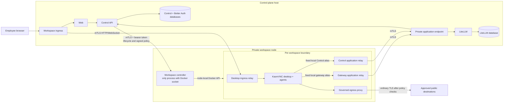

# Remote workspace-node mode

Remote mode places employee-controlled desktops on a private workspace compute
node while keeping identity, policy, provider credentials, OAuth custody, and
the product database in the control plane. It uses the same LemmaComputer
Docker/KasmVNC adapter and workspace image as colocated development; it does
not use the commercial Kasm control plane or Kasm Developer API.

Use this guide when you need to understand the split, qualify it from a task
worktree, or map it to hosted infrastructure. The normative node security and
purge contract remains in [Workspace node deployment](../workspace-node.md).

## Support status

| Mode | Status | Meaning |
| --- | --- | --- |
| Colocated `worktree` | Supported local default | Control services and workspace controller use one Docker host. |
| Remote-node worktree qualification | Repeatable local integration test | Separate Compose projects and networks exercise real mTLS routes while retaining the worktree's existing databases. Both halves still run on one physical Docker host. |
| `customer-managed` remote | Configuration contract supported | The customer supplies private networking, PKI, storage, and operations. |
| `hosted` remote | Required architecture, not yet production-qualified | Hosted must use a remote node and must support Claude Cowork. The repository validates the contract, but the local qualifier is not evidence for a representative cloud deployment. |

The remote abstraction is provider-neutral. A future E2B or Daytona adapter can
implement the same controller, policy, isolation, and purge contracts without
forking the product.

## Full topology



The diagram calls the relays one logical **workspace network gateway**, but it
is intentionally implemented as narrow per-workspace containers. Combining
desktop ingress, private application routing, and public egress into one shared
process would give one compromise all three directions and would create a
cross-workspace network bridge. Separate containers keep their credentials,
networks, and failure domains distinct.

For one running workspace the node normally creates:

| Runtime | Count | Purpose |
| --- | ---: | --- |
| Sandbox | 1 | Desktop, selected applications, and local agent brokers |
| Desktop relay | 1 | Authenticated ingress to that sandbox's KasmVNC port |
| Gateway relay | 0–1 | Fixed local alias to the private LiteLLM endpoint |
| Control relay | 0–1 | Fixed local alias to the private agent-bridge/authorization endpoint |
| Egress proxy | 0–1 | Signed, policy-governed access to approved public destinations |

Many users may have workspaces on the same node. Each workspace gets its own
Docker-internal network and its own applicable relays; the relays are not one
global shared tunnel. The controller reconciles them from signed workspace
configuration and removes runtime containers with the workspace lifecycle.
Persistent workspace-home volumes have a separate deletion contract.

## Why the Docker socket is node-local

`/var/run/docker.sock` is the Unix socket for the Docker Engine running on the
workspace node. Access to it is effectively root-equivalent authority over that
node. Only `workspace-controller` mounts it:

```yaml
services:
  workspace-controller:
    networks:
      node-transport:
        aliases: [workspace-node]
    volumes:
      - /var/run/docker.sock:/var/run/docker.sock
```

Control never mounts or proxies the socket. It sends a bounded lifecycle
request to the node API instead. The controller verifies the mTLS identity,
bearer token, signed policy, workspace ID, and provider labels before using the
local Docker API to create the sandbox, its private network, relays, proxy, and
home volume. The generated qualification Compose is implemented in
`scripts/qualify-remote-workspace-node.mjs`; runtime creation is implemented in
`packages/kasm-adapter/src/index.ts`.

## mTLS and credential custody

Remote mode mutually authenticates every private route that crosses the
control-plane/node boundary:

| Caller | Listener | Authentication | Private key custody |
| --- | --- | --- | --- |
| Control API | Workspace controller | Node-server TLS, Control client certificate, expected client CN, and internal bearer token | Control client key stays in Control; node server key stays on the node |
| Workspace ingress | Per-workspace desktop relay | Relay-server TLS and workspace-ingress client certificate with expected CN | Ingress client key stays in ingress; relay server key stays on the node |
| Per-workspace application relays | Private LiteLLM/Control endpoints | Application-endpoint TLS and node application-gateway client certificate with expected CN | Application client key reaches only node-side application relays through the controller; endpoint server key stays in the control plane |
| Control API | LiteLLM admin proxy | Separate administrator mTLS identity | Control and admin-proxy receive only their own leaf keys |

The node API also requires its bearer token. mTLS proves workload identity and
encrypts the transport; the token preserves the application-level credential
boundary and supports independent rotation.

Browser authentication is not mTLS: the public edge uses normal HTTPS plus the
user session and a path-scoped workspace session. Public egress also uses normal
Web PKI TLS after the per-workspace proxy has enforced signed destination rules.
The relay-to-KasmVNC hop remains inside that workspace's Docker-internal network.

Production certificates must come from the deployment's private CA or workload
identity system. Use distinct leaf identities and keep keys in the owning
workload's secret projection. The local command creates disposable two-day
authorities under an ignored directory; it is not production PKI automation.

## Worktree evaluation

### 1. Prepare the isolated worktree

From a clean primary checkout:

```bash
git fetch origin
git worktree add .worktrees/<task> -b codex/<task> origin/main
cd .worktrees/<task>
npm run worktree:init
npm run dev:doctor
```

If the branch already existed before the remote mTLS variables were added,
merge the current branch first and update its environment without rotating
existing secrets:

```bash
npm run env:update
npm run dev:doctor
```

Do not copy another checkout's `.env` or database volumes. Worktree isolation
is deliberate.

### 2. Start and configure the ordinary worktree

```bash
npm run image:workspace
npm run compose:up
grep LEMMACOMPUTER_PUBLIC_WEB_URL .env
```

Create users and organizations, configure provider deployments, pricing, model
routes, Team rollout, workspace policy, and any connector data in this normal
stack. The remote qualifier will reuse this exact worktree state.

### 3. Validate the split without mutating containers

Stop every workspace through LemmaComputer, then render and validate both
Compose projections:

```bash
npm run qualify:remote-workspace-node -- config
```

For the hosted-required Claude Cowork capability, first verify the host devices
and include `--cowork`:

```bash
test -c /dev/kvm
test -c /dev/vhost-vsock
npm run qualify:remote-workspace-node -- config --cowork
```

`config` creates fresh test certificates, validates the generated files, and
removes them without starting or replacing containers.

### 4. Start the split topology

```bash
npm run qualify:remote-workspace-node -- up
```

Hosted/Cowork evaluation must use:

```bash
npm run qualify:remote-workspace-node -- up --cowork
```

The command:

1. refuses `main`, non-worktree profiles, and active workspace runtime containers;
2. creates a two-day test PKI in `.runtime-remote-workspace-node/`;
3. creates worktree-scoped transport, application, and desktop-ingress networks;
4. starts the workspace controller in a separate Compose project with the node-local Docker socket;
5. disables the colocated controller in the control stack and points Control at the remote mTLS node API;
6. adds a test-only mTLS application endpoint in front of the existing Control and LiteLLM services; and
7. keeps the existing worktree Compose project, PostgreSQL volumes, users, organizations, providers, pricing, routes, policies, and workspace-home volumes.

There is no database dump or copy in this transition. Reusing the same control
stack is what avoids creating another user or re-entering provider settings.

Inspect the running topology with:

```bash
npm run qualify:remote-workspace-node -- status
docker ps --filter label=com.lemmacomputer.sandbox.provider=docker-kasmvnc
```

### 5. Manual acceptance checklist

- sign in with an existing worktree account and select the expected organization;
- create and open a disposable workspace, then a managed workspace;
- open Chrome and exercise an approved and a denied public destination;
- run a governed model request and confirm provider credentials are absent from the sandbox;
- open Hermes Desktop and Hermes CLI and complete a model turn;
- open Claude Desktop; for hosted qualification, confirm Cowork no longer reports unavailable virtualization and complete a Cowork action;
- restart the workspace and reconnect through the same product route;
- run two workspaces concurrently and confirm their IDs, networks, relay containers, and home volumes remain distinct;
- stop one workspace and confirm the other remains reachable;
- inspect safe lifecycle/audit events without certificate, token, prompt, or provider-secret values.

### 6. Restore colocated development

Stop every workspace through the product, then run:

```bash
npm run qualify:remote-workspace-node -- down
```

`down` restores the ordinary colocated worktree controller and removes only the
qualification controller, forwarder, networks, PKI, and generated state. It
retains the worktree's databases and persistent workspace volumes.

## What local qualification does not prove

Both Compose projects still use one physical Docker Engine. The qualification
therefore proves configuration, mTLS identities, route projection, Docker
authority separation at the container boundary, and application behavior. It
does not prove physical-host isolation, cloud security groups, cross-host DNS,
load balancers, certificate issuance/rotation/revocation, managed database
restore, node autoscaling/draining, cross-node latency, or failure recovery.

A hosted release needs a representative private node test with nested
virtualization, `/dev/kvm`, `/dev/vhost-vsock`, encrypted workspace storage,
real workload certificates, network deny rules, monitoring, backup/restore,
node drain and replacement, and Claude Cowork acceptance. `compose.hosted.yaml`
is a deployment-profile marker, not a complete hosted infrastructure stack.

## Common failures

| Symptom | Check |
| --- | --- |
| Environment update reports an incomplete coupled group | Run `npm run env:update` after updating the branch; do not fill individual certificate fields manually. |
| Qualification refuses to switch topology | Stop every managed workspace first; dynamic runtimes cannot be moved safely between controllers. |
| `all predefined address pools have been fully subnetted` | Remove only verified unused worktree/qualification networks; do not prune Docker globally. |
| Node API returns TLS or identity errors | Check CA, server SAN/name, Control client certificate CN, internal token, and clock. |
| Workspace opens as `WORKSPACE_UPSTREAM_UNAVAILABLE` | Inspect ingress and that workspace's desktop relay; verify ingress client-certificate projection and the private relay address. |
| Model or agent bridge fails while desktop works | Inspect that workspace's gateway/Control relays and the private application endpoint mTLS identity. |
| Claude Cowork says virtualization is unavailable | Verify both character devices, nested virtualization, host memory, `--cowork`, and that the workspace was created after enabling Cowork projection. |

Before handoff run `npm run verify:quick`. Database or backup-contract changes
also require `npm run verify:db`.
