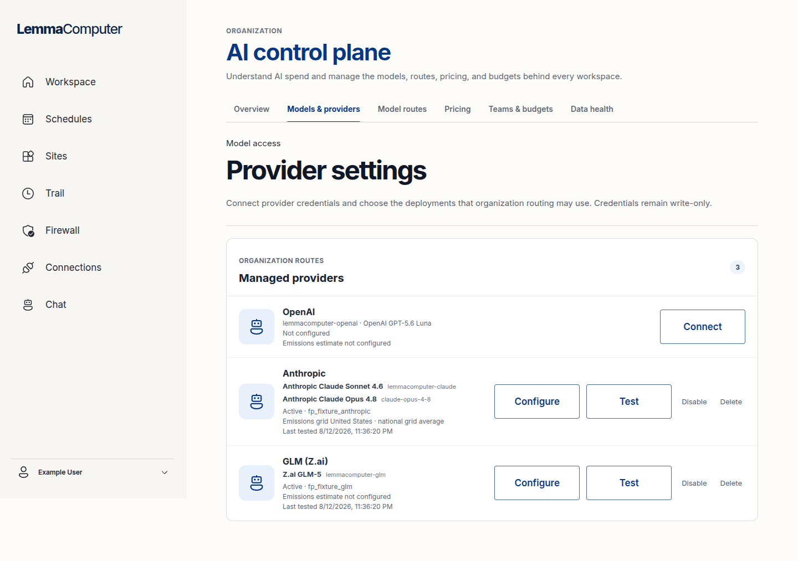
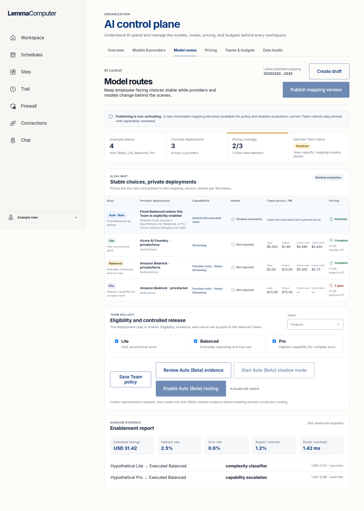
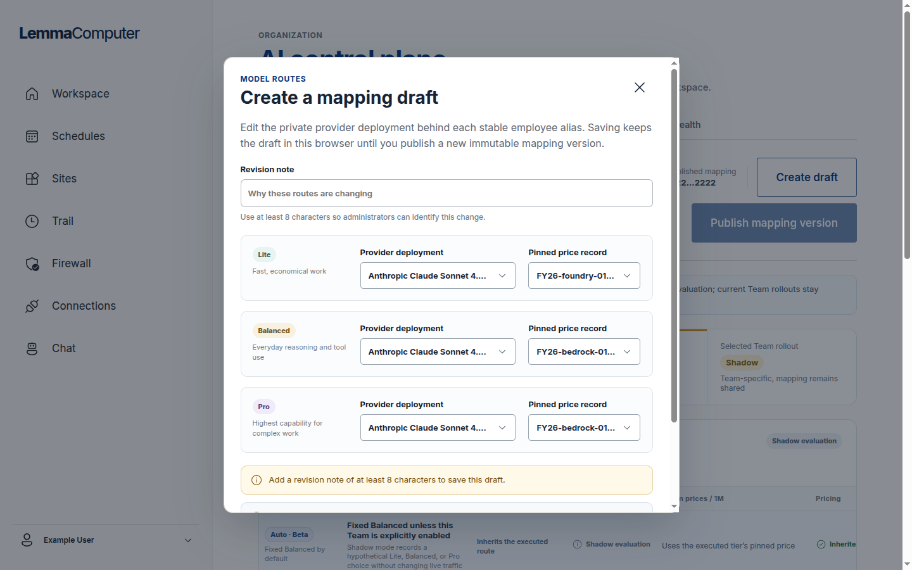
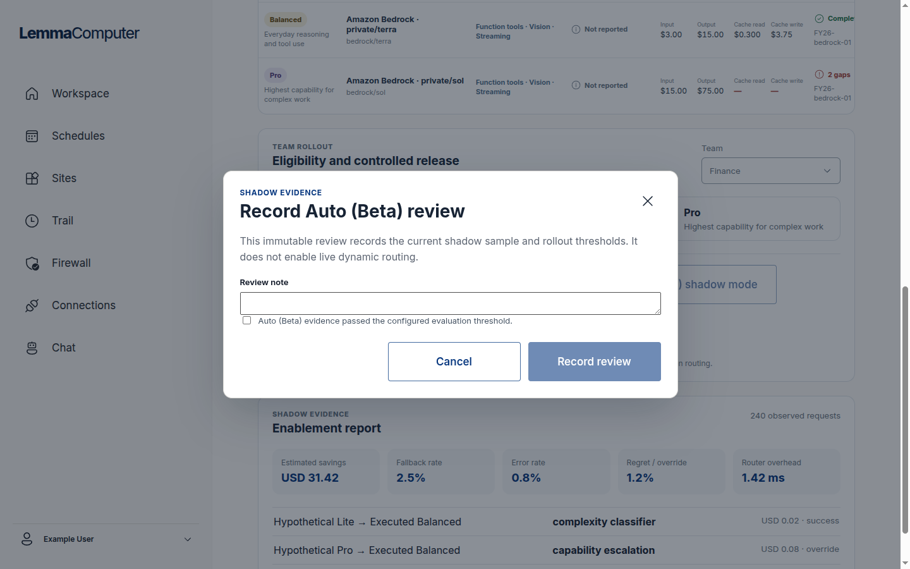
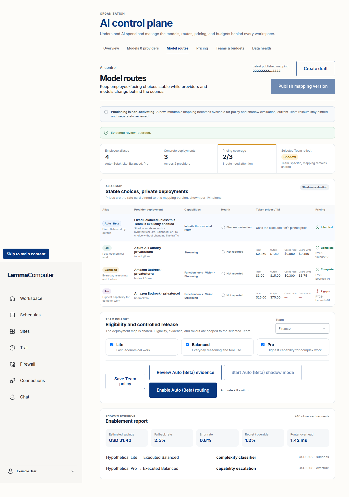
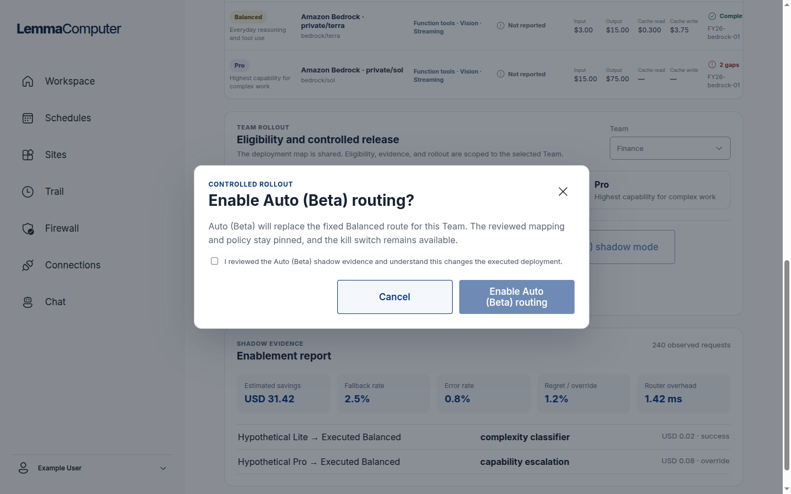
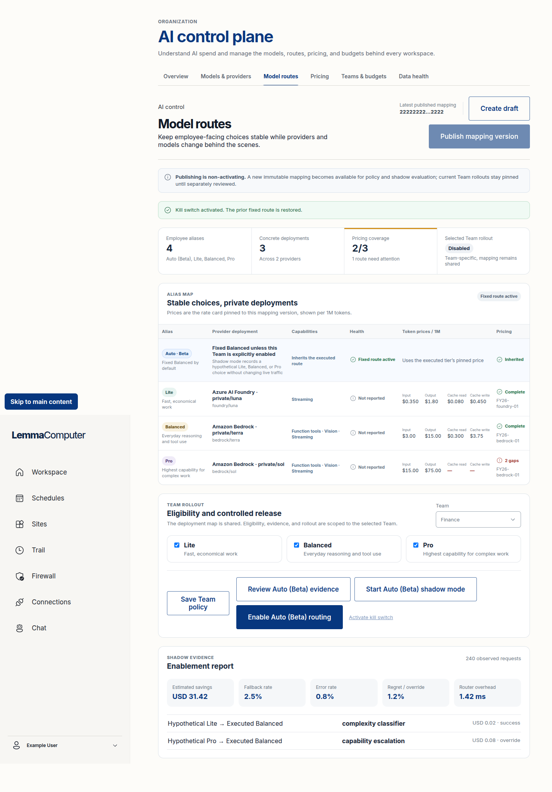
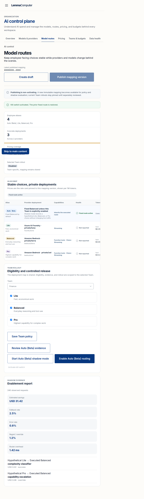
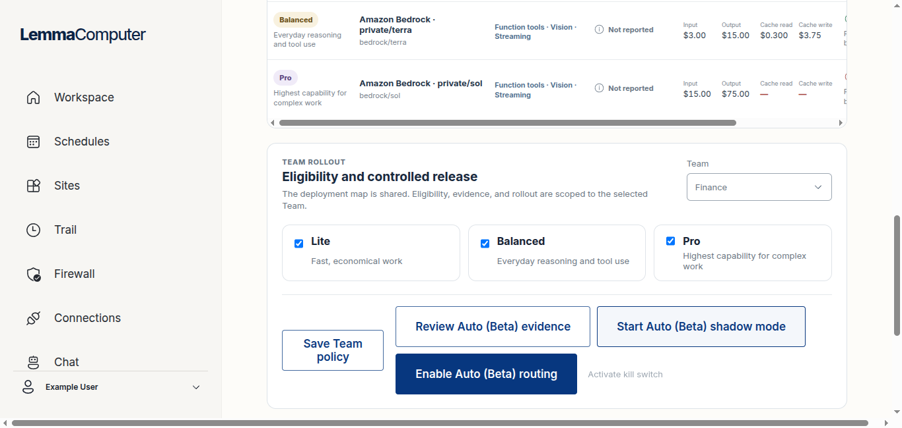
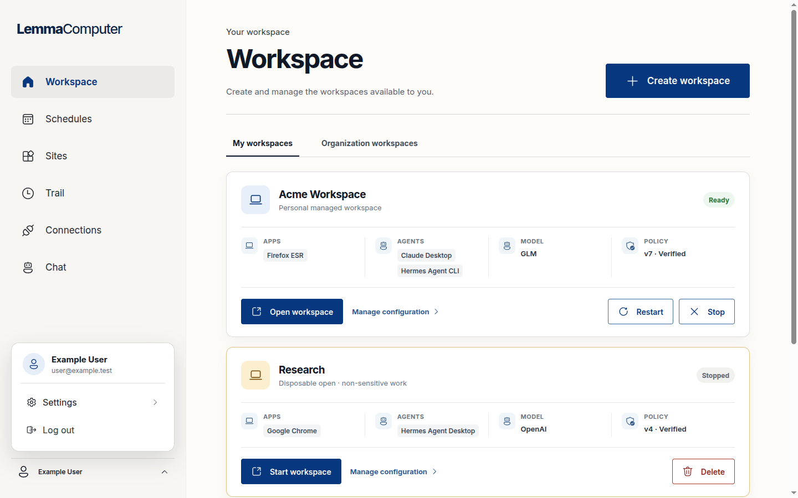

# Phase 0.5 model-routing UX review

Status: proposed product specification for issue #67. Product-owner approval is
required before issue #68 implements it.

## Audit scope and evidence

This review used the current `main` frontend at `061921553b7862bece0df0bfff5c444c1f0ff7ac`
with the repository's deterministic administrator and member fixtures. The audit
walked through provider readiness, mapping draft, publication messaging, Team
policy, shadow evidence, immutable review, live enablement, and kill-switch
rollback. Screenshots were captured at `1440x900`, `1366x650`, and `720x900`.

The fixture is representative product data, not proof of a live provider
deployment. Screenshot evidence supports a UX and visible accessibility review;
it is not WCAG certification or assistive-technology evidence.

### 1. Models and providers — healthy prerequisite, weak readiness handoff

Provider rows clearly separate unconfigured and active credentials, and secrets
remain write-only. The screen does not tell an administrator whether each
provider is ready for a route map: capability review, price coverage, health,
and route eligibility are learned later on other screens.

### 2. Current Model routes — all lifecycle concepts on one page

The current page successfully states that publishing is non-activating and
distinguishes hypothetical from executed routes in evidence. However, one page
simultaneously presents the organization mapping, mapping publication, pricing
coverage, Team eligibility, rollout controls, review evidence, live enablement,
and rollback. The administrator has to infer which controls affect the whole
organization and which affect only the selected Team.

### 3. Mapping draft — correct safety language, action below the fold

The dialog correctly says that a local draft has no traffic effect. At 900px
height the dialog owns a second scroll region and its final action is not
visible. Three visually identical route editors make comparison harder, and
raw rate-card identifiers dominate the selection labels.

### 4. Evidence review — safe gate with limited decision context

Focus moves into the modal and the copy says that review does not enable live
routing. The reviewer must make a binary pass decision while the evidence is
dimmed behind the dialog; the dialog does not restate the exact Team, mapping,
sample window, sample size, or threshold result it will bind.

### 5. Reviewed shadow — not a durable visible state

After review, the only durable behavioral change is that **Enable Auto (Beta)**
becomes available. A transient success notice says the review was recorded, but
the status remains **Shadow** and no review version, reviewer, time, or pass
result is visible. An administrator returning later cannot tell whether the
current shadow window is reviewed.

### 6. Enablement confirmation — strong consequence disclosure

The confirmation accurately says that executed traffic changes, keeps the
mapping and policy pinned, and requires explicit acknowledgement. This is the
strongest step in the current flow and should be retained.

### 7. Live — status changes, but contradictory actions remain

The summary changes to **Enabled** and the route table says the policy is
active. The same controls still offer **Review evidence**, **Start shadow**, and
**Enable Auto**, while the kill switch is a small text action. The page does not
present one safe next step for a live rollout.

### 8. Kill-switch rollback — immediate and safe, but history is ambiguous

Rollback immediately restores the fixed route and confirms the outcome. The
lasting status becomes **Disabled**, which is indistinguishable from a Team
that never enabled Auto. The action is disabled but still present, and the page
does not identify the rolled-back rollout or suggest the next investigation.

### 9. Narrow width — document overflow and clipped route evidence

At `720x900`, the shell reflows and the Team cards stack, but the alias map
keeps a desktop table width. This creates document-level horizontal overflow,
clips columns and actions, and makes the page screenshot 993px wide despite a
720px viewport. The skip link also remains visibly overlaid after focus.

### 10. Compact height — horizontal overflow is visible at laptop size

At `1366x650`, the route table causes a document-level horizontal scrollbar.
The page's decision controls are separated from the current status by a long
scroll, so an administrator cannot see status, consequence, and next action in
one laptop viewport.

### 11. Member role — correct access boundary

An employee without administrator capabilities has no AI control-plane entry
and a direct AI-control URL returns to Workspace. The redesign must preserve
this server-backed role boundary; it should not add a member routing screen.

## Severity-ranked findings

| Severity | Finding | Impact | Required response |
| --- | --- | --- | --- |
| P0 | None found in the reviewed fixture | The governance invariants remained intact | Preserve publication, review, enablement, and role gates |
| P1 | Reviewed, Live, and Rolled back do not each have one durable state and next action | Administrators can repeat or contradict rollout actions | Introduce an explicit Team lifecycle state panel and state-specific controls |
| P1 | Organization route-map work and Team rollout work share one visual hierarchy | Scope and blast radius are easy to misunderstand | Separate **Team rollout** from **Route map** within Model routes |
| P1 | Route table creates document-level horizontal overflow at 720px and 1366x650 | Critical evidence and actions are clipped | Give the table its own contained scroll or responsive detail rows; document width must remain bounded |
| P1 | Mapping draft hides its action inside a tall nested scroll region | Publishing work is difficult on common laptop heights | Use a sticky dialog footer and compact, scannable route rows |
| P1 | Pricing shows `2/3` coverage while review and live enablement remain available in the fixture | The administrator cannot understand whether pricing is a blocker | Present a named readiness gate and the exact action required before the next lifecycle transition |
| P2 | Auto appears as a fourth alias row beside Lite, Balanced, and Pro | Auto is mistaken for a deployment mapping rather than Team rollout behavior | Remove Auto from the organization route-map table; explain it in Team rollout |
| P2 | UUID fragments, private deployment identifiers, and rate-card IDs lead the experience | Traceability overwhelms the human decision | Lead with product labels and keep copyable technical evidence in details |
| P2 | Evidence review hides the decision evidence and binding details | Review feels ceremonial rather than auditable | Summarize Team, mapping, sample, thresholds, and pass/fail in the dialog |
| P2 | Provider readiness is fragmented across Models, Pricing, and Model routes | Administrators discover blockers late | Add a route-readiness summary and direct links, without merging the three domains |

## Approved mental model to implement

The implementation should teach two objects, not one large workflow:

1. **Organization route map** — the immutable, organization-wide definitions
   of Lite, Balanced, and Pro. Publishing a route map never changes traffic.
2. **Team rollout** — the selected Team's allowed choices and current Auto
   lifecycle. Only explicit Team enablement changes Auto traffic.

Provider credentials and pricing remain their existing prerequisite screens.
Auto is not a fourth deployment mapping; it is a Beta rollout mode that chooses
among the allowed Lite, Balanced, and Pro routes.

## Proposed information architecture

Keep the existing **Model routes** top-level tab. Within it use two URL-backed
subsections:

- **Team rollout** — default. Team selector, current lifecycle card, permitted
  service classes, evidence, and exactly one primary next action.
- **Route map** — organization-wide. Published version, readiness, Lite /
  Balanced / Pro mapping, draft creation, and non-activating publication.

Do not create a separate page for every lifecycle stage. Evidence history and
technical identifiers belong in expandable details beneath the current Team
state. Pricing continues to live in **Pricing**, linked from a named readiness
problem.

## Terminology and state contract

| Visible state | Meaning | Executed behavior | Primary action | Safe next-step copy |
| --- | --- | --- | --- | --- |
| Draft | A browser-local proposed organization route map | No traffic change | Publish route map | “Publishing creates an immutable version. Team rollouts do not change.” |
| Published | An immutable organization route map is available | Existing Teams remain pinned | View affected Teams | “Choose a Team to evaluate this version.” |
| Fixed route | Auto is not changing routes for this Team | Auto requests execute Balanced | Start shadow evaluation | “Balanced continues to run while shadow evidence is collected.” |
| Shadow collecting | Hypothetical Auto choices are recorded | Balanced still executes | Review evidence, once ready | “No live traffic changes during shadow evaluation.” |
| Reviewed — ready | A passing review is bound to this exact Team, mapping, policy, and shadow window | Balanced still executes | Enable Auto (Beta) | “The reviewed evidence is ready; enabling changes executed traffic.” |
| Live — Auto (Beta) | Auto selects among the Team's allowed service classes | The selected eligible route executes | View live evidence | “Monitor outcomes. Use Restore fixed route if needed.” |
| Rolled back | A prior live rollout was stopped with the kill switch | Balanced executes again | Start a new shadow evaluation | “Fixed Balanced was restored; prior rollout evidence is retained.” |

Avoid **Disabled** because it does not explain whether the Team is new or was
rolled back. Keep **kill switch** as the emergency-control name, but label its
action **Restore fixed route** and the resulting state **Rolled back**.

## Screen and interaction acceptance criteria for #68

### Team rollout

- The selected Team, lifecycle state, executed consequence, mapping version,
  policy version, and last change appear together above the fold.
- Each lifecycle state exposes exactly one primary next action. Controls for
  other stages are hidden, not left enabled beside the current action.
- Fixed and Shadow state explicitly say that Balanced executes. Live explicitly
  says that Auto may change the executed route.
- Reviewed is durable and shows pass/fail, reviewer, review time, sample size,
  sample window, and the exact pinned mapping/policy.
- Live exposes **View live evidence** as the primary action and **Restore fixed
  route** as a visually dangerous but immediately reachable emergency action.
- Rolled back identifies when rollback occurred, the restored fixed route, and
  the prior rollout whose evidence remains available.
- The eligibility editor saves separately from rollout transitions and states
  whether a change invalidates existing evidence.

### Route map

- The mapping table contains only Lite, Balanced, and Pro. Auto is explained in
  Team rollout.
- Product labels lead each deployment. Provider/model/deployment IDs and UUIDs
  appear only in expandable evidence with copy controls.
- Readiness names each blocking route and reason: provider not configured,
  capability not reviewed, unhealthy deployment, missing required price, or
  policy restriction.
- **Create draft** is the only edit entry point; repeated per-row edit actions
  are removed.
- A saved draft is visibly distinct from the last published version.
- **Publish route map** remains non-activating and requires a concise revision
  note. The confirmation repeats that no Team traffic changes.

### Evidence and dialogs

- The review dialog shows Team, mapping, policy, fixed route, sample size,
  sample window, and threshold results before accepting a decision.
- Enablement retains the current explicit acknowledgement that executed traffic
  changes.
- Dialog headers and footers remain visible at `1366x650`; only the content body
  may scroll.
- Opening a dialog moves focus inside it, Escape closes it, focus is trapped,
  and close returns focus to the invoking control.
- Success and error state changes use a polite live region and also persist in
  the visible lifecycle state; no important outcome exists only as a toast.

### Responsive and accessibility handoff

- No viewport at `720x900` or `1366x650` has document-level horizontal overflow.
- Dense route evidence owns a contained horizontal scroll with a visible cue,
  or reflows to labelled detail rows below the desktop breakpoint.
- Current status and primary action remain reachable without crossing the full
  mapping table.
- Tabs and Team selection remain keyboard operable with a visible focus style.
- Status is communicated by text and semantics, never color alone.
- #70/#71 must verify 200% zoom, screen-reader names and relationships, target
  sizes, focus order, and announcement behavior before any WCAG claim.

## Required deterministic fixtures for #68

Cover Draft, Published, Fixed route, Shadow collecting, Reviewed-ready,
Reviewed-failed, Live, and Rolled-back states, plus missing pricing, stale
review, provider unavailable, permission denied, and empty/no-Team states.
Every fixture must assert the visible state, executed consequence, one primary
action, and the absence of contradictory stage actions.

## Product decision requested

Approve or amend these three decisions before implementation:

1. Model routes defaults to **Team rollout**, with **Route map** as its second
   subsection.
2. Auto is removed from the mapping table and explained as a Team rollout mode.
3. The post-kill-switch state is named **Rolled back**, while the emergency
   action is labelled **Restore fixed route**.
