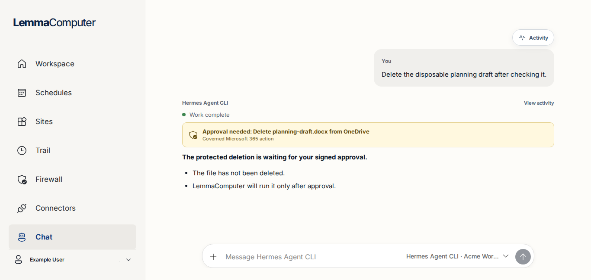
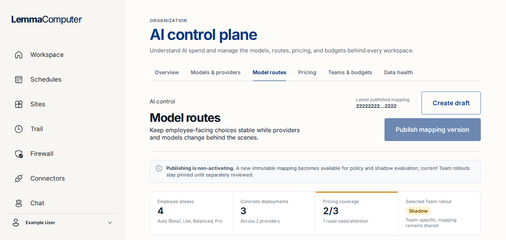

# Responsive UX and accessibility audit

Issue: #70

Audited commit: `dc2c775a682e90e8e9c80a932de6ea5de23394e5`

Capture generated: 2026-08-13 03:39 UTC

Evidence: [`docs/assets/responsive-ux-audit/`](assets/responsive-ux-audit/)

Measurements: [`measurements.json`](assets/responsive-ux-audit/measurements.json)

## Decision summary

The current frontend is broadly responsive, but it is not ready to claim the responsive and keyboard-accessibility contract in #70. The finite remediation register for #71 is:

| ID | Severity | Scope | User impact | Confidence |
| --- | --- | --- | --- | --- |
| RUX-01 | P1 | Workspace > Organization workspaces | Runtime actions are clipped at 1366 px and have no horizontal scroll affordance. | High |
| RUX-02 | P1 | Settings > People and access | Member actions overflow a hidden container at 720 px; keyboard traversal pans the card and clips its left-hand content. | High |
| RUX-03 | P2 | Chat composer | Keyboard focus lands on an unnamed, visually hidden 1×1 file input before the visible Chat actions control. | High |
| RUX-04 | P2 | AI control plane > Model routes | The route table leaks 12 px of document-level horizontal overflow at 1366 px despite having its own scroll container. | High |

No P0 finding was observed. This is a screenshot-based product audit, not a full WCAG conformance assessment.

## Audit contract and method

The audit used the deterministic local UI fixture and a Playwright capture harness. Each default route capture starts from a fresh document. The harness records viewport dimensions, document overflow, primary-action bounds, out-of-bounds elements, scroll containers, and keyboard focus trails.

Required viewport coverage:

| Contract | CSS viewport used | Evidence |
| --- | ---: | --- |
| Compact 1366 × 650 | 1366 × 650 | Workspace, organization workspaces, policies, schedules, sites, connectors, Chat, Firewall, Settings, People and access, and AI control-plane routes |
| Retina-class laptop 1470 × 730 | 1470 × 730 | Workspace |
| 1440 × 800 laptop | 1440 × 800 | Workspace |
| 1920 × 900 external monitor | 1920 × 900 | Workspace |
| Narrow/tablet | 720 × 900 | Organization workspaces, policies, Chat, People and access, AI spend, Activity, and baseline dialog |
| Mobile | 390 × 844 | Workspace, Chat, connectors, navigation drawer, invite dialog, restart dialog, and sign-in |
| 200% zoom equivalent | 683 × 325 CSS pixels rendered at device scale factor 2, producing a 1366 × 650 image | Organization workspaces |

The 200% result is a CSS-pixel-equivalent headless emulation. Headless Chromium did not change zoom in response to `Control++`, so the evidence must not be represented as a native browser-zoom run. No screen reader, high-contrast mode, reduced-motion audit, or production data was used.

## Findings

### RUX-01 — Organization workspace runtime actions are clipped

Severity: **P1**

Cause scope: **route/container contract**, not the shared shell

Owner: `WorkspaceScreen`, `.member-workspace-table`, `.member-workspace-row`, `.member-workspace-actions` in `apps/web/src/App.jsx` and `apps/web/src/styles.css`

Reproduction: `/?view=home&section=organization`, 1366 × 650, fixture organization with three workspaces


Annotation: the rightmost Actions column extends beyond the viewport. Measurements place the row at `x=405.30..1419.30` and the Stop button at `x=1322.30..1401.30` while the viewport ends at 1366. The table uses `overflow: hidden`, so there is no horizontal scroll affordance. The compact-card breakpoint is tied to the whole viewport at `max-width: 1350px`; it misses the 1030 px content area created by the fixed 336 px sidebar.

Required fix:

- Switch the dense row to the compact card layout based on available container width, or move the breakpoint high enough to account for the desktop sidebar and route gutters.
- Keep every runtime action fully within the content box; do not solve this by hiding or truncating actions.
- Preserve the privacy wording and the current separation between runtime administration and workspace content access.

Required automated assertion for #71:

- At 1366 × 650 and 1470 × 730, every visible runtime-action bounding box must be within the viewport and the table/card must expose no clipped overflow.
- Exercise Start, Restart, Stop, and Terminate runtime from the resulting layout.

### RUX-02 — People and access hides member actions at 720 px

Severity: **P1**

Cause scope: **route/container contract**, not the shared shell

Owner: People and access member list, `.admin-member-section`, `.admin-user-list`, `.admin-user-actions`, `.admin-row-action` in `apps/web/src/App.jsx` and `apps/web/src/styles.css`

Reproduction: `/?view=settings&section=people`, 720 × 900, scroll to Organization members or traverse by keyboard


Annotation: before traversal, the action buttons occupy `x=585..765`, 45 px beyond the 720 px viewport. Their `.admin-member-section` ancestor is 662 px wide, has 736 px scroll width, and applies `overflow-x: hidden`. When the browser brings Sign out sessions into view, that hidden container moves to `scrollLeft=74`, clipping the left-hand member identity instead. The stacked action rule starts only at `max-width: 700px`, leaving a broken band above it.

Required fix:

- Stack member rows and make action buttons fluid before the three-column minimum exceeds the actual route container, preferably with a container query.
- Remove the fixed 180 px action width where it competes with the member and role columns.
- A focused action must never cause a hidden container to pan away its associated member identity.

Required automated assertion for #71:

- At 720 × 900, every Organization members action must be fully visible before and after keyboard focus.
- Assert `.admin-member-section.scrollLeft === 0` through the complete member-action tab sequence.

### RUX-03 — Chat exposes a hidden, unnamed file input in the tab order

Severity: **P2**

Cause scope: **component accessibility**

Owner: Chat composer attachment input in `apps/web/src/App.jsx`; `.sr-only` and focus rules in `apps/web/src/styles.css`

Reproduction: `/?view=chat&chat=fixture-session-1`, 1366 × 650, keyboard Tab from Activity through the composer



Annotation: the keyboard trace lands on an `<input type="file" class="sr-only">` with an empty accessible label and a 1 × 1 px box at `x=467, y=566`. The global focus outline exists, but a 3 px outline around a 1 px hidden control is not a meaningful visible focus indicator. The next stop is the correctly named visible Chat actions button.

Required fix:

- Remove the hidden file input from sequential keyboard navigation (`tabIndex=-1`) and invoke it from the visible, named attachment action.
- Ensure the attachment action remains keyboard operable and communicates accepted file types and upload state where needed.

Required automated assertion for #71:

- The composer tab sequence must not focus a hidden file input.
- The visible attachment action must have a non-empty accessible name, show a visible focus indicator, and open the file chooser through keyboard activation.

### RUX-04 — Model routes leaks document-level horizontal overflow

Severity: **P2**

Cause scope: **route table containment**

Owner: AI control-plane Model routes table and `.route-table-scroll` in `apps/web/src/App.jsx` and `apps/web/src/styles.css`

Reproduction: `/?view=ai-control-plane&section=model-routes`, 1366 × 650



Annotation: `document.scrollWidth` is 1378 against a 1366 px viewport. The table itself spans `x=405.30..1479.30`; its intended `.route-table-scroll` owner is 891 px wide with 1074 px scroll width. The route therefore has a valid internal horizontal-scroll mechanism, but it still violates the document-overflow contract by 12 px.

Required fix:

- Keep the table's minimum width fully contained by a `min-width: 0; max-width: 100%` route/container chain.
- Preserve the internal horizontal scroll owner and provide a visible cue or sticky Actions column so management actions are discoverable.

Required automated assertion for #71:

- At 1366 × 650, `document.documentElement.scrollWidth === document.documentElement.clientWidth`.
- The table scroll container must have `scrollWidth > clientWidth`, and its final Actions column must be reachable by scrolling that container only.

## Shared implementation contracts for #71

The fixes should use common layout rules rather than route-specific pixel patches:

1. **Shell contract:** desktop content width is viewport width minus the 336 px sidebar; narrow/mobile content uses a 74 px top bar and 28/19 px route gutters. Breakpoints for dense content must react to the content container, not only the outer viewport.
2. **Overflow contract:** the document must never scroll horizontally. A genuinely dense table may own one labeled or visibly discoverable horizontal scroll region; `overflow: hidden` must not conceal task actions.
3. **Compact-height contract:** use `100dvh` with a `100vh` fallback for shell-owned full-height surfaces. Chat owns its transcript scroll and keeps the composer docked without overlapping messages or the top bar.
4. **Action contract:** primary, destructive, and row actions remain fully visible, reachable by pointer and keyboard, and associated with their row identity at every supported viewport.
5. **Focus contract:** the skip link is first, meaningful interactive controls show a visible focus indicator, and visually hidden implementation inputs are excluded from sequential navigation.
6. **Dialog contract:** dialogs cap their block size to the dynamic viewport, own internal vertical scrolling when required, retain a visible close control, and keep the primary/cancel actions reachable.

## Verified strengths and passing states

- The shared shell changes cleanly from the fixed desktop sidebar to a mobile top bar and inert, scrim-backed navigation drawer.
- The skip link is first in the sampled keyboard sequences. Most buttons and links expose the shared 3 px focus outline.
- Chat keeps its composer docked at 1366 × 650, 720 × 900, and 390 × 844 without document horizontal overflow. The Activity drawer fits at compact and narrow sizes and owns its vertical content.
- The policy baseline, mobile invitation, and mobile restart dialogs fit their sampled viewports with visible close, primary, and cancel/done controls.
- Sign-in has no document horizontal overflow at 1366 × 650 or 390 × 844; the mobile page scrolls vertically to the remaining sign-in methods.
- Workspace, connectors, policies, AI Spend Details, and the mobile navigation drawer did not show document horizontal overflow in the sampled states.
- The 200% CSS-pixel-equivalent sample had no horizontal overflow. At the resulting 683 × 325 CSS viewport, organization-workspace actions are below the fold but remain reachable by vertical scrolling.

## Evidence manifest

### Compact route sweep — 1366 × 650

1. [`01-workspace-1366x650.png`](assets/responsive-ux-audit/01-workspace-1366x650.png)
2. [`02-organization-workspaces-1366x650.png`](assets/responsive-ux-audit/02-organization-workspaces-1366x650.png)
3. [`03-workspace-policies-1366x650.png`](assets/responsive-ux-audit/03-workspace-policies-1366x650.png)
4. [`04-schedules-1366x650.png`](assets/responsive-ux-audit/04-schedules-1366x650.png)
5. [`05-sites-1366x650.png`](assets/responsive-ux-audit/05-sites-1366x650.png)
6. [`06-connectors-1366x650.png`](assets/responsive-ux-audit/06-connectors-1366x650.png)
7. [`07-chat-1366x650.png`](assets/responsive-ux-audit/07-chat-1366x650.png)
8. [`08-firewall-1366x650.png`](assets/responsive-ux-audit/08-firewall-1366x650.png)
9. [`09-settings-1366x650.png`](assets/responsive-ux-audit/09-settings-1366x650.png)
10. [`10-people-access-1366x650.png`](assets/responsive-ux-audit/10-people-access-1366x650.png)
11. [`11-ai-overview-1366x650.png`](assets/responsive-ux-audit/11-ai-overview-1366x650.png)
12. [`12-ai-models-providers-1366x650.png`](assets/responsive-ux-audit/12-ai-models-providers-1366x650.png)
13. [`13-ai-spend-1366x650.png`](assets/responsive-ux-audit/13-ai-spend-1366x650.png)
14. [`14-ai-routing-1366x650.png`](assets/responsive-ux-audit/14-ai-routing-1366x650.png)

### Required display sizes

15. [`15-workspace-1470x730.png`](assets/responsive-ux-audit/15-workspace-1470x730.png)
16. [`16-workspace-1440x800.png`](assets/responsive-ux-audit/16-workspace-1440x800.png)
17. [`17-workspace-1920x900.png`](assets/responsive-ux-audit/17-workspace-1920x900.png)

### Narrow and mobile route sweep

18. [`18-organization-workspaces-720x900.png`](assets/responsive-ux-audit/18-organization-workspaces-720x900.png)
19. [`19-workspace-policies-720x900.png`](assets/responsive-ux-audit/19-workspace-policies-720x900.png)
20. [`20-chat-720x900.png`](assets/responsive-ux-audit/20-chat-720x900.png)
21. [`21-people-access-720x900.png`](assets/responsive-ux-audit/21-people-access-720x900.png)
22. [`22-ai-spend-720x900.png`](assets/responsive-ux-audit/22-ai-spend-720x900.png)
23. [`23-workspace-390x844.png`](assets/responsive-ux-audit/23-workspace-390x844.png)
24. [`24-chat-390x844.png`](assets/responsive-ux-audit/24-chat-390x844.png)
25. [`25-connectors-390x844.png`](assets/responsive-ux-audit/25-connectors-390x844.png)

### Drawers, dialogs, zoom, authentication, and focused failure state

26. [`26-chat-activity-1366x650.png`](assets/responsive-ux-audit/26-chat-activity-1366x650.png)
27. [`27-chat-activity-720x900.png`](assets/responsive-ux-audit/27-chat-activity-720x900.png)
28. [`28-mobile-navigation-390x844.png`](assets/responsive-ux-audit/28-mobile-navigation-390x844.png)
29. [`29-policy-baseline-dialog-720x900.png`](assets/responsive-ux-audit/29-policy-baseline-dialog-720x900.png)
30. [`30-invite-dialog-390x844.png`](assets/responsive-ux-audit/30-invite-dialog-390x844.png)
31. [`31-restart-dialog-390x844.png`](assets/responsive-ux-audit/31-restart-dialog-390x844.png)
32. [`32-organization-workspaces-200-percent-zoom.png`](assets/responsive-ux-audit/32-organization-workspaces-200-percent-zoom.png)
33. [`33-sign-in-1366x650.png`](assets/responsive-ux-audit/33-sign-in-1366x650.png)
34. [`34-sign-in-390x844.png`](assets/responsive-ux-audit/34-sign-in-390x844.png)
35. [`35-people-actions-clipped-720x900.png`](assets/responsive-ux-audit/35-people-actions-clipped-720x900.png)

## Reproduction

The audit-only Vite configuration deduplicates React and permits font assets from the parent checkout; it does not change product behavior.

```bash
UI_FIXTURE_PORT=24370 npm run dev:ui-fixture
LEMMACOMPUTER_CONTROL_URL=http://127.0.0.1:24370 npm run dev -w web -- --config ../../scripts/vite-responsive-audit.config.mjs --host 127.0.0.1 --port 24371 --force
node scripts/capture-responsive-ux-audit.mjs
```

The capture harness is intentionally separate from the eventual #71 regression suite. #71 should promote the finite assertions above into the existing focused Playwright specs rather than treating screenshot generation as the release gate.
