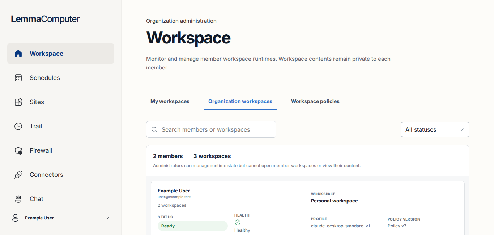
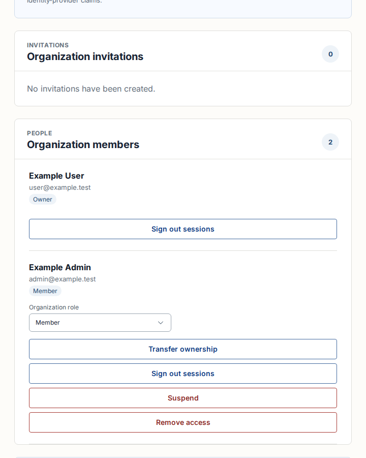
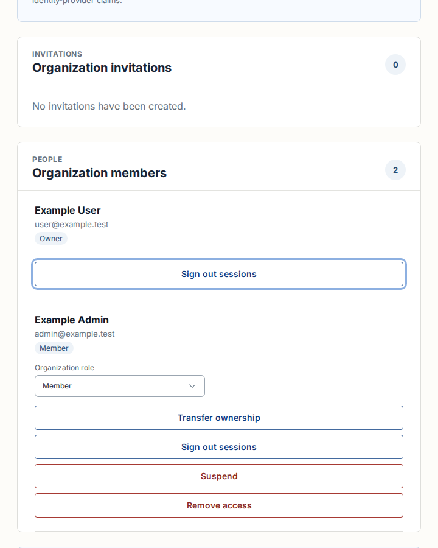
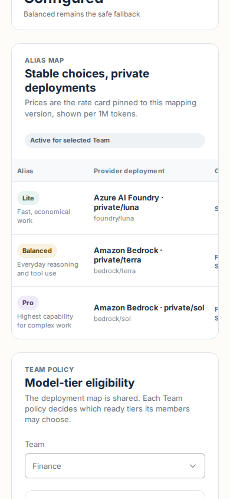
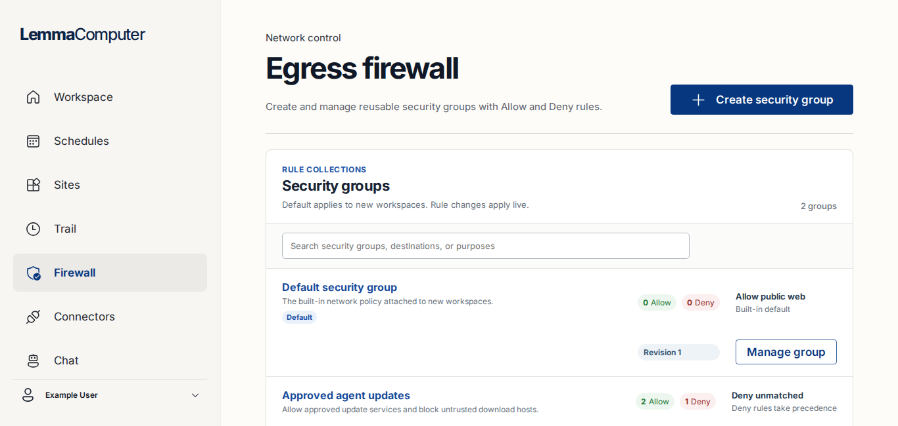
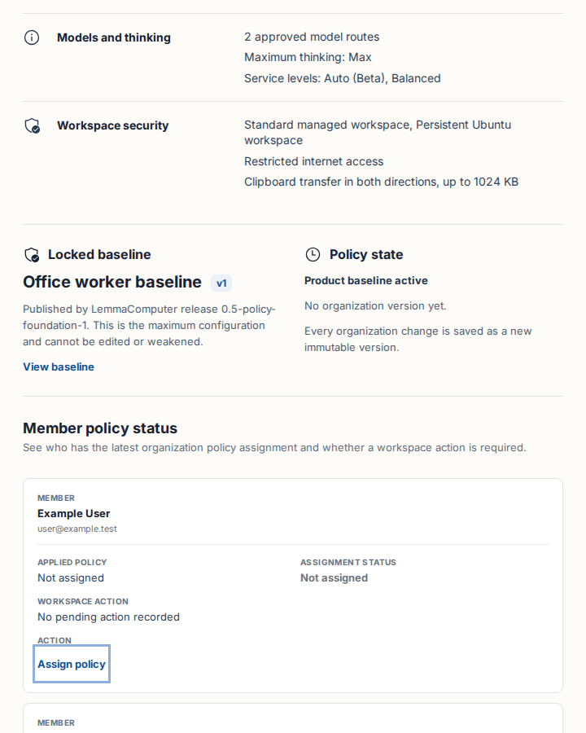
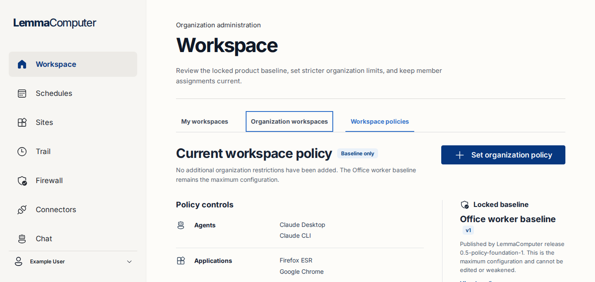
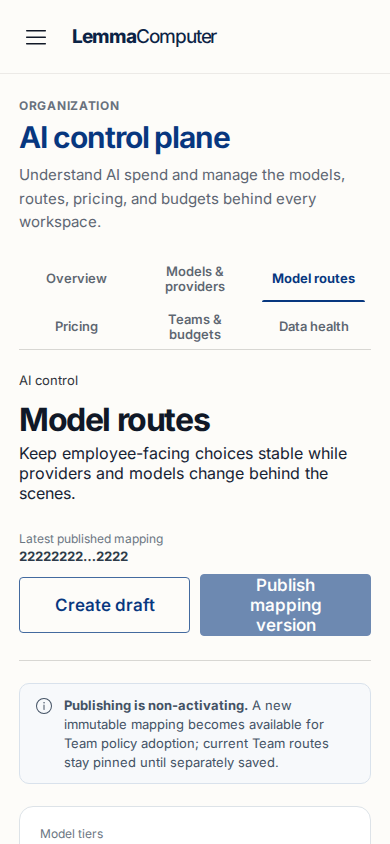
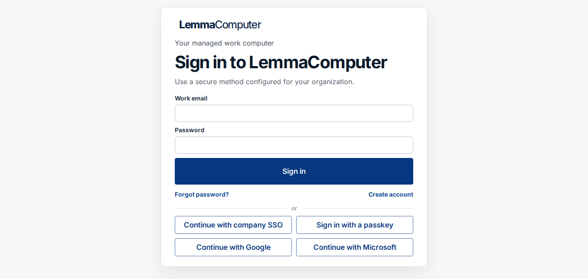
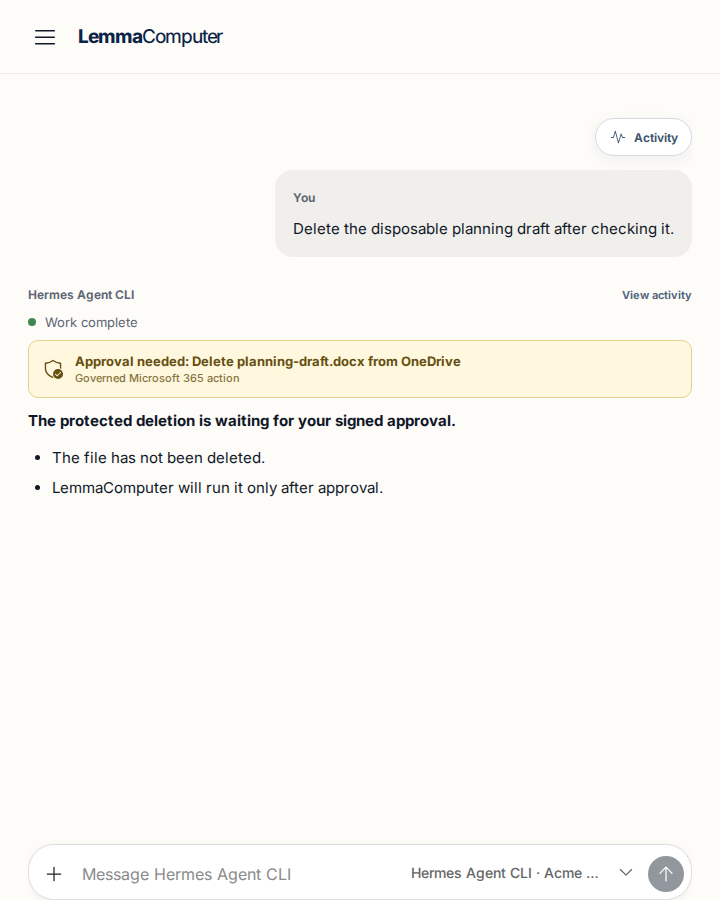

# Responsive UX and accessibility audit

Issue: [#70](https://github.com/ONE-Computer/LemmaComputer/issues/70)

Remediation branch base: `6c5b5e5`

Latest capture generated: 2026-08-13 15:23 UTC

Evidence: [`docs/assets/responsive-ux-audit/`](assets/responsive-ux-audit/)

Measurements: [`measurements.json`](assets/responsive-ux-audit/measurements.json)

## Status and decision summary

The fresh remediation pass covers the full required viewport matrix, including Workspace member home, Chat, Activity, composer docking, sign-in, and sign-up. It found no product-wide shell cause. The original seven route/component findings are resolved in this branch, and two additional P1 first-impression/reachability findings found during remediation are also resolved: compact-laptop authentication height and the 720 px Chat composer docking gap.

| ID | Severity | Route/component | Impact | Confidence |
| --- | --- | --- | --- | --- |
| RUX-01 | P1 | Organization workspaces runtime table | Runtime actions are clipped at 1366 × 650 without a scroll affordance. | High |
| RUX-02 | P1 | People and access member rows | Member actions exceed the 720 px viewport; keyboard focus exposes an action only by clipping its member identity. | High |
| RUX-03 | P1 | AI control plane Model routes table | At 390 × 844 the route creates 569 px of document overflow and hides later table columns/actions beyond the initial view. | High |
| RUX-04 | P1 | Firewall security-group rows | Both Manage group actions are clipped by their card at 1366 × 650. | High |
| RUX-05 | P1 | Workspace policy member status | Both Assign policy actions are clipped at 720 × 900. | High |
| RUX-06 | P2 | Workspace section tabs | A keyboard-focused inactive tab has no visible focus indicator at 1366 × 650. | High |
| RUX-07 | P2 | AI control-plane mobile tabs | Three destinations are offscreen at 390 × 844 with no visible overflow cue. | High |
| RUX-08 | P1 | Authentication sign-in/sign-up | Alternate sign-in methods extended 347 px below the 1366 × 650 fold; account creation was also too tall for a compact laptop. | High |
| RUX-09 | P1 | Chat composer at 720 px | The composer docked 30 px below the 720 × 900 viewport because the compact shell height did not account for its top margin. | High |

All nine findings are **resolved in `codex/71-responsive-ux-remediation`**. Fresh measurements report no document horizontal overflow or clipped interactive in any accepted capture. This remains a responsive UX/accessibility verification result, not a WCAG compliance claim.

No WCAG compliance claim is made from this screenshot-led audit.

## Audited scope

- Authentication: email/password, account recovery/creation links, company SSO, passkey, Google, and Microsoft entry points, including compact-height sign-in and sign-up.
- Shared navigation and shell: desktop sidebar, compact/mobile top bar, keyboard-opened navigation drawer, skip link, focus treatment, and route gutter behavior.
- Workspace member home and administration: member cards, runtime operations, and workspace-policy administration.
- Chat and Activity: transcript, compact composer docking, Activity drawer fit/scroll ownership, and desktop/mobile layout.
- Connections and policy administration: connectors, egress firewall security groups, policy baseline, and associated dialogs.
- People and access: organization identity, invitations, member roles/actions, protected lifecycle operations, and lower-page connection/custom-role actions through keyboard traversal.
- Other stabilized member/admin flows: Schedules, Sites, Settings.
- AI control and usage: overview, providers, spend details, and model routing, including dense table behavior.
- Dialogs: policy baseline at 720 × 900; invitation and restart confirmation at 390 × 844.

## Method and limitations

The audit used the deterministic local UI fixture and a Playwright CLI harness. Only screenshots generated during this run were accepted. Every accepted image was opened and visually inspected. The harness starts each default route in a fresh browser context and records document bounds, action bounds, dialogs, scroll containers and ownership, active focus, and keyboard traversal.

| Required viewport | Stabilized evidence sampled |
| --- | --- |
| 1366 × 650 | Organization workspaces, policies, Schedules, Sites, Connectors, Firewall, Settings, People and access, AI overview/providers/spend/routes, sign-in |
| 1470 × 730 | Organization workspaces |
| 1440 × 800 | People and access |
| 1920 × 900 | Model routes |
| 720 × 900 | Organization workspaces, policies, Connectors, People and access, AI spend, policy dialog |
| 390 × 844 | People and access, Model routes, Connectors, navigation drawer, invitation/restart dialogs, sign-in |
| 200% zoom equivalent | Organization workspaces at a 683 × 325 effective CSS viewport, rendered at device scale factor 2 |

The 200% sample is a headless CSS-pixel-equivalent emulation, not a native browser-zoom claim. It showed no horizontal overflow; actions below the fold remained reachable through document vertical scrolling. No screen reader, high-contrast mode, reduced-motion audit, real tenant data, or native OS/browser zoom was used.

## Findings

### RUX-01 — Organization workspace runtime actions are clipped

Severity: **P1**

Impact: An administrator at the required compact desktop viewport cannot see complete Stop, Start, or Terminate runtime controls. This blocks or obscures critical runtime operations.

Cause scope: **route-local dense-row breakpoint**, not the shared shell.

Owner: `WorkspaceScreen`, `.member-workspace-table`, `.member-workspace-row`, and `.member-workspace-actions` in `apps/web/src/App.jsx` and `apps/web/src/styles.css`.

State: `/?view=home&section=organization`, 1366 × 650, fixture organization with three workspaces.



Remediation evidence: the runtime list now switches to its compact card layout based on the table container width. The fresh 1366 × 650 capture has `documentScrollWidth=1366`, no clipped interactive, and no out-of-bounds control; runtime actions remain associated with their workspace card and are reachable through natural vertical scrolling.

Required fix/test for #71:

- Switch to the compact card layout based on available content width, or move the breakpoint high enough to include the fixed 336 px sidebar and route gutters.
- Keep Start, Restart, Stop, and Terminate runtime within the content box; do not hide or truncate actions.
- Assert all runtime-action rectangles are inside the viewport at 1366 × 650 and 1470 × 730, with no clipped ancestor overflow, then exercise each action.

### RUX-02 — People and access clips member actions at 720 px

Severity: **P1**

Impact: Organization owners cannot see complete session, ownership, suspension, and removal actions. Keyboard traversal focuses actions outside the visible viewport and removes the associated member identity from view.

Cause scope: **route-local member-row breakpoint**, not the shared shell.

Owner: People and access `.admin-member-section`, `.admin-user-list`, `.admin-user-actions`, and `.admin-row-action`.

State: `/?view=settings&section=people`, 720 × 900, Organization members section, before and during keyboard traversal.





Remediation evidence: member rows now stack from their own container width, and each action fills the available row width. The fresh 720 × 900 captures have `documentScrollWidth=720`, no clipped interactive, and no out-of-bounds control; keyboard focus remains visible without moving the member identity off canvas.

Required fix/test for #71:

- Stack the member row and make actions fluid before the columns exceed the available route width, preferably from a container query.
- Keep the focused action and its associated member identity visible together.
- At 720 × 900, assert every member-action rectangle is within the viewport throughout the complete Tab sequence and that neither document nor member section acquires horizontal pan.

### RUX-03 — Model routes escapes its mobile scroll owner

Severity: **P1**

Impact: At 390 × 844, later route-table columns and management actions are not visible in the initial view, and the page exposes document-level horizontal overflow despite an intended table scroller. This makes pricing and mapping actions difficult to discover and unreliable to reach.

Cause scope: **AI Model routes containment**, not the shared shell.

Owner: `.routing-admin-screen`, `.route-table-card`, `.route-table-scroll`, and `.route-table` in `apps/web/src/RoutingAdmin.css`.

State: `/?view=ai-control-plane&section=model-routes`, 390 × 844, route table at `scrollLeft=0`.



Remediation evidence: the fresh 390 × 844 capture has `documentScrollWidth=390` with no document overflow. `.route-table-scroll` is the sole horizontal owner (`clientWidth=350`, `scrollWidth=1040`), exposes a scrollbar, and can be panned to the final actions without moving the document.

Required fix/test for #71:

- Add `min-width: 0`/`max-width: 100%` containment through the route-card and scroll-owner chain so table width never contributes to document width.
- Preserve one internal horizontal scroll owner and make remaining columns/actions discoverable with a cue or sticky Actions column.
- Assert `document.documentElement.scrollWidth === document.documentElement.clientWidth` at 390 × 844 and 1366 × 650; assert only `.route-table-scroll` changes `scrollLeft`, and its final actions are reachable.

### RUX-04 — Firewall security-group actions are clipped

Severity: **P1**

Impact: Administrators see only a truncated Manage group label for both security groups at the compact desktop viewport, obscuring the control used to inspect and change egress policy.

Cause scope: **Firewall dense-row layout**, not the shared shell.

Owner: `.firewall-security-groups` and `.firewall-security-group-list article` in `apps/web/src/styles.css`.

State: `/?view=firewall`, 1366 × 650, two fixture security groups.



Remediation evidence: security-group rows now reflow from the card container width. The fresh 1366 × 650 capture has `documentScrollWidth=1366`, no clipped interactive, and no out-of-bounds control; both Manage group labels and controls are complete.

Required fix/test for #71:

- Reflow the security-group row before its five grid columns exceed the available content width.
- Keep both Manage group controls fully visible and associated with their security-group names.
- At 1366 × 650, assert each control is contained by the card, has an untruncated accessible and visible label, and remains keyboard reachable.

### RUX-05 — Policy assignment actions are clipped at 720 px

Severity: **P1**

Impact: An administrator reviewing member policy status cannot see the complete Assign policy controls, blocking a core policy-administration task.

Cause scope: **Workspace-policy member table**, not the shared shell.

Owner: `.workspace-policy-member-table` and `.workspace-policy-member-row` in `apps/web/src/styles.css`.

State: `/?view=home&section=policies`, 720 × 900, Member policy status, keyboard focus on the first Assign policy control.



Remediation evidence: member status rows now use a two-column compact card layout and keep the action on a full-width final row. In the fresh focus capture the Assign policy control is at `x=46..130`, its 3 px focus indicator is visible, `documentScrollWidth=720`, and no interactive is clipped.

Required fix/test for #71:

- Switch the member-status rows to a compact card/stacked layout before the five-column minimum exceeds the route container.
- Keep member identity, assignment status, pending action, and Assign policy control together.
- At 720 × 900, assert both Assign policy controls and their focus indicators are fully contained and keyboard operable without horizontal pan.

### RUX-06 — Workspace tabs lose visible keyboard focus

Severity: **P2**

Impact: A keyboard user cannot tell which inactive Workspace section tab will activate, even though the control is in the Tab sequence.

Cause scope: **Workspace tab component focus styling**, not the shared shell.

Owner: `.workspace-page-tabs button:focus-visible` in `apps/web/src/styles.css`.

State: `/?view=home&section=policies`, 1366 × 650, keyboard focus on inactive Organization workspaces.



Remediation evidence: the active element is the Organization workspaces button with a solid 2 px focus outline using the shared focus color. The indicator is independent of the selected Workspace policies underline and is not clipped.

Required fix/test for #71:

- Give every focused tab a visible, non-clipped focus indicator independent of selected state.
- Tab across My workspaces, Organization workspaces, and Workspace policies and assert a visible focus style for each inactive and active state.

### RUX-07 — Mobile AI navigation hides destinations without a cue

Severity: **P2**

Impact: Pricing, Teams & budgets, and Data health are absent from the initial 390 px view. The hidden scrollbar and lack of an edge cue make these destinations easy to miss for touch and pointer users.

Cause scope: **AI tab-navigation component**, not the shared shell.

Owner: `.ai-control-plane-tabs` in `apps/web/src/AiControlPlane.css`.

State: any AI control-plane section at 390 × 844; captured on Model routes.



Remediation evidence: at 390 × 844 the navigation switches to a two-row, three-column grid, exposing Overview, Models & providers, Model routes, Pricing, Teams & budgets, and Data health together without horizontal document movement.

Required fix/test for #71:

- Add a perceivable overflow treatment such as an edge fade with directional affordance, a visible compact scrollbar, or a mobile overflow menu.
- Verify every destination is reachable by touch, pointer, and keyboard and that focus automatically reveals the focused tab without moving the document horizontally.

### RUX-08 — Authentication actions exceed compact-laptop height

Severity: **P1**

Impact: The first sign-in experience hid alternate authentication methods below the fold on a typical 14-inch laptop, making configured company, passkey, and social entry points appear unavailable.

Cause scope: **authentication card spacing and method layout**, not the shared shell.

Owner: `SignInScreen`, `.signin-card-with-methods`, and `.signin-method-grid` in `apps/web/src/App.jsx` and `apps/web/src/styles.css`.



Remediation evidence: at 1366 × 650 the company SSO, passkey, Google, and Microsoft methods now form a two-column grid and compact-height spacing keeps the entire sign-in card within `documentScrollHeight=650`. Sign-up actions also remain reachable in the fresh compact capture; mobile retains a single readable column.

Required fix/test for #71:

- Keep every configured method above the fold at 1366 × 650 without reducing its target height below the product control standard.
- Preserve a single-column layout at mobile widths and verify sign-up primary/back actions remain reachable.

### RUX-09 — Chat composer docks below the 720 px viewport

Severity: **P1**

Impact: At 720 × 900 the primary Chat input was partially below the viewport, forcing unexpected document movement before a member could send a message.

Cause scope: **compact-shell Chat height calculation**, not Chat/Activity backend behavior.

Owner: `.chat-screen` compact breakpoint in `apps/web/src/styles.css`.



Remediation evidence: the compact Chat height now subtracts the 74 px top bar and accounts for its 24 px top/bottom spacing. Playwright measured the composer bottom at the 900 px viewport edge and the fresh capture has no horizontal overflow or clipped interactive.

Required fix/test for #71:

- Keep the visible composer within both 720 × 900 and 390 × 844 while preserving transcript scroll ownership.
- Assert composer docking independently of Activity data and backend turn state.

## Shared contracts for #71

1. **Shell:** the sampled desktop sidebar, mobile top bar, skip link, and keyboard-opened drawer pass. Preserve those shared-shell behaviors; fix the seven defects in their route/component owners.
2. **Overflow:** the document must never scroll horizontally. Dense data may own one discoverable horizontal scroller; `overflow: hidden` must not conceal task actions.
3. **Actions:** primary, destructive, and row actions remain visible, reachable, and associated with their row identity at every required viewport.
4. **Focus:** skip link remains first; meaningful controls show a visible focus indicator; focus must not pan hidden containers away from related context.
5. **Dialogs:** cap dialogs to the dynamic viewport, own internal vertical scrolling when needed, and retain visible close and primary/cancel controls.
6. **Tenant/deployment:** remediation must remain tenant-scoped and deployment-profile-neutral; this audit proposes no profile-specific UI fork.

## Passing observations

- The shared shell changes cleanly from the fixed sidebar to the mobile top bar and inert, scrim-backed navigation drawer. The mobile menu button and first drawer item show visible focus.
- The skip link is first in sampled desktop/narrow keyboard sequences. Connectors, member actions, AI date fields, and standard shell controls expose the shared focus treatment when visible.
- Organization workspace cards fit at 720 × 900, and People/member cards fit at 390 × 844.
- Connectors adapt from a two-column desktop grid to readable single-column cards at 720 and 390 without document overflow.
- Policy baseline, mobile invitation, and mobile restart dialogs fit with visible close and action controls; each dialog owns `overflow-y:auto` and had `scrollHeight === clientHeight` in the captured state.
- Sign-in has no horizontal overflow at 1366 × 650 or 390 × 844; the mobile document scrolls vertically to remaining sign-in methods.
- Schedules, Sites, Settings, policies, AI overview/providers/spend, and the sampled mobile drawer showed no navigation overlap or document horizontal overflow.
- AI Spend Details stacks date and export controls at 720 × 900; focused date input is visibly outlined.

## Workspace and Chat qualification

Fresh current-branch captures replace the earlier #77 deferral. Workspace cards preserve their actions and natural document scroll at every required viewport. Chat owns the viewport-height conversation stage at 1366 × 650, 1470 × 730, 1440 × 800, 1920 × 900, 720 × 900, and 390 × 844; the composer is fully docked in each state. Activity is fixed to the right edge on desktop and fills the mobile viewport, while its timeline owns vertical scrolling. Product-owner approval of this register is still required before #70 closes.

## Evidence manifest

### Compact sweep — 1366 × 650

1. [`01-my-workspaces-1366x650.png`](assets/responsive-ux-audit/01-my-workspaces-1366x650.png)
2. [`02-organization-workspaces-1366x650.png`](assets/responsive-ux-audit/02-organization-workspaces-1366x650.png)
2. [`03-workspace-policies-1366x650.png`](assets/responsive-ux-audit/03-workspace-policies-1366x650.png)
3. [`04-schedules-1366x650.png`](assets/responsive-ux-audit/04-schedules-1366x650.png)
4. [`05-sites-1366x650.png`](assets/responsive-ux-audit/05-sites-1366x650.png)
6. [`06-connectors-1366x650.png`](assets/responsive-ux-audit/06-connectors-1366x650.png)
7. [`07-chat-1366x650.png`](assets/responsive-ux-audit/07-chat-1366x650.png)
6. [`08-firewall-1366x650.png`](assets/responsive-ux-audit/08-firewall-1366x650.png)
7. [`09-settings-1366x650.png`](assets/responsive-ux-audit/09-settings-1366x650.png)
8. [`10-people-access-1366x650.png`](assets/responsive-ux-audit/10-people-access-1366x650.png)
9. [`11-ai-overview-1366x650.png`](assets/responsive-ux-audit/11-ai-overview-1366x650.png)
10. [`12-ai-models-providers-1366x650.png`](assets/responsive-ux-audit/12-ai-models-providers-1366x650.png)
11. [`13-ai-spend-1366x650.png`](assets/responsive-ux-audit/13-ai-spend-1366x650.png)
12. [`14-ai-routing-1366x650.png`](assets/responsive-ux-audit/14-ai-routing-1366x650.png)

### Required larger and narrow/mobile samples

13. [`15-organization-workspaces-1470x730.png`](assets/responsive-ux-audit/15-organization-workspaces-1470x730.png)
14. [`16-people-access-1440x800.png`](assets/responsive-ux-audit/16-people-access-1440x800.png)
15. [`17-ai-routing-1920x900.png`](assets/responsive-ux-audit/17-ai-routing-1920x900.png)
16. [`18-organization-workspaces-720x900.png`](assets/responsive-ux-audit/18-organization-workspaces-720x900.png)
17. [`19-workspace-policies-720x900.png`](assets/responsive-ux-audit/19-workspace-policies-720x900.png)
18. [`20-connectors-720x900.png`](assets/responsive-ux-audit/20-connectors-720x900.png)
19. [`21-people-access-720x900.png`](assets/responsive-ux-audit/21-people-access-720x900.png)
20. [`22-ai-spend-720x900.png`](assets/responsive-ux-audit/22-ai-spend-720x900.png)
21. [`23-people-access-390x844.png`](assets/responsive-ux-audit/23-people-access-390x844.png)
22. [`24-ai-routing-390x844.png`](assets/responsive-ux-audit/24-ai-routing-390x844.png)
23. [`25-connectors-390x844.png`](assets/responsive-ux-audit/25-connectors-390x844.png)

### Drawer, dialogs, zoom, authentication, and focused states

24. [`28-mobile-navigation-390x844.png`](assets/responsive-ux-audit/28-mobile-navigation-390x844.png)
25. [`29-policy-baseline-dialog-720x900.png`](assets/responsive-ux-audit/29-policy-baseline-dialog-720x900.png)
26. [`30-invite-dialog-390x844.png`](assets/responsive-ux-audit/30-invite-dialog-390x844.png)
27. [`31-restart-dialog-390x844.png`](assets/responsive-ux-audit/31-restart-dialog-390x844.png)
28. [`32-organization-workspaces-200-percent-zoom.png`](assets/responsive-ux-audit/32-organization-workspaces-200-percent-zoom.png)
29. [`33-sign-in-1366x650.png`](assets/responsive-ux-audit/33-sign-in-1366x650.png)
30. [`34-sign-in-390x844.png`](assets/responsive-ux-audit/34-sign-in-390x844.png)
31. [`35-people-actions-clipped-720x900.png`](assets/responsive-ux-audit/35-people-actions-clipped-720x900.png)
32. [`36-people-sign-out-sessions-focus-720x900.png`](assets/responsive-ux-audit/36-people-sign-out-sessions-focus-720x900.png)
33. [`37-connections-navigation-focus-390x844.png`](assets/responsive-ux-audit/37-connections-navigation-focus-390x844.png)
34. [`38-ai-routing-table-overflow-390x844.png`](assets/responsive-ux-audit/38-ai-routing-table-overflow-390x844.png)
35. [`39-workspace-tab-focus-1366x650.png`](assets/responsive-ux-audit/39-workspace-tab-focus-1366x650.png)
36. [`40-ai-spend-date-focus-720x900.png`](assets/responsive-ux-audit/40-ai-spend-date-focus-720x900.png)
37. [`41-policy-assign-focus-720x900.png`](assets/responsive-ux-audit/41-policy-assign-focus-720x900.png)

### Workspace, Chat, Activity, and sign-up completion

38. [`42-my-workspaces-1470x730.png`](assets/responsive-ux-audit/42-my-workspaces-1470x730.png)
39. [`43-my-workspaces-1440x800.png`](assets/responsive-ux-audit/43-my-workspaces-1440x800.png)
40. [`44-my-workspaces-1920x900.png`](assets/responsive-ux-audit/44-my-workspaces-1920x900.png)
41. [`45-my-workspaces-720x900.png`](assets/responsive-ux-audit/45-my-workspaces-720x900.png)
42. [`46-my-workspaces-390x844.png`](assets/responsive-ux-audit/46-my-workspaces-390x844.png)
43. [`47-chat-1470x730.png`](assets/responsive-ux-audit/47-chat-1470x730.png)
44. [`48-chat-1440x800.png`](assets/responsive-ux-audit/48-chat-1440x800.png)
45. [`49-chat-1920x900.png`](assets/responsive-ux-audit/49-chat-1920x900.png)
46. [`50-chat-720x900.png`](assets/responsive-ux-audit/50-chat-720x900.png)
47. [`51-chat-390x844.png`](assets/responsive-ux-audit/51-chat-390x844.png)
48. [`52-activity-1366x650.png`](assets/responsive-ux-audit/52-activity-1366x650.png)
49. [`53-activity-390x844.png`](assets/responsive-ux-audit/53-activity-390x844.png)
50. [`54-sign-up-1366x650.png`](assets/responsive-ux-audit/54-sign-up-1366x650.png)
51. [`55-sign-up-390x844.png`](assets/responsive-ux-audit/55-sign-up-390x844.png)

## Reproduction

The audit-only Vite configuration deduplicates React and permits font assets from the parent checkout; it does not alter production behavior.

```bash
UI_FIXTURE_PORT=24370 npm run dev:ui-fixture
LEMMACOMPUTER_CONTROL_URL=http://127.0.0.1:24370 npm run dev -w web -- --config ../../scripts/vite-responsive-audit.config.mjs --host 127.0.0.1 --port 24371 --force
node scripts/capture-responsive-ux-audit.mjs
```

The capture harness remains the visual evidence producer. Release-gate assertions now live in `tests/e2e/responsive-remediation.spec.ts` and the compact-auth coverage in `tests/e2e/customer-authentication.spec.ts`.
